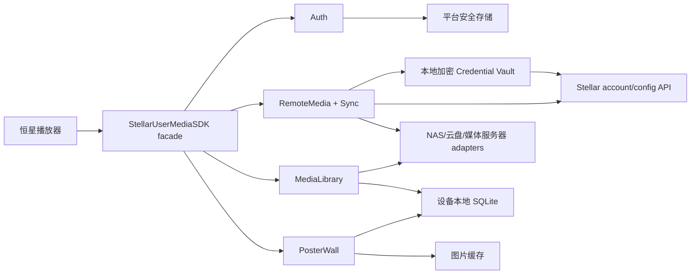

# Stellar User Media SDK

为“恒星播放器”提供跨平台的用户身份、远程媒体配置同步、媒体库扫描和海报墙数据能力。

当前仓库处于架构与合同初始化阶段，目标平台为 Swift（最低 iOS/iPadOS 17、macOS 14、tvOS 17）、Android（Kotlin）和 OpenHarmony/HarmonyOS（ArkTS）。Swift 实现使用当前最新稳定 Swift 6.3 工具链与 Swift 6 语言模式。播放器解码、渲染和音视频输出不属于本 SDK；SDK 负责在播放前提供用户会话、可访问的媒体来源、媒体实体、海报和可播放资源描述。

## 核心能力

1. **用户 OAuth 登录及状态维护**
   - Authorization Code + PKCE；
   - 登录、刷新、退出、撤销和需要重新认证状态；
   - Token 仅进入平台安全存储；
   - 多账户数据隔离和会话事件流。
2. **远程媒体配置同步**
   - 同步 NAS、WebDAV、云盘和媒体服务器的连接配置；
   - 同步 Favorite、扫描范围、元数据与预缓存策略；
   - 用户名、密码和第三方 Token 通过 Credential Vault 端到端加密后保存到本地数据库并跨设备同步；
   - 云端只保存加密 envelope，解密密钥仅交给用户已授权的设备；
   - 版本、冲突和 tombstone 删除协议。
3. **媒体库与海报墙**
   - 本地、NAS、云盘及 Plex/Emby/Jellyfin 来源适配；
   - 文件名解析、NFO/内嵌信息、TMDB 等 provider 匹配；
   - 可恢复扫描、变化检测、缺失保护和重建；
   - 电影/剧集/季/集、多版本、海报、背景、搜索和分页查询。

## 总体架构



三端分别使用平台原生语言和并发模型，但共享 `specs/` 中的数据语义、状态机、错误分类、SQLite 迁移和同步格式。每台设备维护自己的数据库，不在多设备之间直接共享活动 SQLite 文件。

## 仓库结构

```text
docs/                 架构、决策、安全、路线图和研究资料
specs/                三平台必须共同遵守的产品与数据合同
platforms/swift/       Swift Package、SDK library 与 stellar-media CLI
platforms/android/     Android/Kotlin library 预留结构
platforms/ohos/        OHOS ArkTS HAR 预留结构
examples/              三个平台的示例应用规划
tools/reference/       研究和验证脚本，不属于生产 SDK
```

## 设计入口

- [架构总览](docs/architecture/overview.md)
- [公共合同索引](specs/README.md)
- [OAuth 与会话合同](specs/auth/oauth-session.md)
- [远程媒体配置同步合同](specs/remote-media/source-config-sync.md)
- [扫描与海报墙合同](specs/media-library/scanning-and-poster-wall.md)
- [SQLite 与同步边界](specs/storage/sqlite-and-sync.md)
- [安全基线](docs/security.md)
- [开发路线图](docs/roadmap.md)
- [Swift Reference Implementation Plan](docs/plans/swift-reference-implementation.md)
- [Infuse 研究资料索引](docs/research/infuse/README.md)

## 当前约束

- 不把 OAuth client secret、明文用户密码、明文 refresh token 或 NAS Token 写进 Git、日志、普通 SQLite 字段或云端；媒体源凭据只以端到端加密 envelope 形式持久化和同步。
- 自动扫描无权删除真实媒体文件。
- 来源不可达或枚举不完整时，不得把未看到的文件判定为删除。
- 人工匹配、观看状态、片单和未上传同步事件不能随索引重建丢失。
- `docs/research/` 只用于 clean-room 行为研究，不作为复制第三方私有实现的来源。

Swift 构建清单已经固定 Apple 平台首版兼容基线；Android 与 OHOS 的最低版本、包标识和发布渠道仍需确定。
