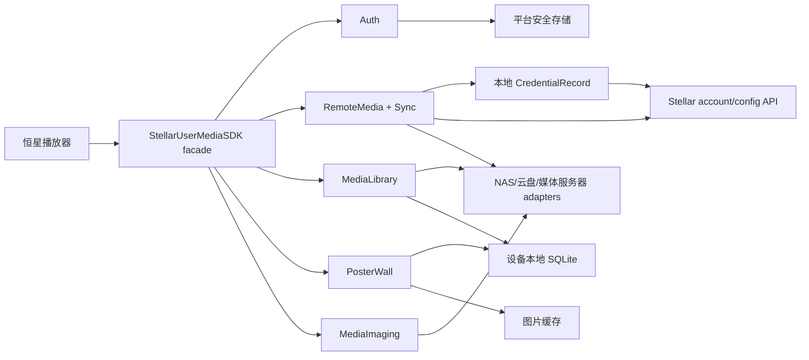

# Stellar User Media SDK

为 Apple 平台上的“恒星播放器”提供用户身份、远程媒体配置同步、媒体库扫描和海报墙数据能力。

本项目只支持 Apple 平台：最低 iOS/iPadOS 17、macOS 14 与 tvOS 17。SDK 使用 Swift 6.3 工具链与 Swift 6 语言模式；SwiftPM 清单必须在 macOS 上解析。播放器解码、渲染和音视频输出不属于本 SDK；SDK 负责在播放前提供用户会话、可访问的媒体来源、媒体实体、海报和可播放资源描述。

## 核心能力

1. **用户 OAuth 登录及状态维护**
   - Authorization Code + PKCE；
   - 登录、刷新、退出、撤销和需要重新认证状态；
   - access token 仅驻留内存或平台安全存储，refresh token 仅进入平台安全存储；
   - 多账户数据隔离和会话事件流。
2. **远程媒体配置同步**
   - 同步 NAS、WebDAV、云盘和媒体服务器的连接配置；
   - 同步 Favorite、扫描范围、元数据与预缓存策略；
   - 用户名、密码和第三方 Token 在 v1 以可同步的明文 `CredentialRecord` 保存；
   - 新设备完成 Stellar OAuth 后无需 Vault 批准或恢复步骤即可使用凭据，结构预留未来加密升级；
   - 版本、冲突和 tombstone 删除协议。
3. **媒体库与海报墙**
   - 本地、NAS、云盘及 Plex/Emby/Jellyfin 来源适配；
   - 文件名解析、NFO/内嵌信息、TMDB 等 provider 匹配；
   - 可恢复扫描、变化检测、缺失保护和重建；
   - 电影/剧集/季/集、多版本、海报、背景、搜索和分页查询。
4. **远程媒体访问与截图**
   - Apple 平台通过 AMSMB2 提供只读 SMB2/3 目录、属性和 range read；
   - 通过 FFmpegKit/libav 定位并解码目标视频帧，输出 PNG 或 JPEG；
   - 远端媒体统一经过 `MediaSourceSession`，不会把来源凭据拼进 FFmpeg URL。

## 总体架构



Apple 各设备族共享 `specs/` 中的数据语义、状态机、错误分类、SQLite 迁移和同步格式。每台设备维护自己的数据库，不在设备之间直接共享活动 SQLite 文件。

## 仓库结构

```text
docs/                 架构、决策、安全、路线图和研究资料
specs/                Apple SDK 与服务端共同遵守的产品和数据合同
platforms/swift/       Apple Swift Package、SDK library 与 macOS stellar-media CLI
examples/swift/        Apple 示例应用
tools/reference/       研究和验证脚本，不属于生产 SDK
debug-infuse/          本地保留的 Infuse IPA 静态分析工作区（大文件默认忽略）
```

## 设计入口

- [架构总览](docs/architecture/overview.md)
- [WebDAV 只读访问架构](architecture.md)
- [公共合同索引](specs/README.md)
- [OAuth 与会话合同](specs/auth/oauth-session.md)
- [远程媒体配置同步合同](specs/remote-media/source-config-sync.md)
- [扫描与海报墙合同](specs/media-library/scanning-and-poster-wall.md)
- [SQLite 与同步边界](specs/storage/sqlite-and-sync.md)
- [SQLite v1 schema manifest](specs/storage/schema-manifest-v1.json)
- [安全基线](docs/security.md)
- [开发路线图](docs/roadmap.md)
- [Swift Reference Implementation Plan](docs/plans/swift-reference-implementation.md)
- [AMSMB2、FFmpegKit 与截图架构决策](docs/decisions/0006-amsmb2-ffmpegkit-and-screenshot.md)
- [Infuse 研究资料索引](docs/research/infuse/README.md)

## 当前约束

- 不把 OAuth client secret、Stellar OAuth token、用户密码或 NAS Token 写进 Git、日志、崩溃报告、分析事件或 URL。第三方媒体源凭据按当前产品决策会以应用层明文进入 `account.sqlite` 和同步服务；这些数据库、备份和服务端快照必须按凭据材料保护，产品不得声称 E2EE。
- 自动扫描无权删除真实媒体文件。
- 来源不可达或枚举不完整时，不得把未看到的文件判定为删除。
- 人工匹配、观看状态、片单和未上传同步事件不能随索引重建丢失。
- `docs/research/` 只用于 clean-room 行为研究，不作为复制第三方私有实现的来源。

Swift 构建清单已固定 Apple 平台首版兼容基线。Linux、Windows、Android 与 OpenHarmony/HarmonyOS 不属于支持范围。
