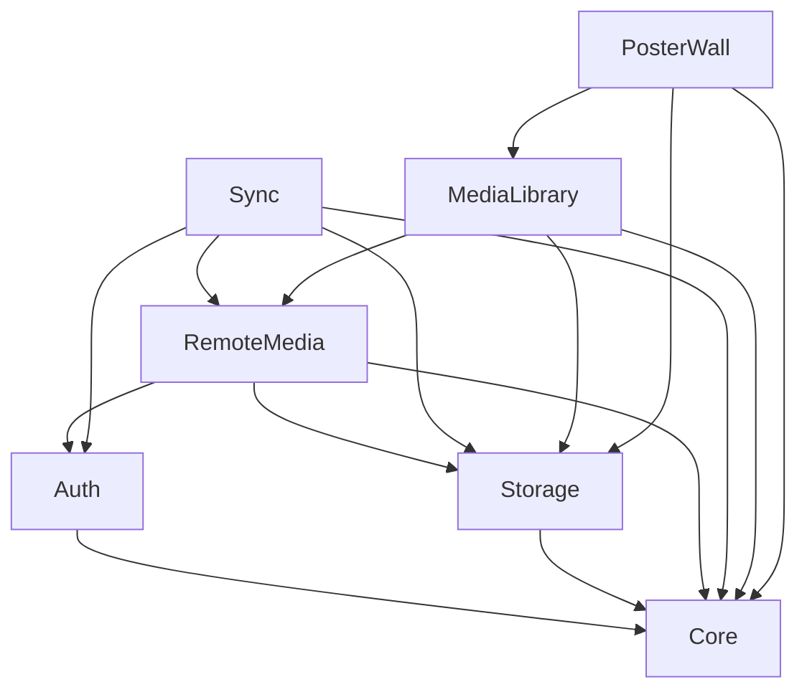

# 架构总览

## 1. 产品边界

`StellarUserMediaSDK` 是恒星播放器的用户与媒体数据层，负责：

- 建立和维护 Stellar 用户会话；
- 保存并同步用户的远程媒体来源配置；
- 访问来源、扫描媒体、解析文件名和物化媒体库；
- 提供海报墙、搜索、继续观看和媒体详情查询；
- 为播放器输出可播放资源描述和必要凭据句柄。

SDK 不负责解码器、渲染器、音频输出、字幕渲染或 DRM 播放实现。

## 2. 模块

| 模块 | 职责 | 不应承担 |
|---|---|---|
| `Core` | ID、时间、错误、事件、序列化、取消和日志接口 | 平台 UI、网络来源细节 |
| `Auth` | OAuth PKCE、用户会话、Token 刷新、退出和账户切换 | NAS/云盘文件访问 |
| `RemoteMedia` | 来源模型、能力描述、凭据引用和 adapter 接口 | 用户账号登录 |
| `Sync` | 来源配置、Favorite、用户状态的增量同步与冲突处理 | 直接同步活动 SQLite 文件 |
| `Storage` | SQLite、迁移、事务、缓存和安全存储抽象 | 业务匹配策略 |
| `MediaLibrary` | 枚举、解析、匹配、物化、删除协调和重建 | 海报墙 UI 控件 |
| `PosterWall` | 媒体墙查询、分页、排序、筛选、图片选择和预取 | 扫描真实文件 |

## 3. 依赖方向



反向依赖不允许。例如 `Auth` 不能引用 `MediaLibrary`，数据库驱动不能内置 TMDB 评分策略。

## 4. 关键数据流

### 4.1 登录到配置同步

```text
OAuth callback
  → 校验 state/PKCE
  → refresh token 写平台安全存储；access token 优先只驻留内存
  → 发布 signedIn session
  → Sync 拉取用户 source config 变化
  → 合并本地配置和 tombstone
  → 拉取明文 CredentialRecord
  → 按账户和来源重新校验 payload
  → 来源进入 ready
```

### 4.2 配置到媒体库

```text
来源新增/修改
  → RemoteMedia 校验能力与根路径
  → library_source UPSERT
  → 创建 incremental/full scan_run
  → adapter 枚举
  → parser/local metadata/provider match
  → media_entity + file_binding 物化
  → PosterWall 查询发布增量更新
```

### 4.3 播放器取资源

```text
entity + selected media_file
  → RemoteMedia adapter 解析可播放 URL/请求头
  → 通过 credential_uid 从本地 CredentialRecord 读取凭据
  → 返回 PlayableResource
  → 播放器内核消费
```

`PlayableResource` 不应被长期持久化，短期签名 URL 到期后需要重新解析。

## 5. 多账户隔离

- 每个用户有独立 account namespace；
- Token 与远程凭据按 account UID 隔离；
- SQLite 可采用每账户独立文件，或所有业务表增加不可绕过的 account 约束；
- v1 推荐每账户独立数据库目录，降低查询漏过滤风险；
- 退出登录默认锁定本地用户域，不立即删除媒体文件缓存；用户明确“删除本机数据”时才回收。

## 6. 平台实现策略

首版采用三套原生实现，共享规范和测试向量：

| 平台 | 并发/API 风格 | 安全存储 | 后台工作 |
|---|---|---|---|
| Swift | `async/await`、actor、`AsyncSequence` | Keychain | 系统允许的后台任务 + 前台恢复 |
| Android | Kotlin coroutine、`Flow` | Keystore-backed storage | WorkManager |
| OHOS | ArkTS `Promise`、事件/异步迭代接口 | HUKS/系统安全存储 | 系统允许的后台任务 + 前台恢复 |

跨平台一致性依靠：

- 同一组规范化 JSON 测试向量；
- 同一份 SQLite DDL 和迁移 checksum；
- 同一状态机和错误码；
- 同一文件名 parser fixture；
- 同一同步冲突测试。

## 7. 海报墙边界

v1 的 PosterWall 是数据 SDK，不强制绑定 SwiftUI、Compose 或 ArkUI。它提供：

- 分页和稳定排序；
- 电影、剧集、最近添加、继续观看、类型、片单查询；
- 海报/背景 URL 与本地缓存状态；
- 页面预取和变化事件；
- 多版本选择和可播放性状态。

平台 UI 组件可作为后续独立包建立，避免数据层被某一代 UI 框架锁定。
