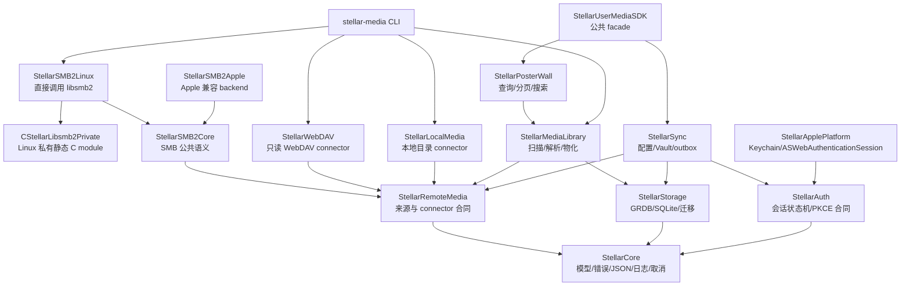

# Swift Reference Implementation Plan

最后核对日期：2026-08-16

当前阶段：**S4 — SQLite v1 与扫描入库**

目标工具链：Swift 6.3.x、Swift 6 language mode  
最低 Apple 平台：iOS/iPadOS 17、macOS 14、tvOS 17

本文是 `StellarUserMediaSDK` 的 Swift 实施顺序和完成状态入口。产品与跨语言行为以 [`specs/`](../../specs/README.md) 为准；本文只决定 Swift reference implementation 如何实现、验证并交付这些合同。

## 1. 实施策略

采用 **contract-first、Swift-first、fixture-driven**：

1. 先把行为写入语言无关规范、DDL 或 JSON fixture。
2. Swift 作为第一份完整 reference implementation，同时提供 macOS/Linux CLI。
3. 每个里程碑必须产生可供 Kotlin 和 ArkTS 重放的输入、输出和错误样本。
4. Swift 通过 reference v1 验收后，其他语言实现同一合同，而不是逐行翻译 Swift。

Swift 实现不是规范本身。`Codable` 默认行为、Foundation 类型、actor、Keychain、`ASWebAuthenticationSession`、GRDB 和 libsmb2 的私有类型不得进入跨平台 wire format。

### Swift Reference v1 范围

v1 必须包含：

- Core 合同、错误、日志脱敏、取消和公共 fixtures；
- Stellar OAuth session、来源配置同步和 E2EE Credential Vault 客户端；
- 本地目录、SMB2/3、WebDAV 三种只读文件型来源；
- 可恢复 scanner、SQLite v1、文件名/NFO 解析、媒体物化和 PosterWall 查询；
- macOS/Linux CLI，以及 StellarPlayer iOS 的正式集成。

v1 不包含：

- 解码、转码、播放器 UI 或 SwiftUI PosterWall 组件；
- 远端文件写入/删除；
- Jellyfin、Plex、Google Drive、OneDrive 等后续 provider；
- 在 SDK 仓库内实现 Stellar 云服务本身。SDK 必须提供 transport、fake service 和 staging contract tests，服务端单独交付。

## 2. 已固定的工程决策

| 项目 | 决策 |
| --- | --- |
| Swift | 使用最新稳定 Swift 6.3.x；Package tools version 6.3；Swift 6 严格并发 |
| Apple 兼容基线 | SDK 最低 iOS/iPadOS 17、macOS 14、tvOS 17；当前 StellarPlayer App 最低 iOS 18，可直接消费 SDK |
| Linux 角色 | 正式支持 Core、Storage、SMB connector 和 CLI；Linux 是首个 SMB2 扫库验收环境，不只是偶发开发宿主 |
| Windows 角色 | reference v1 冻结前完成 Core/CLI 编译验证；不阻断首个 Linux SMB 验收 |
| SMB | 使用 libsmb2；首版只读，禁止创建、修改、重命名或删除远端文件 |
| SQLite | 共享 SQLite DDL；Swift 优先沿用 GRDB 7.11.1，必须自行维护 Linux CI 与迁移测试 |
| 凭据 | 本地 SQLite 与云端只保存 E2EE envelope；Vault 解锁材料进入平台安全存储；服务端不能解密 |
| 播放 | SDK 只返回 `PlayableResource`；不依赖 KSPlayer、FFmpegKit、SwiftUI 或播放器 View |
| UI | v1 PosterWall 是数据查询 API，不在本 SDK 中交付 SwiftUI 组件 |
| 依赖版本 | 所有第三方依赖精确固定；升级使用独立变更并重新执行跨平台合同测试 |

## 3. 当前事实

已经完成：

- Swift 6.3 Package，导出 `StellarUserMediaSDK` library 与 `stellar-media` executable；
- `StellarCore`、`StellarRemoteMedia`、`StellarLocalMedia`、`StellarWebDAV` 和 `StellarMediaLibrary` 已拆分为独立 target，并保留 umbrella SDK 兼容入口；
- 可注入 clock、UUID、logger、retry 和 cancellation Core runtime；
- URL、Header、路径、用户名、密码和 token 的统一 redaction API，CLI stderr 已接入；
- `FieldPresence`、epoch 毫秒和 `CursorPage` wire contract 及公共 fixture；
- iOS 17、macOS 14、tvOS 17 最低版本；
- 公共错误模型、`EncryptedCredentialEnvelope` wire model；
- 最小电影/剧集文件名 parser；
- repository-wide parser fixture；
- 57 个 Swift Testing 测试，macOS debug/release 构建已通过；
- GitHub Actions 已在 macOS 26 与 Ubuntu 24.04 首次实际通过对等验证，并固定第三方 Action SHA；
- SwiftPM exact/revision 依赖锁定门禁，以及 8 个公开模块、717 个 symbol 的 API compatibility 基线；
- libsmb2 来源/ABI/私有静态链接 ADR、机器可读 lock、全符号前缀和 C ABI smoke guard；
- 不依赖真实服务器的 `SMB2Transport` / `SMB2Session` seam、只读值模型和 fake transport 合同测试；
- allowlisted C wrapper、Linux `LinuxSMB2Transport`、有界 blocking executor，以及连接、枚举、`stat`、range read 和确定性释放实现；
- Linux CLI 的 `smb check`、`smb list`、`smb scan`，密码只从 stdin 读取；
- 来源无关的 `RemoteLocator`、`RemoteEntry`、connector 能力、路径比较语义和公共枚举 fixture；
- full/scoped incremental/repair scanner 状态机、有界目录队列、原子 page checkpoint 和公共扫描 fixture；
- macOS/Linux 本地目录 connector、SMB transport adapter、WebDAV URLSession/transport seam，以及三者的统一 scanner tests；
- Credential Vault 规范和 E2EE 同步 ADR。

尚未完成：

- 尚未产生真实代码的 Auth、Sync 与平台 backend targets；
- Windows compile check；
- SMB3 encryption 的客户端合同与 server-free 测试已经完成；当前没有可用的隔离加密服务，真实服务验收推迟到 release candidate，不阻断 S2；
- S4 的 Linux CI 对等验证；SQLite v1 是首个正式版本，因此没有上一正式版本迁移 fixture；
- OAuth、配置同步、Vault 密码学实现和服务端 transport；
- StellarPlayer iOS 正式集成。

## 4. 目标 Package 架构

targets 在第一次产生真实代码时建立，不创建只有空目录的模块。



约束：

- `StellarCore`、`StellarRemoteMedia`、`StellarStorage`、`StellarMediaLibrary` 和 CLI MUST 在 macOS 与 Linux 构建。
- Apple framework import 只能出现在 `StellarApplePlatform` 或明确的 Apple backend target。
- libsmb2 context、file handle 和 C callback userdata 不得声明为无条件 `Sendable`；由 actor 或单一执行器拥有。
- CLI 只调用 SDK 公共 API，不维护另一份扫描、解析或数据库业务逻辑。
- Linux 的 `CStellarLibsmb2Private` 通过私有 `stellar-libsmb2-private.pc` 解析全符号前缀的静态 archive，并通过条件 target dependency 与 Apple backend 隔离。不得安装或解析公共 `libsmb2.pc`；Apple backend 采用同样的私有静态隔离并由 ADR 固化 LGPL relink kit 边界。

## 5. 依赖基线与待决 ADR

| 依赖 | 初始基线 | 用途 | 合入前要求 |
| --- | --- | --- | --- |
| libsmb2 | 以 StellarPlayer 已验证的 `aedafb2c8742c83188e27841e270fdaad6035d41` 为兼容基准 | SMB2/3 连接、枚举、stat、range read | ADR：源码固定、私有静态 archive、全符号前缀、LGPL relink kit |
| GRDB.swift | 精确版本 7.11.1 | SQLite 连接、迁移、事务和查询 | Linux debug/release、WAL、migration、`foreign_key_check` 全部进入 CI |
| Swift Crypto | 候选精确版本 4.5.1 | Apple/Linux 共用 AES-GCM、KDF 和 key wrapping 基础能力 | ADR：算法套件、AAD canonical encoding、设备批准和恢复流程；不得先写自定义密码算法 |

必须先完成的 ADR：

1. libsmb2 获取、固定版本、私有静态链接和 Apple/Linux 分发方式；
2. SQLite/GRDB 采用方式、数据库文件布局和 DDL 所有权；
3. Credential Vault key wrapping、设备批准、恢复材料和 key rotation；
4. StellarPlayer iOS 现有媒体库向 SDK 迁移及旧数据库清理策略。

## 6. 里程碑

### S0 — Package 与合同基线 ✅

目标：让最小 SDK 和 CLI 可构建，并证明公共 JSON 合同可以被 Swift 实现。

完成项：

- [x] 初始化 Swift 6.3 Package；
- [x] 建立 library、CLI 和 Swift Testing target；
- [x] 实现错误模型、文件名 parser 和加密凭据 envelope model；
- [x] 建立第一个公共 fixture；
- [x] macOS debug tests 和 release build 通过。

完成定义：当前已有的 8 个测试通过，`stellar-media parse` 输出规范化 JSON。

### S1 — 模块边界与跨平台构建 ✅

目标：在加入 C、数据库和 Apple framework 前固定依赖方向，让 Linux 不被后续 Apple 代码破坏。

工作：

- [x] 按第 4 节拆分现有 target，保留 umbrella product；
- [x] 为时钟、UUID、日志、重试和取消建立可注入接口；
- [x] 建立统一 redaction API，覆盖 URL userinfo、Header、路径、用户名、密码和 token；
- [x] 明确未知枚举、缺失与 `null`、epoch 毫秒、游标分页的 Swift 编码策略；
- [x] 建立 macOS 与 Ubuntu 的 Swift 6.3 CI；
- [x] CI 执行 format lint、debug tests、release build、fixture tests 和 secret scan；
- [x] 建立依赖解析记录门禁，禁止浮动 branch/range；S1 完成时没有外部依赖，S4 引入 GRDB 后提交精确解析记录；
- [x] 为 public API 加入最小顶层 DocC 注释与 API compatibility 基线。

完成定义：同一 commit 在 macOS 和 Linux 上执行 Core/CLI tests；代码中没有未经条件隔离的 Apple import；fixture 输出语义一致。

完成证据：初始 commit `d1b8b2e` 已在 GitHub-hosted macOS 26、Ubuntu 24.04 和 repository guards 全部通过；后续 S3 run `31907420283` 继续证明两端 symbol graph 一致。CI 拒绝 SwiftPM branch/range；新增外部依赖要求 exact version 或 immutable revision 并提交 `Package.resolved`。`API/PublicAPI.json` 当前固定包括 `StellarStorage` 在内的 8 个公开模块、717 个 symbol，API 有意变化必须显式更新并审阅 baseline diff。

### S2 — Linux libsmb2 只读纵向切片 ✅

目标：在 Linux 上用真实 SMB2/3 来源完成连接、递归枚举和验收报告，这是首个生产数据路径。

范围：首版只支持用户提供 server、share、root、domain、username/password 的 NTLMSSP 连接。Kerberos、DFS、写操作和 share discovery 不阻断本里程碑。

工作：

- [x] 完成 libsmb2 ADR，固定 C ABI 基线与许可证交付方式；
- [x] 建立 `CStellarLibsmb2Private` module map、私有 shim、固定静态构建、全符号前缀和 C ABI smoke 检查；
- [x] 建立 `SMB2Transport` seam，使单元测试不需要真实服务器；
- [x] 建立项目自有 allowlisted C wrapper，公开 header 不暴露任何 libsmb2 类型；
- [x] 封装 context、directory/file handle 的唯一所有权和确定性释放；
- [x] 实现连接、NTLMSSP 认证、目录枚举、`stat` 和分块 range read；
- [x] 映射取消、超时、认证、权限、网络、远端不可用和协议错误；
- [x] 支持 SMB 2.1、3.0、3.1.1 协商信息记录，以及可配置 signing/encryption 要求；
- [x] 所有 transport 方法保持 `async throws`，同步 C API 只在最多 4 个 worker 的专用 blocking executor 运行，并在调用前后检查取消；
- [x] 通过 libsmb2 fd callback 跟踪活动 socket，Swift task 取消时主动 `shutdown()` 中止 in-flight C 调用；loopback 黑洞 peer 验证连接在 2 秒内返回 `ECANCELED` 并确定性释放；
- [x] CLI 新增以下命令：

```text
stellar-media smb check
stellar-media smb list
stellar-media smb scan
```

- [x] 当前 CLI 密码只允许从 stdin 输入；明确拒绝 `--password <value>` 和带密码的 SMB URL，Vault/进程外 secret provider 留待 Sync 集成；
- [x] `smb scan` 输出不带路径的 JSONL 条目与单独 summary，包含 schema、source、范围、开始/结束时间、结果、错误分类和 libsmb2 版本，不包含完整主机、用户名、密码或敏感路径；
- [x] 真实 NAS 使用明确批准的隔离资源完成手动验收；鉴于真实环境验收已经通过，CI 不再重复启动临时 Samba 执行 SMB 冒烟；
- [x] 构建生成 LGPL 许可证、固定 commit 完整对应源码和 symbol map；release kit 加入 SwiftPM object code、集成源码、重建/重链接脚本和 SHA-256 manifest，并从交付源码实际重建替换 archive 后重链接验证。

验收矩阵：

- 空目录、单文件、深层目录、大目录；
- 空格、emoji、CJK、组合 Unicode、点文件和无扩展名文件；
- 正确凭据、错误密码、无权限目录、来源离线、扫描中断和超时；
- SMB 2.1/3.x、要求 signing；要求 SMB3 encryption 的客户端配置、错误和 fake transport 合同测试必须通过，真实加密服务验收推迟到 release candidate；
- 重复扫描结果稳定；扫描过程不执行任何远端写操作；
- 密码不会出现在 argv、stdout/stderr、JSONL、日志、core dump 测试字符串或 CI artifact。

完成定义：Ubuntu release binary 能针对至少一个获准的真实 SMB2/3 来源完成只读扫描；取消/失败不会生成“完整成功”标记；报告可用于后续 scanner fixture。当前无可用的 SMB3 encryption 隔离服务，因此真实加密服务不属于本阶段完成门禁。

完成证据：macOS 已通过 26 个 Swift 测试和 API/依赖/secret/import guards。Ubuntu 26.04 已从固定 libsmb2 6.1.0 commit 重建全符号前缀静态 archive，通过 C ABI/主动取消 smoke、28 个 Swift 测试、公共 API guard 和无额外参数的 release CLI 构建；Swift `Task.cancel()` 黑洞连接测试在 2 秒门限内返回 `.cancelled`，实际为毫秒级。最终 ELF 内含私有 archive，相关 symbol 为 local，动态导出和 `DT_NEEDED` 均不含 libsmb2。LGPL kit 已从包内完整源码重建替换 archive，并用 15 个交付 object 重链接、运行及复核静态隔离。隔离真实 NAS 已使用 kit 重链接 binary 通过 SMB 2.1、3.0、3.0.2、3.1.1、required signing、递归重复扫描、`stat`、range read、离线失败和错误凭据分类验收。该 NAS 不支持 SMB3 encryption，已用 Samba 客户端对照确认；客户端的 required-encryption 配置和失败语义由 server-free 合同测试覆盖，真实加密服务验收明确推迟到 release candidate。

### S3 — Scanner 状态机与公共扫描 fixture ✅

目标：把“列目录”提升为可恢复、可判断覆盖范围的媒体扫描，不依赖具体来源实现。

工作：

- [x] 定义 `RemoteLocator`、`RemoteEntry`、能力、稳定 ID、路径大小写和 Unicode 语义；
- [x] 实现 full、scoped incremental、repair 三种 scan mode；
- [x] 实现有界并发目录队列、背压、取消、checkpoint 和进度事件；
- [x] 只有完整覆盖且成功结束的扫描才有资格协调 missing；
- [x] 来源不可达、认证失败、分页中断、取消或超时时禁止把未看到的文件标记为删除；
- [x] 建立本地 fake connector，覆盖分页、重复条目、顺序变化、移动、删除、循环/异常路径和断线恢复；
- [x] 实现 macOS/Linux 本地目录只读 connector；Apple security-scoped bookmark 适配留到 S7；
- [x] 实现 WebDAV 只读 connector，覆盖验证、PROPFIND 分页/目录、`stat`、Range read、鉴权失效和 TLS 错误；
- [x] 本地目录、SMB 和 WebDAV 通过同一套 connector/scanner contract tests；
- [x] 扩展文件名 parser fixture，覆盖电影、剧集、季、集、多版本、样片和无法识别文件；
- [x] CLI 支持扫描 manifest 的重放与规范化 snapshot 比较。

完成证据：来源枚举合同 v1、scanner 状态机、Swift 公共模型、`remote-enumeration-v1.json` 与 `scanner-state-v1.json` 已建立。Scanner 对根执行 `stat` 预检，以最多 32、默认 4 个并发目录请求分页遍历；每页 entries 与 checkpoint 经 `MediaScanSink` 原子提交，只有 batch 成功后内存状态才前移，pending queue 保留其他 in-flight 请求以支持安全重放；最终 completion 是唯一 missing 授权边界。fake connector 已覆盖分页重复、顺序变化、persistent-ID 移动、删除、重复 cursor、异常路径、断线续扫、取消、存储提交失败和并发上限。本地 connector 使用目录清单指纹令分页期间的变化失败关闭，并阻止 symlink 越出配置根；SMB adapter 和 WebDAV connector 复用同一 scanner，WebDAV 另覆盖跨 origin href、鉴权和 TLS 分类。parser fixture 已扩展到 series/season、多集、edition 和 sample；release CLI 可重放 `scanner-state-v1.json` 并比较规范化 snapshot。GitHub Actions run `31907420283` 已在 macOS 26 与 Ubuntu 24.04 通过 Swift 6.3.3 API baseline、47 个测试、debug/release build、公共 fixtures、依赖/format/secret/import/libsmb2 guards；Ubuntu 另通过私有静态 libsmb2、主动取消和 LGPL relink kit 验证。

完成定义：同一 fixture 重复扫描幂等；中断后续扫不会丢失已提交工作；不完整枚举不能产生删除；本地目录、SMB、WebDAV 和 fake connector 通过同一 scanner contract tests。

### S4 — SQLite v1 与扫描入库 🚧

目标：让 macOS/Linux 使用同一 DDL 把扫描结果安全物化为可查询媒体库。

工作：

- [x] 从现有 27 表设计提取版本化 `library.sqlite` DDL；
- [x] 定义 `account.sqlite` 的来源、E2EE envelope、outbox 与 cursor 表；
- [x] 定义可删除的 `metadata_cache.sqlite`；
- [x] 完成 GRDB/SQLite ADR，并精确固定 GRDB 7.11.1；
- [x] 每条连接启用 foreign keys、WAL、busy timeout；写入由单一 writer actor 协调；
- [x] 实现空库创建、逐版本 migration、checksum、`foreign_key_check` 和失败保留原库；
- [x] 扫描批次使用短事务；正式快照、完成标志与 missing diff 位于同一原子边界；
- [x] 实现 transactional outbox，业务行清理不能级联删除未上传事件；
- [x] CLI 新增 `db migrate`、`db verify`、`library scan`、`library inspect`；
- [ ] 测试空库、上一版、中断扫描、未知枚举、大型 fixture、数据库损坏和取消。

当前进展：`specs/storage/sql/` 已成为三端 SQL 唯一合同入口，manifest 固定 `library` 27 表、`account` 6 表与 `metadata_cache` 3 表的 application ID、版本、表数和 SHA-256。Swift 精确固定 GRDB 7.11.1，并新增 `StellarStorage`、事务迁移、只读 verify、`LibraryStore`、`AccountStore` 与 `SQLiteMediaScanSink`。Credential envelope 与 outbox 在同一事务提交，operation UID 幂等且业务行清理不会级联丢失 outbox。公共 scanner fixture 已产生规范化数据库 snapshot；重复 full scan 幂等，persistent stable ID 移动复用原文件事实，scoped incremental 只协调范围内 missing，分页中断或任务取消会保留 checkpoint 且不误标现有文件。macOS 本地 57 个测试、新 CLI smoke、2000 文件批次、checksum 不匹配和损坏库失败保留均已通过；v1 没有上一正式版本样本，Ubuntu 对等 CI 仍待完成。

完成定义：macOS/Linux 使用同一 DDL checksum；同一 scanner fixture 产生一致的规范化数据库 snapshot；迁移失败不覆盖旧库；`foreign_key_check` 为零。

### S5 — 媒体物化、元数据与 PosterWall ⬜

目标：从文件事实生成电影/剧集实体，并提供播放器需要的媒体库查询。

工作：

- [ ] 完善文件名 parser、NFO、sidecar 和基础技术信息接口；
- [ ] provider 查询通过协议注入，单元测试使用录制/合成响应，不要求真实 TMDB key；
- [ ] 实现候选生成、评分、低置信度队列、人工锁定和多版本绑定；
- [ ] 物化 movie、series、season、episode、extra 与 external IDs；
- [ ] 实现最近添加、继续观看、电影、剧集、类型、片单、搜索和稳定游标分页；
- [ ] 建立 poster/backdrop 选择、缓存索引和预取接口；
- [ ] provider 失败不能删除本地文件事实，也不能覆盖人工匹配；
- [ ] CLI 新增 `library list/search/show`，输出与 PosterWall fixture 对齐。

完成定义：从 SMB fixture 扫描到数据库，再到海报墙 JSON 查询形成完整离线纵向路径；重建派生索引不会丢失人工状态、播放状态或 outbox。

### S6 — OAuth、来源同步与 Credential Vault ⬜

目标：实现账户会话、来源配置同步及用户明确要求的跨平台凭据同步。

工作：

- [ ] 实现 PKCE、state/nonce 校验、session actor、单飞 refresh、退出/撤销和 reauthentication；
- [ ] Stellar OAuth token 每设备独立，只进入平台安全存储，不进入 Vault；
- [ ] 实现 `MediaSourceConfig`、revision、tombstone、冲突和 config outbox；
- [ ] 完成 Vault ADR，固定 Swift Crypto 版本、AES-256-GCM、AAD canonical encoding、key wrapping、设备批准、恢复和轮换；
- [ ] 实现 `CredentialPayload` 受限 schema、seal/open、envelope repository 和 redaction；
- [ ] 新设备未获 Vault 授权时只能取得配置和密文，来源状态为 `credential_required`；
- [ ] 实现可替换 sync transport 与 deterministic fake server；staging 服务可用后执行真实 pull/push/revoke 验收；
- [ ] 建立跨语言 known-answer vectors，覆盖加解密、AAD 篡改、key rotation 和未知 schema；
- [ ] 验证 SQLite、WAL、备份、请求、服务端存储和日志中没有明文测试秘密。

完成定义：两台隔离设备可在用户授权后同步并使用 SMB 凭据；服务端/fake service 只有密文；设备撤销、密码更新、冲突、删除和 key rotation 均通过。

### S7 — StellarPlayer iOS 集成与数据迁移 ⬜

目标：让 `StellarPlayer_iOS` 使用本 SDK 的正式数据路径，并退役重复实现。

现有资产：App 已有 `Modules/StellarMediaLibrary`、GRDB 7.11.1、`MediaLibraryStore`、SMB/WebDAV provider boundary、来源浏览和 Direct Play。它们作为行为基线和迁移来源，不与 SDK 长期双轨演进。

工作：

- [ ] 建立现有 App 模型/API 到 SDK 模型/API 的映射表；
- [ ] 把可复用领域行为和 GRDB migration 迁入 SDK，保留语言无关合同；
- [ ] 为 App 提供薄 adapter，保持 `PlaybackStore` 和 `KSPlaybackEngine` 不依赖 SDK 内部实现；
- [ ] Apple SMB backend 可暂时适配现有 AMSMB2/SMBFilesServer，但必须通过与 Linux libsmb2 相同的 connector contract tests；
- [ ] Apple WebDAV backend 与 SDK WebDAV connector 做行为对等，最终只保留一个正式实现或一个明确的薄适配层；
- [ ] SDK `PlayableResource` 适配为 App 的运行期播放候选；凭据不得进入持久化队列或普通日志；
- [ ] 用真实扫描 repository 替换 `DemoMediaCatalogProvider`；
- [ ] 迁移来源、选择范围、目录快照和凭据引用；所有 migration 可重试并保留回滚副本；
- [ ] 当前 App SQLite 中的明文媒体源凭据必须 seal 成 Vault envelope，再清理旧字段、WAL、临时备份和明文缓存；迁移测试应搜索测试秘密字节；
- [ ] 行为对等并经过至少一个版本验证后，删除或明确冻结 App 内重复的媒体库实现；
- [ ] 更新 App 产品规范、媒体库架构和 PLAN 状态；
- [ ] 执行 App Package tests、Debug/Release simulator build、静态分析和 SMB 真机回归。

完成定义：StellarPlayer 媒体库不依赖演示 provider；来源管理、扫描、查询和 Direct Play 经过 SDK；App 中不存在第二份继续演进的 scanner/DDL/sync 规则。

### S8 — 稳定化与 Swift Reference v1 冻结 ⬜

目标：形成可供 Kotlin 和 ArkTS 实现的稳定 reference package。

工作：

- [ ] 大型媒体库性能、内存、数据库大小、冷启动和取消测试；
- [ ] 网络抖动、来源离线、数据库忙/满/损坏、进程终止和恢复 fault injection；
- [ ] API compatibility、migration rollback、隐私、安全和 secret scanning；
- [ ] 完成 libsmb2、GRDB、Swift Crypto 及传递依赖许可证与 notices；
- [ ] Windows Core/CLI compile check，修正路径、stderr 和进程退出差异；
- [ ] 发布 DocC、CLI reference、数据库 schema、迁移说明和故障排查；
- [ ] 冻结 reference v1 的 JSON Schema、fixtures、DDL/checksum、错误表和行为矩阵；
- [ ] 输出 Kotlin/ArkTS porting kit，不包含 Swift 私有类型或 Apple framework 假设。

完成定义：所有 required CI、隔离集成测试和 Apple 验收通过；没有未决安全/数据丢失/许可证阻断；其他语言仅凭 specs、fixtures、DDL 和行为矩阵即可实现兼容版本。

## 7. CI 与测试门禁

### 每次变更

- `swift format lint`；
- macOS Core/CLI unit tests；
- Linux Core/CLI unit tests；
- debug 与 release build；
- 公共 JSON fixtures；
- `git diff --check`；
- secret scan。

### 触及数据库

- 全部 migration 样本；
- DDL checksum；
- `PRAGMA foreign_key_check`；
- 中断、磁盘满和损坏注入；
- 规范化 snapshot 比较。

### 触及 SMB

- fake transport contract tests；
- 不依赖服务器的 C ABI、主动取消和确定性释放测试；
- signing/encryption、认证失败、断线、取消的合同测试；
- argv/log/artifact 凭据泄漏检查；
- release candidate 或 SMB 行为实质变化时，人工执行隔离真实来源只读验收；CI 不启动临时 Samba。

### 触及 Credential Vault

- known-answer vectors；
- nonce 唯一性和篡改失败；
- 未授权设备、批准、撤销、恢复和 key rotation；
- SQLite/WAL/backup/network/log 明文扫描。

## 8. 每个里程碑的交付物

每个里程碑必须同时交付：

1. 对应规范或 ADR；
2. Swift production code；
3. 单元测试和失败测试；
4. 至少一组语言无关 fixture；
5. CLI 或集成测试可观察入口；
6. 验证命令和结果记录；
7. 文档与里程碑状态更新。

只有代码编译、只有协议、只有 mock 或只有 UI 均不能标为完成。

## 9. Portability review

每个里程碑结束时检查：

- wire format 是否依赖 Swift 属性名、`Date`、`URL`、`Error.localizedDescription` 或字典顺序；
- 状态机能否映射到 Kotlin coroutine/Flow 与 ArkTS Promise/事件流；
- SQLite 是否使用目标平台缺失的扩展、collation 或触发器；
- connector 是否泄漏 libsmb2/AMSMB2 类型；
- fixture 是否能由非 Swift runner 独立加载；
- Apple 平台限制是否被误写成产品合同；
- 取消、重试、错误和冲突是否有可观察结果，而不是依赖实现细节。

## 10. 当前关键路径

```text
S1 模块/CI
  → S2 Linux libsmb2 扫描
  → S3 Scanner 状态机
  → S4 SQLite 入库
  → S5 媒体物化与 PosterWall
  → S7 StellarPlayer 集成
  → S8 Reference v1

S1
  → S6 OAuth/Config/Vault
  ───────────────────────→ S7
```

首个执行目标不是完整 OAuth，也不是 UI，而是：

```text
Ubuntu + Swift CLI + libsmb2
  → 只读连接真实 SMB2/3 share
  → 可取消递归枚举
  → 规范化 JSONL + summary
  → fixture 重放与验收报告
```

## 11. 计划维护规则

1. 新任务必须归入一个 Swift 里程碑；改变跨平台语义时先更新 `specs/`。
2. 当前阶段未达到完成定义前，不同时铺开无关的大型 provider。
3. 依赖真实后端、真机、真实 NAS 或法律确认的工作不能只凭 mock 标为完成。
4. 完成项在同一个变更中更新代码、测试、规范和本计划状态。
5. 不为赶进度降低凭据安全、missing 保护、迁移保全或只读限制。
6. Swift reference v1 冻结后，破坏性合同变化必须提升 schema/API 版本并提供迁移。
