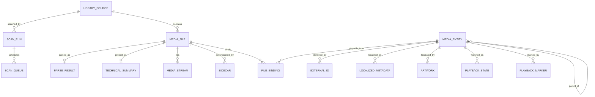
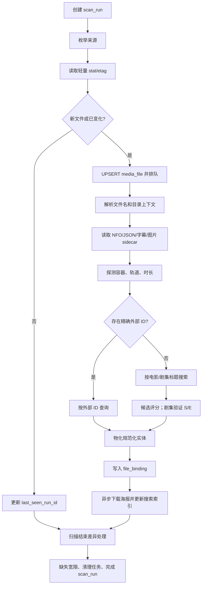

# 类 Infuse 媒体库：iOS、OHOS、Android 数据模型与扫描入库设计

> 凭据存储与同步说明：本文记录形成初版架构时的研究推导，其中所有 Credential Vault、E2EE envelope、设备批准和“凭据不得以明文进入 account.sqlite”的结论均已被 [ADR-0005](../../decisions/0005-synced-credential-storage.md) 和 [第三方凭据存储规范](../../../specs/security/credential-storage.md)取代。v1 使用可同步的明文 `CredentialRecord`，本文后续相关段落仅保留历史背景，不再是实现合同。

版本：1.2
日期：2026-08-14  
定位：面向本地文件、NAS 和媒体服务器的跨平台客户端；本设计为 clean-room 架构，不复制 Infuse 的私有实现。

配套详解：[`infuse_library_scan_rebuild_and_our_scanner_design.md`](./infuse_library_scan_rebuild_and_our_scanner_design.md) 进一步整理了 Infuse 8.5.1 的建库、扫描、触发、失败恢复和重建证据，并把它们落实为本 27 表方案的可执行扫描状态机。

## 1. 结论

三个平台都使用 SQLite 是可行且推荐的，但需要区分两个概念：

1. **共用数据模型和迁移 SQL：推荐。** iOS、OHOS、Android 使用相同的核心表名、字段语义、约束、索引和版本号。
2. **多设备直接共用同一个 SQLite 文件：不推荐。** 每台设备应维护自己的本地数据库，通过记录级同步交换用户状态。不要把活动数据库直接放到 iCloud Drive、网盘、WebDAV、SMB 或 NFS 上让多台设备同时打开。

推荐的最终方案是：

| 层 | 内容 | 是否可删除重建 | 是否参与跨设备同步 |
|---|---|---:|---:|
| `library.sqlite` | 文件索引、规范化影视实体、匹配关系、播放进度、收藏、扫描任务 | 否 | 只同步选择后的用户数据，不同步整个文件 |
| `account.sqlite` | 来源配置、E2EE 凭据 envelope、同步 outbox | 否 | 按记录同步配置和密文，不共享活动数据库文件 |
| `metadata_cache.sqlite` | TMDB 等接口原始响应、候选结果、图片下载登记 | 是 | 否 |
| `artwork/` | 海报、背景、Logo、剧照和派生缩略图 | 是 | 通常否 |
| 平台安全存储 | Stellar OAuth token、Vault 设备私钥和解锁材料 | 否 | 私钥不上传；只同步不可由服务端解开的 wrapped key |

这样既保留 Infuse 式的离线媒体库体验，也避免把缓存、图片和云同步状态混进一张巨型表。

## 2. 参考 Infuse 得到的架构启发

对本机安装的 Infuse 8.5.1 仅做了只读的数据库结构检查，没有读取媒体记录内容；另外对用户提供的同版本 iOS IPA 做了只读静态分析，没有修改、重签或运行时注入应用。可观察到的结构具有以下分层：

| Infuse 中可观察到的职责 | 可观察到的代表结构 | 本设计的对应模块 |
|---|---|---|
| 文件源与文件索引 | `VFSIndex`、`FileIndex`、`index_file_info` | `library_source`、`media_file` |
| 容器与音视频探测 | `meta_ffmpeg` | `technical_summary`、`media_stream` |
| 文件本地元数据 | `meta_local` | `parse_result`、`sidecar`、规范化元数据 |
| 在线元数据 | `meta_tmdb` | `external_id`、`localized_metadata`、`metadata_cache.sqlite` |
| 电影与剧集成品视图 | `meta_movie`、`meta_tvshow` | `media_entity`、`file_binding` 和查询 View/Repository |
| 剧/季/集缓存 | `cached_series`、`cached_seasons`、`cached_episodes` | 自引用的 `media_entity` 层级 |
| 海报与缩略图 | `ThumbnailsList`、`ThumbnailsRefs`、独立缩略图数据库 | `artwork` + `artwork/` 文件缓存 |
| 片头片尾标记 | `EpisodeMarkers_IDBAPP`、`EpisodeMarkers_TIDBORG` | `playback_marker` |
| 云同步状态 | 独立的 cloud-sync SQLite 数据库 | `change_log`、`sync_cursor`，执行记录级同步 |

### 2.1 Infuse 如何知道文件已经删除

先说明证据边界：InfusePlus 仓库不是 Infuse 的源代码。本节结论来自 Infuse 8.5.1（build 8.5.5726）安装包中的类名、日志字符串、SQL、ARM64 反汇编，以及本机 SQLite schema 的只读检查；没有修改 Infuse 数据，也没有执行真实文件删除测试。官方文档只确认 Auto Scan 会在启动和应用空闲时扫描，以反映新增、变化和删除的文件。[Firecore：Library Scanning & Indexing](https://support.firecore.com/hc/en-us/articles/27862264977047-Library-Scanning-Indexing)

Infuse 的主要判断方式不是“对每个旧文件发一次 `exists` 请求”，而是**当前扫描快照与旧索引做集合差分**：

1. `FCMIndexDAO` 为一个 VFS 来源或本次扫描覆盖的目录创建临时索引表。
2. 枚举器把本次实际看到的项目写进临时表，每项包含稳定 `ItemID`、路径、显示名、flags 和修改时间等。
3. 扫描成功进入合并阶段后，执行语义等价于下面的 SQL；`旧 FileIndex - 当前临时表` 就是本次确认消失的文件：

```sql
DELETE FROM FileIndex
WHERE ItemID IN (
    SELECT ItemID FROM FileIndex WHERE VFS_id = :vfs_id
    EXCEPT
    SELECT ItemID FROM :temporary_index
);
```

4. 目录级增量扫描不会拿一个子目录结果与整个来源相比。二进制中还有 `INCLUDED_ITEMS`、`EXCLUDED_ITEMS` 和父目录限定 SQL，只在本次成功覆盖的范围内做差分。
5. 同一个 `ItemID` 的 label 或 flags 改变时，旧索引行会删除后重建；只有 `ModificationDate` 改变时可以单独更新。这使改名、属性变化和内容更新与“完全消失”分开处理。

失败路径也单独存在：`FCMIndexer fetcher:didFailWithError:` 会记录失败并安排重新索引，网络索引器会停止当前 VFS；只有完成 crawling 的路径才出现“merge indexed content”。因此，高置信度结论是：**根目录不可达、授权失败、超时、取消或枚举未完成时，不应把不完整临时表作为删除依据**。这正是跨平台实现必须保留“扫描是否有资格协调缺失项”标志的原因。

此外，本地文件来源存在 `DirectoryWatcher.swift`、`OS_dispatch_source_vnode` 和 `LocalFileSystemsWatcher`，检测到变化后会通知界面更新。它可以更快触发刷新，但静态证据不能证明 watcher 事件本身直接删除数据库行；权威删除判断仍应由后续扫描/合并完成。SMB、WebDAV 和云盘没有本地 vnode 可监听，主要依赖自动或手动扫描。

Plex、Emby、Jellyfin 还需区分模式：Library Mode 会在设备上缓存索引并定期扫描；Direct Mode 按需读取服务器当前数据，因此服务端删除通常能更快反映，也不走完整的本地 TMDB 建库流程。Firecore 当前文档列出的扫描时机是启动时、前台每 15 分钟，以及 Apple TV 开启后台刷新时约每小时一次。[Firecore：Streaming from Plex, Emby, and Jellyfin](https://support.firecore.com/hc/en-us/articles/360006462093-Streaming-from-Plex-Emby-and-Jellyfin)

### 2.2 Infuse 确认文件消失后如何处理

Infuse 把“可播放文件索引”和“已匹配的影视元数据/用户状态”分开处理，并非一条级联删除全部数据：

| 层 | 观察到的处理 | 结论 |
|---|---|---|
| 主文件索引 | 成功扫描合并时，从 `FileIndex` 删除不在当前快照中的 `ItemID` | 普通媒体库不再把它当作可播放文件 |
| Spotlight | 查询 `FileIndex` 已不存在或 `Enabled=0` 的项目并清理 Spotlight 索引 | 系统搜索结果会随后台清理消失 |
| “正在播放/继续观看” | `FCUpNextCleanMissingItemsOperation` 明确处理 missing 和 invalid 项目 | 不可播放项目从 In Progress 列表移除或隐藏 |
| 电影/剧集元数据 | `meta_movie`、`meta_tvshow` 有 `MarkedForDeletion`；无启用文件且缓存过旧时先标记，之后再清理 | 元数据延迟回收，不与文件索引同步硬删 |
| 已看状态 | 不因服务器上的文件被移动或删除而清除 | 文件重新出现并匹配到同一身份时，可恢复已看状态 |
| Playlists / Collections | 从 Infuse 外部删除时，引用可能保留；在 Infuse 内明确删除文件时，一并从片单和合集移除 | 通过“是否有明确用户删除意图”区分临时不可用与永久删除 |

元数据回收可以从 `FCMergedMetadataDAO` 的 SQL 还原为两阶段流程：

```text
FileIndex 已无启用文件
  → DateCached 早于 now - 7 天：MarkedForDeletion = 1
  → 后续清理周期仍无启用文件且标记仍在：删除合并元数据
  → 清理前若元数据再次被加载/关联：MarkedForDeletion = 0，取消回收
```

7 天来自 `clearObsoleteMetadata` 中传给日期运算的 `-604800` 秒常量，并与 `DateCached < ?` 查询配合。实际删除时间是“至少达到门槛，再等下一次相应清理周期”，不能理解为精确到第 7 天自动删除。本机数据库中也能观察到非零的 `MarkedForDeletion=1` 记录，说明这不是未使用的遗留字段。

用户数据的保留策略有官方工作人员说明作为交叉验证：Firecore 表示，Infuse 不会因为服务器上的项目移动或删除而清除已看历史，因为无法判断文件是永久删除还是外接盘/服务器暂时不可用。[Firecore 社区：Memory of videos](https://community.firecore.com/t/memory-of-videos/56400) 对片单和合集，外部从 OneDrive 删除的项目按设计会继续保留引用；如果从 Infuse 内删除文件，则会同时移出 Playlists/Collections。[Firecore 社区：Duplicates in OneDrive still appear after being deleted](https://community.firecore.com/t/duplicates-in-onedrive-still-appear-after-being-deleted/48842)

因此，“影片删除”在 Infuse 中至少有四个不同结果：可播放索引较快移除、继续观看列表清理、在线元数据延迟回收、已看历史长期保留。片单/合集则取决于删除发生在 Infuse 外部还是由用户在 Infuse 内明确执行。

### 2.3 对本设计的直接约束

- 扫描必须保存覆盖范围和“本轮结果可用于判定缺失”标志，不能只看 `state='completed'`。
- 文件缺失采用成功快照差分；失败扫描只能标记来源 `offline` 或重试。
- `media_file`、可重建元数据、继续观看呈现和永久观看历史必须分层。
- 外部缺失不应立即改写用户片单；应用内明确删除最后一个可播放版本时，可以按产品策略同步移除片单引用，但要与“仅从媒体库排除”分开。
- 延迟标记、再次出现时撤销标记、下一轮再硬删，比一次扫描直接级联删除更安全。

这里借鉴的是**职责分离**，不是表结构复制。本设计还刻意做了几项调整：

- 电影、剧集、季、单集统一为规范化实体，减少重复字段。
- 一个文件可绑定多个实体，以支持 `S01E01-E02` 合集文件。
- 在线接口原始 JSON 放入可删除缓存库，不污染核心库。
- 播放状态与同步 outbox 位于同一核心事务中，避免“进度已更新但同步事件丢失”。
- 海报文件不以大 BLOB 形式塞入核心数据库。

### 2.4 iOS IPA 与 macOS 版的交叉验证

用户提供的 iOS IPA 同样是 Infuse 8.5.1 / build 5726，ARM64 主程序的 `cryptid=0`。将其与本机 macOS 8.5.1 主程序逐项比较后，电影解析、剧集候选生成、通用元数据请求链、在线 TMDB 请求入口和陈旧元数据清理等关键方法的 Objective-C 调用序列全部一致；标题正则、噪声 token、TMDB 路径/参数、代理域名、FileIndex 差分 SQL 也一致。iOS 版的元数据清理方法同样加载 `-604800` 秒常量。

普通文件的请求对象按 `FFmpeg/内嵌元数据 → EyeTV（适用时）→ 本地或用户覆盖 → online` 顺序加入复杂请求链，online 阶段对符合条件的视频创建 TMDB request。Plex、Emby/Jellyfin、iTunes、UPnP 和 deeplink 会先按来源协议分支，因此媒体服务器项目不应无条件再按普通文件走一遍 TMDB。

TMDB 初始主机是 `api.themoviedb.org`，v3 `api_key` 作为 HTTPS 查询参数发送；未发现额外的 HMAC/时间戳签名。代码同时提供 `movie-api.infuse.im`、`movie-api-north-yc.infuse.im` 以及图片代理，遇到 TMDB 受阻或特定网络/HTTP 错误时可回退。正确的设计抽象应是“直连优先、代理可回退”，而不是固定假定所有请求都直连或都经过 Infuse。

完整的样本校验、解析示例、请求链、TMDB 参数、其他 provider 和证据边界见独立报告 [Infuse iOS 8.5.1 静态分析](infuse_ios_8.5.1_static_analysis.md)。

## 3. 为什么三平台可以统一使用 SQLite

- Apple 明确说明 SQLite 可用于所有 Apple 平台；如果需要掌控真实 SQL 表结构，应使用 SQLite 接口或其薄封装。Core Data 虽可使用 SQLite 持久化，但 Apple 将其底层 store 格式视为私有格式，不适合作为三平台共享 DDL 的合同。[Apple Structured Data Models](https://developer.apple.com/documentation/technologyoverviews/structured-data-models)、[Core Data Persistent Store Types and Behaviors](https://developer.apple.com/library/archive/documentation/Cocoa/Conceptual/CoreData/PersistentStoreFeatures.html)
- Android 官方推荐 Room 作为 SQLite 上的持久化层，支持实体、DAO、事务和迁移；Room 仍允许按统一字段名建立相同的业务表。[Android Room](https://developer.android.com/training/data-storage/room/)
- OpenHarmony/HarmonyOS 的关系型数据库 RDB 底层也是 SQLite，支持事务、索引、外键、参数化查询和 SQL；实际工程使用目标 SDK 对应的 `relationalStore` API。[OpenHarmony RDB 概述](https://gitee.com/openharmony/docs/blob/319346524149aae5d198447750a3436206ace170/zh-cn/application-dev/database/database-relational-overview.md)

SQLite 的 WAL 适合“一写多读”的本机并发，但官方明确说明 WAL 不支持多主机网络文件系统，而且活动状态还包括 `-wal` 和 `-shm` 文件。因此数据库必须位于应用本机沙箱，跨设备交换的是记录，不是数据库文件。[SQLite WAL](https://www.sqlite.org/wal.html)

## 4. 数据库及文件布局

建议每个平台保持相同的逻辑布局：

```text
ApplicationData/
├── Database/
│   ├── library.sqlite
│   └── metadata_cache.sqlite
├── Artwork/
│   ├── original/ab/<sha256>.<ext>
│   └── derived/320x480/ab/<sha256>.<ext>
├── Logs/
└── Temp/
```

规则：

- `library.sqlite` 必须备份或由记录同步保护。
- `metadata_cache.sqlite`、`Artwork/derived` 可随时清除并重建。
- `Artwork/original` 也是缓存；若接口许可和网络成本允许，可以不备份。
- 数据库不能位于 NAS 或云盘同步目录。
- WAL 模式下备份数据库必须使用 SQLite backup API，或先完成 checkpoint 并关闭全部连接；不能只复制主 `.sqlite` 文件。

## 5. 跨平台字段格式合同

### 5.1 基本格式

| 语义 | SQLite | iOS / Swift | Android / Kotlin | OHOS / ArkTS | 约束 |
|---|---|---|---|---|---|
| 本地行 ID | `INTEGER` | `Int64` | `Long` | `number` | 仅设备内使用 |
| 跨设备 ID | `TEXT` | `String` | `String` | `string` | UUIDv7；小写带连字符 |
| 时间 | `INTEGER` | `Int64` | `Long` | `number` | Unix epoch 毫秒，UTC |
| 时长/位置 | `INTEGER` | `Int64` | `Long` | `number` | 毫秒 |
| 布尔值 | `INTEGER` | `Bool` 转换 | `Boolean` 转换 | `boolean` 转换 | 只允许 `0/1` |
| 比例/评分 | `REAL` | `Double` | `Double` | `number` | 不用字符串保存 |
| 文本 | `TEXT` | `String` | `String` | `string` | UTF-8 |
| 二进制句柄 | `BLOB` | `Data` | `ByteArray` | `Uint8Array` | 只用于平台访问句柄等 |
| JSON 扩展 | `TEXT` | `Codable` | kotlinx serialization | JSON | UTF-8、稳定 key 命名 |
| 语言 | `TEXT` | `Locale.Identifier` | BCP 47 tag | BCP 47 tag | 例如 `zh-CN`、`en-US`、`und` |
| 内容哈希 | `TEXT` | `String` | `String` | `string` | 小写十六进制 SHA-256 |

### 5.2 ID 规则

- SQLite 的整数 `id` 用于 JOIN 和本机查询性能。
- 每个需要同步或导出的对象同时拥有 `uid`，格式为 UUIDv7。
- 不得把本机整数 ID 发送到另一设备；导入时按 `uid` 查找或创建本机行。
- TMDB、IMDb、TVDB 等 ID 统一进入 `external_id`，不要把某一个供应商 ID 当成本地主键。
- TMDB 的电影、电视剧和单集 ID 位于不同命名空间，例如 `tmdb/movie`、`tmdb/tv`、`tmdb/episode`，防止数值碰撞。

### 5.3 路径与访问句柄

- `relative_path` 使用 `/` 作为逻辑分隔符，并采用 NFC Unicode 规范化；显示时仍保留 `display_name` 原文。
- `root_uri` 不得包含用户名、密码或 API 密钥。
- SMB、NFS、WebDAV 用“来源 ID + 规范化相对路径”定位，不把挂载后的临时 POSIX 路径当作跨设备身份。
- `access_handle` 是平台本地数据，不能跨设备同步：
  - iOS：目录选择器返回的 URL 对应 bookmark data；访问时配对调用 security-scoped resource 的 start/stop。[Apple：Providing Access to Directories](https://developer.apple.com/documentation/uikit/providing-access-to-directories)
  - Android：保存 SAF `content://` URI，并取得 persistable URI grant；文档移动或删除后授权仍可能失效。[Android Storage Access Framework](https://developer.android.com/training/data-storage/shared/documents-files)
  - OHOS：保存 Picker 返回的 URI，并通过目标系统版本支持的 FileShare 持久化授权；权限句柄仍是设备本地的。[HarmonyOS 文件授权持久化](https://developer.huawei.com/consumer/cn/doc/HarmonyOS-Guides/native-fileshare-guidelines)
- `library.sqlite` 只保存 `credential_ref`；它关联 `account.sqlite` 中可同步的 E2EE envelope。明文密码只在连接器使用时短暂解密，Vault 设备私钥和解锁材料位于 Keychain、Android Keystore 或 HUKS。

### 5.4 海报格式

- `artwork` 表保存 URL、哈希、尺寸、语言、选择状态和相对缓存路径。
- 下载的原图尽量保持服务端 MIME 类型和字节，不重复有损编码。
- 派生缩略图是平台缓存，可使用目标系统高效支持的 JPEG、PNG、WebP 或 HEIF；其格式不是同步合同。
- 带透明背景的 Logo 使用 PNG/WebP lossless，不强制转 JPEG。
- 文件名使用内容 SHA-256，按前两位分目录，避免单目录文件过多。

## 6. 核心库 `library.sqlite` 表结构

以下 DDL 是三平台共同合同。为了兼容不同系统内置的 SQLite 版本，不使用 `STRICT` table，也不要求 JSON1 或 FTS5。`PRAGMA foreign_keys=ON` 必须在**每条连接**打开后显式执行，因为 SQLite 不应依赖外键默认值。[SQLite Foreign Keys](https://www.sqlite.org/foreignkeys.html)

```sql
PRAGMA application_id = 0x4D4C4942; -- "MLIB"
PRAGMA user_version = 1;
PRAGMA foreign_keys = ON;
PRAGMA journal_mode = WAL;
PRAGMA synchronous = NORMAL;
PRAGMA busy_timeout = 5000;

CREATE TABLE schema_migration (
    version             INTEGER PRIMARY KEY,
    applied_at_ms       INTEGER NOT NULL,
    checksum            TEXT NOT NULL
);

CREATE TABLE library_source (
    id                  INTEGER PRIMARY KEY,
    uid                 TEXT NOT NULL UNIQUE,
    kind                TEXT NOT NULL CHECK (kind IN (
                            'local_folder', 'device_media', 'smb', 'nfs',
                            'webdav', 'ftp', 'plex', 'emby', 'jellyfin'
                        )),
    display_name        TEXT NOT NULL,
    root_uri            TEXT NOT NULL,
    access_handle       BLOB,
    credential_ref      TEXT,
    capabilities_json   TEXT,
    scan_policy         TEXT NOT NULL DEFAULT 'incremental'
                        CHECK (scan_policy IN ('manual', 'incremental', 'scheduled')),
    enabled             INTEGER NOT NULL DEFAULT 1 CHECK (enabled IN (0, 1)),
    created_at_ms       INTEGER NOT NULL,
    updated_at_ms       INTEGER NOT NULL,
    last_scan_at_ms     INTEGER,
    deleted_at_ms       INTEGER
);

CREATE TABLE scan_run (
    id                  INTEGER PRIMARY KEY,
    uid                 TEXT NOT NULL UNIQUE,
    source_id           INTEGER NOT NULL REFERENCES library_source(id) ON DELETE RESTRICT,
    mode                TEXT NOT NULL CHECK (mode IN ('full', 'incremental', 'repair')),
    state               TEXT NOT NULL CHECK (state IN (
                            'queued', 'enumerating', 'processing',
                            'finalizing', 'completed', 'cancelled', 'failed'
                        )),
    cursor_in           TEXT,
    cursor_out          TEXT,
    coverage_json       TEXT,
    reconcile_missing   INTEGER NOT NULL DEFAULT 0
                        CHECK (reconcile_missing IN (0, 1)),
    started_at_ms       INTEGER,
    finished_at_ms      INTEGER,
    discovered_count    INTEGER NOT NULL DEFAULT 0,
    changed_count       INTEGER NOT NULL DEFAULT 0,
    ready_count         INTEGER NOT NULL DEFAULT 0,
    error_count         INTEGER NOT NULL DEFAULT 0,
    error_summary       TEXT
);

CREATE INDEX idx_scan_run_source_time
    ON scan_run(source_id, started_at_ms DESC);

CREATE TABLE media_file (
    id                  INTEGER PRIMARY KEY,
    uid                 TEXT NOT NULL UNIQUE,
    source_id           INTEGER NOT NULL REFERENCES library_source(id) ON DELETE RESTRICT,
    stable_key          TEXT NOT NULL,
    parent_stable_key   TEXT,
    relative_path       TEXT NOT NULL,
    display_name        TEXT NOT NULL,
    extension           TEXT,
    mime_type           TEXT,
    size_bytes          INTEGER,
    modified_at_ms      INTEGER,
    created_at_ms       INTEGER,
    etag                TEXT,
    quick_hash          TEXT,
    full_hash           TEXT,
    availability        TEXT NOT NULL DEFAULT 'present'
                        CHECK (availability IN (
                            'present', 'offline', 'missing', 'excluded', 'deleted'
                        )),
    last_seen_run_id    INTEGER REFERENCES scan_run(id) ON DELETE SET NULL,
    missing_since_ms    INTEGER,
    missing_scan_count  INTEGER NOT NULL DEFAULT 0,
    parser_version      INTEGER NOT NULL DEFAULT 0,
    probe_version       INTEGER NOT NULL DEFAULT 0,
    indexed_at_ms       INTEGER,
    deleted_at_ms       INTEGER,
    updated_at_ms       INTEGER NOT NULL,
    UNIQUE(source_id, stable_key)
);

CREATE INDEX idx_media_file_source_path
    ON media_file(source_id, relative_path);
CREATE INDEX idx_media_file_source_availability
    ON media_file(source_id, availability);
CREATE INDEX idx_media_file_last_seen
    ON media_file(source_id, last_seen_run_id);
CREATE INDEX idx_media_file_quick_hash
    ON media_file(quick_hash) WHERE quick_hash IS NOT NULL;

CREATE TABLE sidecar (
    id                  INTEGER PRIMARY KEY,
    uid                 TEXT NOT NULL UNIQUE,
    media_file_id       INTEGER NOT NULL REFERENCES media_file(id) ON DELETE CASCADE,
    kind                TEXT NOT NULL CHECK (kind IN (
                            'nfo', 'metadata_json', 'poster', 'backdrop',
                            'logo', 'subtitle', 'chapters', 'other'
                        )),
    relative_path       TEXT NOT NULL,
    language            TEXT NOT NULL DEFAULT 'und',
    forced              INTEGER NOT NULL DEFAULT 0 CHECK (forced IN (0, 1)),
    modified_at_ms      INTEGER,
    sha256              TEXT,
    parsed_json         TEXT,
    UNIQUE(media_file_id, relative_path)
);

CREATE TABLE parse_result (
    media_file_id       INTEGER PRIMARY KEY REFERENCES media_file(id) ON DELETE CASCADE,
    media_kind          TEXT NOT NULL CHECK (media_kind IN (
                            'movie', 'episode', 'extra', 'unknown'
                        )),
    clean_title         TEXT,
    sort_title          TEXT,
    hint_year           INTEGER,
    season_number       INTEGER,
    episode_start       INTEGER,
    episode_end         INTEGER,
    edition             TEXT,
    release_group       TEXT,
    language_hint       TEXT,
    provider_hints_json TEXT,
    raw_tokens_json     TEXT,
    confidence          REAL NOT NULL DEFAULT 0.0,
    parser_version      INTEGER NOT NULL,
    updated_at_ms       INTEGER NOT NULL,
    CHECK (episode_end IS NULL OR episode_start IS NOT NULL),
    CHECK (episode_end IS NULL OR episode_end >= episode_start)
);

CREATE TABLE technical_summary (
    media_file_id       INTEGER PRIMARY KEY REFERENCES media_file(id) ON DELETE CASCADE,
    container           TEXT,
    duration_ms         INTEGER,
    overall_bitrate     INTEGER,
    video_codec         TEXT,
    width               INTEGER,
    height              INTEGER,
    frame_rate          REAL,
    hdr_profile         TEXT,
    audio_codec         TEXT,
    audio_channels      REAL,
    embedded_cover      INTEGER NOT NULL DEFAULT 0 CHECK (embedded_cover IN (0, 1)),
    probe_provider      TEXT NOT NULL,
    probe_version       INTEGER NOT NULL,
    probed_at_ms        INTEGER NOT NULL,
    extra_json          TEXT
);

CREATE TABLE media_stream (
    id                  INTEGER PRIMARY KEY,
    media_file_id       INTEGER NOT NULL REFERENCES media_file(id) ON DELETE CASCADE,
    stream_index        INTEGER NOT NULL,
    kind                TEXT NOT NULL CHECK (kind IN ('video', 'audio', 'subtitle', 'attachment')),
    codec               TEXT,
    language            TEXT NOT NULL DEFAULT 'und',
    title               TEXT,
    bit_rate            INTEGER,
    width               INTEGER,
    height              INTEGER,
    frame_rate          REAL,
    hdr_profile         TEXT,
    channel_count       REAL,
    channel_layout      TEXT,
    sample_rate         INTEGER,
    is_default          INTEGER NOT NULL DEFAULT 0 CHECK (is_default IN (0, 1)),
    is_forced           INTEGER NOT NULL DEFAULT 0 CHECK (is_forced IN (0, 1)),
    extra_json          TEXT,
    UNIQUE(media_file_id, stream_index)
);

CREATE INDEX idx_media_stream_file_kind
    ON media_stream(media_file_id, kind);

CREATE TABLE media_entity (
    id                  INTEGER PRIMARY KEY,
    uid                 TEXT NOT NULL UNIQUE,
    kind                TEXT NOT NULL CHECK (kind IN (
                            'movie', 'series', 'season', 'episode', 'extra'
                        )),
    parent_id           INTEGER REFERENCES media_entity(id) ON DELETE RESTRICT,
    canonical_title     TEXT NOT NULL,
    original_title      TEXT,
    sort_title          TEXT,
    original_language   TEXT NOT NULL DEFAULT 'und',
    year                INTEGER,
    season_number       INTEGER,
    episode_number      INTEGER,
    episode_end_number  INTEGER,
    release_date        TEXT,
    runtime_ms          INTEGER,
    status              TEXT NOT NULL DEFAULT 'active'
                        CHECK (status IN ('active', 'unmatched', 'obsolete', 'deleted')),
    metadata_state      TEXT NOT NULL DEFAULT 'partial'
                        CHECK (metadata_state IN ('none', 'partial', 'complete', 'manual')),
    locked_fields_json  TEXT,
    created_at_ms       INTEGER NOT NULL,
    updated_at_ms       INTEGER NOT NULL,
    deleted_at_ms       INTEGER,
    CHECK ((kind IN ('movie', 'series') AND parent_id IS NULL)
        OR (kind IN ('season', 'episode', 'extra') AND parent_id IS NOT NULL))
);

CREATE UNIQUE INDEX uq_media_season
    ON media_entity(parent_id, season_number)
    WHERE kind = 'season';
CREATE UNIQUE INDEX uq_media_episode
    ON media_entity(parent_id, episode_number)
    WHERE kind = 'episode';
CREATE INDEX idx_media_entity_kind_sort
    ON media_entity(kind, sort_title, canonical_title);
CREATE INDEX idx_media_entity_parent
    ON media_entity(parent_id);

CREATE TABLE file_binding (
    media_file_id       INTEGER NOT NULL REFERENCES media_file(id) ON DELETE CASCADE,
    entity_id           INTEGER NOT NULL REFERENCES media_entity(id) ON DELETE RESTRICT,
    binding_role        TEXT NOT NULL DEFAULT 'primary'
                        CHECK (binding_role IN ('primary', 'contained', 'version', 'extra')),
    match_method        TEXT NOT NULL CHECK (match_method IN (
                            'manual', 'sidecar_id', 'filename_id', 'provider_search',
                            'media_server', 'inherited'
                        )),
    confidence          REAL NOT NULL,
    matched_query       TEXT,
    locked              INTEGER NOT NULL DEFAULT 0 CHECK (locked IN (0, 1)),
    decided_at_ms       INTEGER NOT NULL,
    PRIMARY KEY(media_file_id, entity_id)
);

CREATE UNIQUE INDEX uq_file_primary_binding
    ON file_binding(media_file_id)
    WHERE binding_role = 'primary';
CREATE INDEX idx_file_binding_entity
    ON file_binding(entity_id);

CREATE TABLE external_id (
    entity_id           INTEGER NOT NULL REFERENCES media_entity(id) ON DELETE CASCADE,
    provider            TEXT NOT NULL,
    namespace           TEXT NOT NULL,
    external_value      TEXT NOT NULL,
    is_primary          INTEGER NOT NULL DEFAULT 0 CHECK (is_primary IN (0, 1)),
    updated_at_ms       INTEGER NOT NULL,
    PRIMARY KEY(entity_id, provider, namespace),
    UNIQUE(provider, namespace, external_value)
);

CREATE INDEX idx_external_id_lookup
    ON external_id(provider, namespace, external_value);

CREATE TABLE localized_metadata (
    entity_id           INTEGER NOT NULL REFERENCES media_entity(id) ON DELETE CASCADE,
    locale              TEXT NOT NULL,
    title               TEXT NOT NULL,
    sort_title          TEXT,
    overview            TEXT,
    tagline             TEXT,
    content_rating      TEXT,
    provider            TEXT NOT NULL,
    provider_updated_at_ms INTEGER,
    materialized_at_ms  INTEGER NOT NULL,
    PRIMARY KEY(entity_id, locale)
);

CREATE TABLE genre (
    id                  INTEGER PRIMARY KEY,
    uid                 TEXT NOT NULL UNIQUE,
    provider            TEXT NOT NULL,
    provider_key        TEXT NOT NULL,
    UNIQUE(provider, provider_key)
);

CREATE TABLE genre_name (
    genre_id            INTEGER NOT NULL REFERENCES genre(id) ON DELETE CASCADE,
    locale              TEXT NOT NULL,
    name                TEXT NOT NULL,
    PRIMARY KEY(genre_id, locale)
);

CREATE TABLE entity_genre (
    entity_id           INTEGER NOT NULL REFERENCES media_entity(id) ON DELETE CASCADE,
    genre_id            INTEGER NOT NULL REFERENCES genre(id) ON DELETE CASCADE,
    position            INTEGER NOT NULL DEFAULT 0,
    PRIMARY KEY(entity_id, genre_id)
);

CREATE INDEX idx_entity_genre_genre
    ON entity_genre(genre_id, entity_id);

CREATE TABLE person (
    id                  INTEGER PRIMARY KEY,
    uid                 TEXT NOT NULL UNIQUE,
    display_name        TEXT NOT NULL,
    sort_name           TEXT,
    profile_url         TEXT
);

CREATE TABLE credit (
    entity_id           INTEGER NOT NULL REFERENCES media_entity(id) ON DELETE CASCADE,
    person_id           INTEGER NOT NULL REFERENCES person(id) ON DELETE CASCADE,
    credit_kind         TEXT NOT NULL CHECK (credit_kind IN ('cast', 'director', 'writer', 'crew')),
    role_name           TEXT NOT NULL DEFAULT '',
    department          TEXT,
    position            INTEGER NOT NULL DEFAULT 0,
    provider_credit_id  TEXT,
    PRIMARY KEY(entity_id, person_id, credit_kind, role_name)
);

CREATE INDEX idx_credit_person
    ON credit(person_id, entity_id);

CREATE TABLE artwork (
    id                  INTEGER PRIMARY KEY,
    uid                 TEXT NOT NULL UNIQUE,
    entity_id           INTEGER NOT NULL REFERENCES media_entity(id) ON DELETE CASCADE,
    kind                TEXT NOT NULL CHECK (kind IN (
                            'poster', 'backdrop', 'logo', 'still', 'banner', 'thumbnail'
                        )),
    locale              TEXT NOT NULL DEFAULT 'und',
    provider            TEXT NOT NULL,
    remote_url          TEXT,
    sha256              TEXT,
    local_relative_path TEXT,
    mime_type           TEXT,
    width               INTEGER,
    height              INTEGER,
    score               REAL,
    is_selected         INTEGER NOT NULL DEFAULT 0 CHECK (is_selected IN (0, 1)),
    fetched_at_ms       INTEGER,
    updated_at_ms       INTEGER NOT NULL
);

CREATE UNIQUE INDEX uq_artwork_remote
    ON artwork(entity_id, kind, provider, remote_url)
    WHERE remote_url IS NOT NULL;
CREATE UNIQUE INDEX uq_artwork_selected
    ON artwork(entity_id, kind, locale)
    WHERE is_selected = 1;
CREATE INDEX idx_artwork_sha256
    ON artwork(sha256) WHERE sha256 IS NOT NULL;

CREATE TABLE playback_profile (
    id                  INTEGER PRIMARY KEY,
    uid                 TEXT NOT NULL UNIQUE,
    display_name        TEXT NOT NULL,
    is_default          INTEGER NOT NULL DEFAULT 0 CHECK (is_default IN (0, 1)),
    created_at_ms       INTEGER NOT NULL,
    updated_at_ms       INTEGER NOT NULL
);

CREATE UNIQUE INDEX uq_default_profile
    ON playback_profile(is_default)
    WHERE is_default = 1;

CREATE TABLE playback_state (
    profile_id          INTEGER NOT NULL REFERENCES playback_profile(id) ON DELETE CASCADE,
    entity_id           INTEGER NOT NULL REFERENCES media_entity(id) ON DELETE RESTRICT,
    media_file_id       INTEGER REFERENCES media_file(id) ON DELETE SET NULL,
    position_ms         INTEGER NOT NULL DEFAULT 0,
    duration_ms         INTEGER,
    completed           INTEGER NOT NULL DEFAULT 0 CHECK (completed IN (0, 1)),
    play_count          INTEGER NOT NULL DEFAULT 0,
    last_played_at_ms   INTEGER,
    updated_at_ms       INTEGER NOT NULL,
    revision            INTEGER NOT NULL DEFAULT 1,
    PRIMARY KEY(profile_id, entity_id)
);

CREATE INDEX idx_playback_state_recent
    ON playback_state(profile_id, last_played_at_ms DESC)
    WHERE last_played_at_ms IS NOT NULL;

CREATE TABLE playback_marker (
    entity_id           INTEGER NOT NULL REFERENCES media_entity(id) ON DELETE CASCADE,
    kind                TEXT NOT NULL CHECK (kind IN (
                            'intro', 'recap', 'credits', 'outro', 'commercial', 'chapter'
                        )),
    ordinal             INTEGER NOT NULL DEFAULT 0,
    start_ms            INTEGER NOT NULL,
    end_ms              INTEGER,
    provider            TEXT NOT NULL,
    confidence          REAL,
    submissions         INTEGER,
    updated_at_ms       INTEGER NOT NULL,
    PRIMARY KEY(entity_id, kind, ordinal, provider),
    CHECK (end_ms IS NULL OR end_ms >= start_ms)
);

CREATE TABLE media_collection (
    id                  INTEGER PRIMARY KEY,
    uid                 TEXT NOT NULL UNIQUE,
    kind                TEXT NOT NULL CHECK (kind IN ('manual', 'provider', 'smart')),
    title               TEXT NOT NULL,
    sort_title          TEXT,
    rule_json           TEXT,
    provider            TEXT,
    provider_key        TEXT,
    created_at_ms       INTEGER NOT NULL,
    updated_at_ms       INTEGER NOT NULL,
    deleted_at_ms       INTEGER
);

CREATE TABLE collection_item (
    collection_id       INTEGER NOT NULL REFERENCES media_collection(id) ON DELETE CASCADE,
    entity_id           INTEGER NOT NULL REFERENCES media_entity(id) ON DELETE RESTRICT,
    position            INTEGER NOT NULL DEFAULT 0,
    added_at_ms         INTEGER NOT NULL,
    PRIMARY KEY(collection_id, entity_id)
);

CREATE INDEX idx_collection_item_entity
    ON collection_item(entity_id);

CREATE TABLE scan_queue (
    id                  INTEGER PRIMARY KEY,
    run_id              INTEGER NOT NULL REFERENCES scan_run(id) ON DELETE CASCADE,
    media_file_id       INTEGER NOT NULL REFERENCES media_file(id) ON DELETE CASCADE,
    stage               TEXT NOT NULL CHECK (stage IN (
                            'parse', 'probe', 'local_metadata', 'match',
                            'materialize', 'artwork', 'search_index'
                        )),
    state               TEXT NOT NULL DEFAULT 'queued'
                        CHECK (state IN ('queued', 'running', 'retry', 'done', 'failed')),
    priority            INTEGER NOT NULL DEFAULT 0,
    attempts            INTEGER NOT NULL DEFAULT 0,
    next_attempt_at_ms  INTEGER,
    lease_until_ms      INTEGER,
    error_code          TEXT,
    error_message       TEXT,
    updated_at_ms       INTEGER NOT NULL,
    UNIQUE(run_id, media_file_id, stage)
);

CREATE INDEX idx_scan_queue_dispatch
    ON scan_queue(state, next_attempt_at_ms, priority DESC, id);

CREATE TABLE search_document (
    entity_id           INTEGER PRIMARY KEY REFERENCES media_entity(id) ON DELETE CASCADE,
    title               TEXT NOT NULL,
    aliases             TEXT NOT NULL DEFAULT '',
    people              TEXT NOT NULL DEFAULT '',
    genres              TEXT NOT NULL DEFAULT '',
    romanized           TEXT NOT NULL DEFAULT '',
    updated_at_ms       INTEGER NOT NULL
);

CREATE TABLE change_log (
    seq                 INTEGER PRIMARY KEY AUTOINCREMENT,
    event_uid           TEXT NOT NULL UNIQUE,
    entity_type         TEXT NOT NULL,
    entity_uid          TEXT NOT NULL,
    operation           TEXT NOT NULL CHECK (operation IN ('upsert', 'delete')),
    payload_json        TEXT,
    device_uid          TEXT NOT NULL,
    modified_at_ms      INTEGER NOT NULL,
    uploaded_at_ms      INTEGER,
    retry_count         INTEGER NOT NULL DEFAULT 0
);

CREATE INDEX idx_change_log_pending
    ON change_log(uploaded_at_ms, seq);

CREATE TABLE sync_cursor (
    backend             TEXT NOT NULL,
    scope               TEXT NOT NULL,
    cursor_blob         BLOB,
    updated_at_ms       INTEGER NOT NULL,
    PRIMARY KEY(backend, scope)
);
```

### 6.1 27 张核心表的数据字典

这里的“27 张”只计算 `library.sqlite` 的业务表，不包含 SQLite 内部表、索引、View、FTS 派生表，也不包含 `metadata_cache.sqlite` 的 3 张可删除缓存表。

| 分组 | 表 | 作用与一行代表什么 | 主要关联 | 删除原则 |
|---|---|---|---|---|
| 数据库管理 | `schema_migration` | 一行代表一次已经成功应用的 schema 迁移，保存版本、时间和 SQL 校验值 | 独立表；与 `PRAGMA user_version` 共同校验版本 | 不随媒体删除；只在重建整个数据库时删除 |
| 来源与扫描 | `library_source` | 一行代表一个本地目录、设备媒体集合、NAS 或媒体服务器来源 | 父级：`scan_run`、`media_file` | 默认软删除；有扫描或文件记录时外键禁止直接硬删 |
| 来源与扫描 | `scan_run` | 一行代表一次完整、增量或修复扫描，保存统计、cursor、覆盖范围和本轮能否协调缺失项 | 属于 `library_source`；拥有 `scan_queue`；被 `media_file.last_seen_run_id` 引用 | 可按保留期清理；删除会级联任务并把文件的 last-seen 引用置空 |
| 文件层 | `media_file` | 一行代表来源中的一个可播放物理文件或服务器 item，并保存最后一次看见、首次缺失和连续缺失次数 | 属于 `library_source`；拥有 sidecar、解析、探测、轨道和绑定 | 先 `missing/excluded/deleted`，宽限后硬删；硬删只清文件派生数据，不直接删影视实体和播放历史 |
| 文件层 | `sidecar` | 一行代表某媒体文件的一份 NFO、字幕、本地图片或章节伴随文件 | 从属于 `media_file` | 随媒体文件级联删除；单个 sidecar 消失时只删对应行 |
| 文件层 | `parse_result` | 一行代表当前解析器对一个文件名和目录上下文的结构化推断 | 与 `media_file` 一对零或一 | 可重建；随文件级联删除 |
| 文件层 | `technical_summary` | 一行代表一个文件的容器、时长、主要视频/音频和显示摘要 | 与 `media_file` 一对零或一 | 可重建；随文件级联删除 |
| 文件层 | `media_stream` | 一行代表文件中的一条视频、音频、字幕或附件轨道 | `media_file` 一对多 | 可重建；随文件级联删除 |
| 影视实体 | `media_entity` | 一行代表 movie、series、season、episode 或 extra 之一，是海报墙和播放历史的规范化身份 | 自引用形成 series → season → episode；被绑定、元数据和用户状态引用 | 默认保留；只有无文件、无子实体、无进度、无片单和无受保护人工数据时才允许底向上回收 |
| 影视实体 | `file_binding` | 一行代表一个文件与一个影视实体的匹配，并记录方法、置信度和是否人工锁定 | `media_file` 与 `media_entity` 的多对多桥表 | 文件硬删时级联删除；反方向使用 `RESTRICT`，防止删除仍有文件的实体 |
| 影视元数据 | `external_id` | 一行代表某实体在 TMDB、IMDb、TVDB 等供应商命名空间中的一个 ID | `media_entity` 一对多 | 属于可重新获取的身份元数据；实体确认回收时级联删除 |
| 影视元数据 | `localized_metadata` | 一行代表某实体在一个 locale 下的标题、简介、宣传语和分级 | `media_entity` 一对多，`(entity, locale)` 唯一 | 可刷新；实体确认回收时级联删除，人工锁定内容需先解除保护 |
| 影视元数据 | `genre` | 一行代表一个供应商类型概念的稳定身份 | 拥有 `genre_name`；通过 `entity_genre` 关联实体 | 仅在没有关联或由元数据清理任务确认后回收 |
| 影视元数据 | `genre_name` | 一行代表一个类型在一个 locale 下的显示名称 | 从属于 `genre` | 随类型级联删除，可从供应商重建 |
| 影视元数据 | `entity_genre` | 一行代表一个影视实体属于一个类型 | `media_entity` 与 `genre` 的多对多桥表 | 任一端被确认删除时级联删除 |
| 影视元数据 | `person` | 一行代表一个去重后的演员、导演、编剧或工作人员 | 通过 `credit` 关联实体 | 先删无效 credit；仅在零 credit 且无人工资料时回收孤立人物 |
| 影视元数据 | `credit` | 一行代表某人在某作品中的一种职能或角色 | `media_entity` 与 `person` 的多对多桥表 | 任一端确认删除时级联删除，可从供应商重建 |
| 图片 | `artwork` | 一行代表实体的一张海报、背景、Logo、剧照或缩略图及其缓存路径 | `media_entity` 一对多 | 记录随实体级联；图片文件按引用计数/哈希清理，不能只删文件不清路径 |
| 用户状态 | `playback_profile` | 一行代表一个本地播放档案或家庭成员 | 拥有 `playback_state` | 只有用户明确删除档案时才删；会级联该档案全部进度，必须确认并生成同步 tombstone |
| 用户状态 | `playback_state` | 一行代表一个档案对一部电影或一集的进度、完成状态和播放次数 | 属于 profile 和 entity；可选记住最近播放的 `media_file` | 删除文件只把 `media_file_id` 置空；删除实体被 `RESTRICT` 阻止，历史需显式“忘记” |
| 播放辅助 | `playback_marker` | 一行代表实体的一个片头、回顾、片尾、广告或章节时间段 | `media_entity` 一对多 | 在线来源可重建；人工 marker 视为用户数据，实体回收前需单独判断 |
| 片单 | `media_collection` | 一行代表一个手动、供应商或智能片单 | 拥有 `collection_item` | 支持软删除；确认硬删后级联删除成员关系，不删除成员实体 |
| 片单 | `collection_item` | 一行代表片单包含一个影视实体及排序位置 | `media_collection` 与 `media_entity` 的多对多桥表 | 删除片单时级联；实体侧 `RESTRICT`，避免静默破坏用户片单 |
| 任务 | `scan_queue` | 一行代表一个文件在一次扫描中的一个 parse/probe/match 等待办阶段 | 同时属于 `scan_run` 与 `media_file` | 运行或文件删除时级联；完成任务可按保留期清理 |
| 搜索 | `search_document` | 一行代表一个实体聚合后的标题、别名、人物、类型和罗马字搜索文档 | 与 `media_entity` 一对零或一 | 完全可重建；随实体级联删除 |
| 同步 | `change_log` | 一行代表一个等待上传或已上传的 upsert/delete 事件，即 transactional outbox | 故意不设本机整数外键，使用跨设备 UID | 不随目标行级联；上传确认并超过 tombstone 保留期后清理 |
| 同步 | `sync_cursor` | 一行代表某同步后端和 scope 已消费到的远端 cursor | 独立表，cursor 为不透明 BLOB | 断开同步或重建同步状态时删除；与媒体删除无关 |

这 27 张表中，真正属于“用户不可随意丢失的数据”主要是 `playback_state`、手动 `media_collection`/`collection_item`、人工锁定的 `file_binding`/字段/marker，以及尚未上传的 `change_log`。解析、探测、在线元数据、图片和搜索文档原则上都可重建，但仍应通过后台回收而不是在 UI 操作中大范围同步删除。

### 6.2 表之间的核心关系



### 6.3 完整关联规则与外键动作

| 父对象 | 子对象或引用方 | 基数 | `ON DELETE` | 设计含义 |
|---|---|---:|---|---|
| `library_source` | `media_file` | 1:N | `RESTRICT` | 不能误删来源并连带清空文件索引，来源回收必须走显式事务 |
| `library_source` | `scan_run` | 1:N | `RESTRICT` | 先处理扫描历史，再硬删来源 |
| `scan_run` | `scan_queue` | 1:N | `CASCADE` | 删除一次扫描可清除它的任务 |
| `scan_run` | `media_file.last_seen_run_id` | 1:N，可空 | `SET NULL` | 清理扫描历史不等于删除文件 |
| `media_file` | `sidecar`、`parse_result`、`technical_summary`、`media_stream`、`scan_queue` | 1:N 或 1:1 | `CASCADE` | 这些都是文件拥有的派生记录 |
| `media_file` | `file_binding` | 1:N | `CASCADE` | 文件记录硬删后解除其影视绑定 |
| `media_file` | `playback_state.media_file_id` | 1:N，可空 | `SET NULL` | 文件消失仍保留按实体保存的观看历史 |
| `media_entity` | 子 `media_entity` | 1:N | `RESTRICT` | series/season 必须等子实体处理后才能底向上回收 |
| `media_entity` | `file_binding` | 1:N | `RESTRICT` | 有可播放文件时禁止删除影视实体 |
| `media_entity` | `playback_state` | 1:N | `RESTRICT` | 有观看历史时禁止静默删除实体 |
| `media_entity` | `collection_item` | 1:N | `RESTRICT` | 有用户片单引用时禁止静默删除实体 |
| `media_entity` | `external_id`、`localized_metadata`、`entity_genre`、`credit`、`artwork`、`playback_marker`、`search_document` | 1:N 或 1:1 | `CASCADE` | 实体通过全部保护条件并确认回收后，清理其派生元数据 |
| `genre` | `genre_name`、`entity_genre` | 1:N | `CASCADE` | 类型回收时清理名称和关联 |
| `person` | `credit` | 1:N | `CASCADE` | 人物回收时清理演职员关系；实际 GC 只回收孤立人物 |
| `playback_profile` | `playback_state` | 1:N | `CASCADE` | 删除档案是一项显式用户数据删除操作 |
| `media_collection` | `collection_item` | 1:N | `CASCADE` | 删除片单只删除成员关系，不删除影视实体 |

`change_log` 和 `sync_cursor` 没有整数外键是刻意设计：目标业务行物理删除后，删除事件仍必须存在并上传，否则离线设备会把旧数据重新同步回来。

### 6.4 为什么不把所有字段放进电影表和剧集表

规范化模型解决以下问题：

- 同一影片有 1080p、4K、导演剪辑版等多个文件时，影视元数据只存一份，技术参数按文件保存。
- 多集文件可以关联多个 episode 实体。
- 切换 `zh-CN`、`en-US` 时只切换 `localized_metadata`，不复制整个文件记录。
- TMDB ID、IMDb ID、TVDB ID 可以并存。
- 换元数据供应商时不会破坏本地文件索引和播放状态。

## 7. 缓存库 `metadata_cache.sqlite`

缓存库不建立指向 `library.sqlite` 的外键。跨库引用使用 `file_uid` 或 `entity_uid`，因为 WAL 下多个 attached database 的组合事务不应被当作原子整体。

```sql
PRAGMA application_id = 0x4D434143; -- "MCAC"
PRAGMA user_version = 1;
PRAGMA journal_mode = WAL;
PRAGMA synchronous = NORMAL;
PRAGMA busy_timeout = 5000;

CREATE TABLE provider_response_cache (
    request_key         TEXT PRIMARY KEY,
    provider            TEXT NOT NULL,
    endpoint            TEXT NOT NULL,
    request_fingerprint TEXT NOT NULL,
    locale              TEXT NOT NULL DEFAULT 'und',
    http_status         INTEGER NOT NULL,
    etag                TEXT,
    last_modified       TEXT,
    response_json       TEXT,
    fetched_at_ms       INTEGER NOT NULL,
    expires_at_ms       INTEGER NOT NULL,
    error_count         INTEGER NOT NULL DEFAULT 0
);

CREATE INDEX idx_provider_cache_expiry
    ON provider_response_cache(expires_at_ms);

CREATE TABLE match_candidate_cache (
    file_uid            TEXT NOT NULL,
    provider            TEXT NOT NULL,
    entity_kind         TEXT NOT NULL,
    provider_id         TEXT NOT NULL,
    candidate_title     TEXT NOT NULL,
    candidate_year      INTEGER,
    season_number       INTEGER,
    episode_number      INTEGER,
    score               REAL NOT NULL,
    rank                INTEGER NOT NULL,
    raw_fragment_json   TEXT,
    created_at_ms       INTEGER NOT NULL,
    PRIMARY KEY(file_uid, provider, entity_kind, provider_id)
);

CREATE INDEX idx_match_candidate_rank
    ON match_candidate_cache(file_uid, score DESC, rank);

CREATE TABLE artwork_cache_file (
    sha256              TEXT PRIMARY KEY,
    relative_path       TEXT NOT NULL UNIQUE,
    mime_type           TEXT NOT NULL,
    width               INTEGER,
    height              INTEGER,
    size_bytes          INTEGER NOT NULL,
    last_access_at_ms   INTEGER NOT NULL
);
```

缓存策略：

- 以“供应商 + endpoint + 排序后的查询参数 + locale”计算 `request_key`。
- 支持 `ETag` / `Last-Modified` 条件请求。
- 404 采用短期 negative cache，429/5xx 使用指数退避。
- 原始响应遵守供应商缓存、署名和使用条款；TMDB 对应用认证、开发者/商业使用及署名有明确要求。[TMDB Authentication](https://developer.themoviedb.org/docs/authentication-application)、[TMDB FAQ](https://developer.themoviedb.org/docs/faq)
- 缓存清理不能删除 `library.sqlite` 中已经物化的用户选择结果。

## 8. 三个平台的具体实现

### 8.1 iOS / iPadOS

| 项目 | 设计 |
|---|---|
| 数据库实现 | 使用系统 `sqlite3` C API 或保持 SQL 语义的薄封装；不以 Core Data/SwiftData 的私有 SQLite 格式作为跨平台合同 |
| 数据库位置 | Application Support 下的应用私有目录；缓存库和派生图片标记为可清理/不参与备份 |
| 并发 | 一个串行 writer actor/queue；读取连接池；所有 UI 查询异步 |
| 目录来源 | `UIDocumentPickerViewController` + bookmark/access handle；应用沙箱内文件直接使用 URL |
| 本机视频 | 用户选择目录或导入应用沙箱；不要假设能任意遍历系统文件 |
| 凭据 | E2EE envelope 位于 `account.sqlite`；Vault 解锁材料位于 Keychain；媒体库表只放 `credential_ref` |
| 媒体探测 | AVFoundation 获取系统可见属性；需要完整容器/字幕信息时使用统一的 FFmpeg/MediaInfo 核心 |
| 后台扫描 | 短任务增量化、可恢复；遇到系统挂起时释放文件访问和 DB 事务 |

Apple 建议高频数据库写入使用事务、合适索引并可采用 WAL；这与本设计的“网络和探测在事务外、短事务集中提交”一致。[Apple：Reducing Disk Writes](https://developer.apple.com/documentation/xcode/reducing-disk-writes)

### 8.2 Android

| 项目 | 设计 |
|---|---|
| 数据库实现 | Room；`@Entity(tableName=...)`、列名、索引和外键与公共 DDL 对齐 |
| Room 附加表 | 允许 Room 自己维护 `room_master_table`；它不属于跨平台业务模型 |
| 迁移 | 每个版本提供显式 `Migration`，导出 Room schema，并在设备 SQLite 上测试迁移 |
| 并发 | `Dispatchers.IO` + Room transaction；禁止主线程查询；由单一扫描协调器控制写入 |
| 目录来源 | SAF `ACTION_OPEN_DOCUMENT_TREE` + persistable URI permission |
| 设备视频 | 可从 `MediaStore.Video` 增量枚举；保存 `content://` URI，不拼接伪文件路径 |
| 凭据 | E2EE envelope 位于 `account.sqlite`；Vault 解锁材料由 Android Keystore 保护；媒体库表只放 `credential_ref` |
| 后台扫描 | WorkManager；每批可中断，保存 cursor 和 lease，遵守电量与网络约束 |

Android 的 `MediaStore` 是系统媒体索引，适合扫描设备共享视频；SAF 适合用户选择的目录和文档供应商。[Android MediaStore](https://developer.android.com/training/data-storage/shared/media)、[Android SAF](https://developer.android.com/training/data-storage/shared/documents-files)

### 8.3 OHOS / HarmonyOS NEXT

| 项目 | 设计 |
|---|---|
| 数据库实现 | `relationalStore` / `RdbStore`；新 SDK 通常从 `@kit.ArkData` 导入，旧 OpenHarmony SDK 名称按目标 API 适配 |
| 建库 | `getRdbStore` 后按 `user_version` 顺序执行同一套 migration SQL |
| 并发 | WorkerTaskPool 执行枚举/解析/探测，RDB 提交通过单 writer 队列；不并发开启长写事务 |
| 目录来源 | Picker/FileShare URI；需要重启后继续访问时申请并保存持久化授权 |
| 凭据 | E2EE envelope 位于 `account.sqlite`；Vault 解锁材料由 HUKS 或系统安全能力保护；媒体库表只放 `credential_ref` |
| 媒体探测 | 系统媒体 API 读取基础属性；复杂容器继续复用统一 native 探测核心 |
| 后台扫描 | 使用目标设备类型允许的后台任务能力，分批保存 cursor，前台恢复 |

OHOS RDB 默认就是基于 SQLite 的关系型本地存储，并支持 WAL 和 SQL 能力；仍应按目标 API 和设备类型验证连接数、后台任务以及可用编译选项。[OpenHarmony RDB 概述](https://gitee.com/openharmony/docs/blob/319346524149aae5d198447750a3436206ace170/zh-cn/application-dev/database/database-relational-overview.md)

### 8.4 公共业务层与平台适配层

推荐拆分为：

```text
Domain
├── FilenameParser
├── MatchScorer
├── MetadataNormalizer
├── ScanStateMachine
└── SyncMergePolicy

Ports
├── DatabasePort
├── FileSourcePort
├── MediaProbePort
├── MetadataProviderPort
├── ArtworkStorePort
└── CredentialStorePort

Adapters
├── iOS: SQLite + URL/Bookmark + AVFoundation
├── Android: Room + SAF/MediaStore + MediaExtractor
└── OHOS: RdbStore + Picker/FileShare + Media APIs
```

如果三端分别使用 Swift、Kotlin、ArkTS，应共享：

- `schema/*.sql` 迁移文件；
- 文件名解析的 JSON 测试向量；
- 匹配评分的输入/预期结果；
- 同步 envelope JSON Schema；
- 字段枚举和错误码清单。

不要试图共享：

- 数据库连接对象；
- iOS bookmark、Android `content://` 权限、OHOS FileShare 授权；
- 系统绝对路径；
- 平台派生缩略图；
- 平台安全存储中的 Vault 私钥、解锁材料和本地 alias（稳定 `credential_uid` 可以同步）。

数据库约束以外，Repository 还必须验证这些领域不变量：season 的父实体只能是 series，episode 的父实体只能是 season，播放进度只直接挂在 movie/episode 上，extra 必须有 owner。之所以不使用触发器强制这些规则，是为了让三平台迁移保持简单，并让错误能够以业务错误码返回。

## 9. 扫描与入库状态机



### 9.1 阶段 0：来源注册

1. 用户选择本地目录、设备媒体、NAS 或媒体服务器。
2. 平台适配器取得访问授权；账号凭据在客户端加密成 envelope，写入 `account.sqlite` 并进入同步 outbox。
3. `library_source` 写入协议、显示名、无密钥的 root URI、能力 JSON 和稳定 `credential_ref`。
4. 执行连接测试和只读能力检测，不立即开启超长事务。

`capabilities_json` 可描述：

```json
{
  "stableFileId": true,
  "etag": true,
  "deltaCursor": false,
  "rangeRead": true,
  "caseSensitive": false,
  "serverMetadata": false
}
```

### 9.2 阶段 1：枚举与快速差异检测

1. 建立 `scan_run(state='enumerating', reconcile_missing=0)`，并把 full scan 的根范围或 incremental scan 的精确目录范围写入 `coverage_json`。`reconcile_missing` 在枚举成功结束前绝不能提前设为 1。
2. 按页或批次枚举，默认每批 100～500 项。
3. 过滤隐藏文件、临时文件、样本文件和不支持的扩展名；规则必须可配置。
4. 生成 `stable_key`：
   - Android MediaStore：volume + media ID；
   - Android SAF：authority + document ID；
   - iOS/OHOS 文件授权：平台资源标识或规范化 URI；
   - SMB/NFS/WebDAV：服务器文件 ID 优先，否则来源 ID + 规范化相对路径；
   - Plex/Emby/Jellyfin：服务器 item key。
5. 用 `stable_key + size + modified_at/etag` 判断是否需要重新处理。
6. 每批用短事务 UPSERT `media_file`，更新 `last_seen_run_id`，把重新出现文件的 `availability` 恢复为 `present`、清空 `missing_since_ms` 和 `missing_scan_count`，并创建 `scan_queue`。
7. 只有来源根/目标目录可访问、分页或递归枚举正常结束、cursor 连续且没有严重协议错误时，才在最终事务中设置 `reconcile_missing=1`；缺失差分只能作用于 `coverage_json` 明确覆盖的范围。

不要在枚举阶段读取整部影片。远程来源优先用 `etag`、file ID、size、mtime；必要时才做 range read。

### 9.3 阶段 2：文件身份与指纹

本地或可 range-read 的文件可计算快速指纹：

```text
quick_hash_v1 = SHA-256(
    version || file_size || first_1MiB || last_1MiB
)
```

- 快速指纹用于识别改名、移动和重复文件，不作为密码学内容证明。
- `full_hash` 只在用户要求去重、文件较小或后台空闲时计算。
- 无法读取头尾的媒体服务器项目以服务器 ID + etag 作为稳定身份。
- 移动检测成功时更新原 `media_file` 的路径，不创建第二份播放状态。

### 9.4 阶段 3：文件名与目录解析

解析输入包括：

- 文件基本名；
- 直接父目录和上一级目录；
- 同目录 NFO/JSON；
- 媒体服务器已提供的 ID；
- 已知 release token 字典。

推荐顺序：

1. 提取显式 ID：`tmdb-119051`、`imdb-tt13443470`、NFO uniqueid。
2. 识别剧集模式：`S02E03`、`2x03`、`S02E03-E04`、`Season 2/Episode 3`。
3. 识别年份、版本、语言、来源、分辨率、编码、音频和发布组。
4. 从标题中移除确定的技术 token，但将原 token 保存进 `raw_tokens_json`。
5. 合并父目录候选，例如 `Wednesday (2022)/Season 02/...`。
6. 生成 `parse_result`，解析失败也保留 `media_kind='unknown'`，不得丢文件。

对于示例：

```text
Wednesday.S02E03.2022.2160p.NF.WEB-DL.DDP5.1.Atmos.H.265-ColorTV.mkv
```

应生成：

```json
{
  "mediaKind": "episode",
  "cleanTitle": "Wednesday",
  "hintYear": 2022,
  "seasonNumber": 2,
  "episodeStart": 3,
  "episodeEnd": 3,
  "releaseGroup": "ColorTV",
  "technicalHints": {
    "resolution": "2160p",
    "source": "NF WEB-DL",
    "audio": "DDP 5.1 Atmos",
    "video": "H.265"
  }
}
```

`2022` 即使位于 `S02E03` 后也应保留为低权重 `hint_year`，但不能在未验证前把它当作该单集播出年份。

### 9.5 阶段 4：sidecar 与本地元数据

优先级建议：

```text
用户手动锁定
  > sidecar 中的精确 ID / 用户 NFO
  > Plex/Emby/Jellyfin 提供的 ID
  > 在线供应商结果
  > 容器内嵌标签
  > 文件名推断
```

处理：

- `.nfo` / 本地 JSON：解析 ID、标题、年份、简介、分级和 artwork 路径。
- `.srt/.ass/.ssa/.vtt`：解析语言、forced/SDH 标志，写入 `sidecar`。
- `poster.*`、`fanart.*`、`backdrop.*`、`logo.*`：进入 `artwork`，provider=`local`。
- 用户手动修改的字段写入 `locked_fields_json`，后续刷新不得覆盖。

### 9.6 阶段 5：技术探测

1. 探测在数据库事务之外执行。
2. 基础信息写入 `technical_summary`；每条轨道写入 `media_stream`。
3. 探测器版本进入 `probe_version`，升级探测器后只重跑旧版本文件。
4. 网络文件先读容器头；若 moov atom 位于尾部，使用 range read，不默认下载整文件。
5. 一次探测结果用一个短事务替换，避免 UI 看到半套轨道。

### 9.7 阶段 6：TMDB 查询与候选评分

电影流程：

1. 有 TMDB ID：直接查询 movie details。
2. 有 IMDb ID：使用 find-by-external-ID。
3. 否则调用 `GET /3/search/movie`，查询 `clean_title`，年份作为提示。
4. 获取选中结果的 details、external IDs、images、credits，并物化到规范化表。

剧集流程：

1. 有剧集/电视剧精确外部 ID 时先解析到 series。
2. 否则调用 `GET /3/search/tv` 搜索剧名。
3. 对高分候选调用 `GET /3/tv/{series_id}/season/{season}/episode/{episode}`。
4. 只有候选确实存在该季该集时，才提高为可自动匹配结果。
5. 建立 series → season → episode 层级，分别保存 TMDB TV ID 与 TMDB episode ID。
6. `file_binding` 指向 episode；合集文件为每个 episode 建立绑定。

TMDB 官方分别提供电影搜索、电视剧搜索和单集详情接口。[Search Movies](https://developer.themoviedb.org/reference/search-movie)、[Search TV](https://developer.themoviedb.org/reference/search-tv)、[TV Episode Details](https://developer.themoviedb.org/reference/tv-episode-details)、[Find by External ID](https://developer.themoviedb.org/reference/find-by-id)

建议评分组成（本项目规则，不声称是 Infuse 原始权重）：

| 信号 | 权重方向 |
|---|---:|
| 显式 TMDB/IMDb/TVDB ID 一致 | 直接命中 |
| 标题完全归一化相等 | 很高 |
| 原始标题/本地化标题/别名相等 | 高 |
| 年份相等 | 中高 |
| 年份相差 1 | 小惩罚 |
| 剧集候选存在指定 S/E | 很高 |
| 类型不符 | 淘汰 |
| 指定 S/E 不存在 | 强惩罚或淘汰 |
| 仅靠热门度 | 只作 tie-breaker |

置信区间建议：

- `>= 0.88`：自动绑定；
- `0.72～0.88`：暂存候选，必要时让用户确认；
- `< 0.72`：保持 unmatched；
- 用户确认后 `file_binding.locked=1`，刷新不可覆盖。

### 9.8 阶段 7：物化入库

网络请求完成后才开启写事务：

```text
BEGIN IMMEDIATE
  UPSERT media_entity（series/movie）
  UPSERT season / episode
  UPSERT external_id
  UPSERT localized_metadata / genre / credit / artwork
  UPSERT file_binding
  UPSERT search_document
  标记 scan_queue 当前阶段 done
COMMIT
```

所有 UPSERT 都必须基于明确的唯一键，不允许“先 SELECT、再无约束 INSERT”。SQLite 的 `ON CONFLICT ... DO UPDATE` 可用于幂等入库。[SQLite UPSERT](https://www.sqlite.org/lang_upsert.html)

### 9.9 阶段 8：海报墙生成

1. UI 首先查询 `media_entity + localized_metadata + selected artwork`，立即展示文字占位。
2. 海报下载进入低优先级队列，不阻塞主元数据事务。
3. 下载到临时文件，校验 MIME、尺寸和哈希后原子 rename 到内容寻址路径。
4. 更新 `artwork.local_relative_path` 和缓存登记。
5. 视图按 entity 查询，因此多版本文件只显示一张影片卡片。
6. 电视剧首页用 series poster；季页面用 season poster；单集列表用 still。
7. 海报失败只影响图片状态，不把影视实体回滚为 unmatched。

### 9.10 阶段 9：缺失与删除

删除必须区分“状态不可用”“从应用移除”和“删除真实文件”。数据库硬删除是最后一步，不是 UI 删除按钮的第一步。

#### 9.10.1 五种文件状态

| `media_file.availability` | 含义 | 是否在普通媒体库显示 | 是否允许自动恢复 | 是否立即硬删数据库行 |
|---|---|---:|---:|---:|
| `present` | 当前扫描确认可访问 | 是 | 不适用 | 否 |
| `offline` | 来源断线、授权失效或服务器不可达，尚不能判断文件是否存在 | 可显示为离线 | 是 | 绝不 |
| `missing` | 一次成功扫描没有看到该文件，但仍在宽限期 | 可在“不可用项目”显示 | 是 | 否 |
| `excluded` | 用户只从应用媒体库排除，磁盘文件保持不动 | 否 | 只有用户撤销排除时 | 否；保留稳定键以防下次扫描重新导入 |
| `deleted` | 应用已确认真实文件删除成功，或用户确认忘记该文件记录 | 否 | 同一路径重新出现时可作为新版本恢复 | 宽限和同步完成后才可 |

同时记录：

- `missing_since_ms`：首次确认缺失的时间；
- `missing_scan_count`：在有资格协调缺失项的扫描中连续未见的次数；失败、取消或范围不覆盖的扫描不增加；
- `deleted_at_ms`：用户排除、确认真实删除或进入删除流程的时间；
- `updated_at_ms`：最近状态变化时间。

只有 `scan_run.state='completed' AND reconcile_missing=1`，并且文件位于 `coverage_json` 的确认覆盖范围内，才有资格把未见文件从 `present` 改成 `missing`。NAS 断线、登录失败、根目录 404、SMB 超时、分页中断或扫描被取消时统一进入来源/文件 `offline` 处理，绝不能批量判定删除。

若希望贴近 Infuse，可在第一次权威扫描未见时立即从普通海报墙隐藏文件，但保留元数据回收标记至少 7 天。对本设计，建议本地来源硬删除前至少等待 24 小时且连续两次成功扫描；远程来源等待 7～30 天。用户可以在设置中调整，但默认策略应偏向保护数据。

#### 9.10.2 用户删除单个文件时

必须提供两个不同操作：

1. **从媒体库排除**：不操作磁盘，把 `availability` 改为 `excluded` 并设置 `deleted_at_ms`。保留 `media_file` 的稳定键和 `file_binding`，以便撤销排除时原样恢复；可以清理可重建的解析、探测和轨道数据，但保留文件行以阻止下次扫描自动导入。只有用户另选“忘记匹配”时才删除绑定。`media_entity`、播放历史和片单不删除。
2. **删除真实文件**：需要额外确认和文件系统写权限。先精确解析目标并删除或移入系统废纸篓；只有文件操作成功后，才把数据库状态改为 `deleted`。文件操作失败时数据库仍保持原状态并记录错误，不允许出现“数据库说已删、磁盘仍存在”。若要复刻 Infuse 的意图语义，当这是实体最后一个可播放版本时，可同时移除该实体的手动片单/合集成员关系；必须记录同步 tombstone，并在确认框中明确说明。已看历史仍不删除。

`media_file` 进入最终硬删除时，真实外键结果是：

| 数据 | 处理 |
|---|---|
| `sidecar`、`parse_result`、`technical_summary`、`media_stream` | 随文件 `CASCADE` 删除，因为只属于该文件且可重建 |
| `scan_queue` | 随文件 `CASCADE` 删除，避免继续处理不存在的文件 |
| `file_binding` | 随文件 `CASCADE` 删除，只解除该文件与实体的绑定 |
| `playback_state.media_file_id` | `SET NULL`，保留按 `entity_id` 保存的位置、已看状态和次数 |
| `media_entity` 及其外部 ID、标题、海报 | 不因文件删除而立即删除；可能还有其他画质版本，或需要保留用户历史 |
| `collection_item` | 外部缺失或仅排除时保留；应用内明确删除最后一个可播放版本时，可按产品策略显式删除并写同步 tombstone |
| `change_log` | 不级联删除；若操作需要同步，追加 delete/upsert 事件并等待上传 |

一个 1080p 文件删除但 4K 版本仍存在时，只会少一个 `file_binding`，海报墙中的同一电影继续存在。

#### 9.10.3 扫描发现文件缺失时

```text
成功且 reconcile_missing=1 的扫描，在本轮覆盖范围内未看到文件
  → availability = missing，记录 missing_since_ms，missing_scan_count += 1
  → 宽限期内仍保留全部解析、匹配和用户状态
  → 后续扫描再次看到同一 stable_key：恢复 present，清空 missing_since_ms/count
  → 连续成功扫描仍缺失且超过宽限：标记可清理
  → 后台事务硬删 media_file 及文件派生记录
  → 单独运行 media_entity 垃圾回收
```

文件改名或移动时应先使用平台稳定 ID、服务器 file ID、etag 和 quick hash 尝试找回原 `media_file.uid`。只有移动匹配失败，才将旧路径视为 missing 并创建新文件记录。

外部扫描发现缺失时，不修改 `collection_item` 和 `playback_state`。普通“继续观看”查询应只返回仍有 `availability='present'` 绑定的实体，从而隐藏不可播放项但保留已看状态；文件恢复并重新绑定同一 external ID 后，历史仍可复用。这与直接删除用户进度不是一回事。

#### 9.10.4 删除或断开一个媒体来源时

UI 至少区分三种操作：

| 操作 | `library_source` | 其 `media_file` | 影视实体与用户状态 | 真实媒体文件 |
|---|---|---|---|---|
| 暂停扫描 | `enabled=0` | 全部保留 | 全部保留 | 不处理 |
| 从应用移除来源 | `enabled=0`、设置 `deleted_at_ms`，先软删除 | 先隐藏并进入保留期，之后可硬删 | 先保留，再由独立实体 GC 判断 | 默认绝不处理 |
| 删除来源及真实文件 | 与上相同 | 每个文件分别执行确认删除流程 | 仍不直接批量删除历史 | 仅在用户二次确认、来源可写且逐项成功时删除 |

“移除 SMB/NAS 来源”绝不能等同于“删除 NAS 上的媒体”。默认按钮只能解除应用索引和授权。

`library_source` 使用 `ON DELETE RESTRICT`，所以不能一条 SQL 误删整个来源。软删除保留期和同步完成后，硬删除顺序必须在一个本地事务中明确执行：

```sql
BEGIN IMMEDIATE;

-- 1. 删除该来源的文件；级联文件派生记录和绑定，播放状态的文件引用自动置空。
DELETE FROM media_file WHERE source_id = :source_id;

-- 2. 删除扫描历史；剩余任务级联删除。
DELETE FROM scan_run WHERE source_id = :source_id;

-- 3. 此时 RESTRICT 条件满足，才允许删除来源本身。
DELETE FROM library_source WHERE id = :source_id;

COMMIT;
```

删除来源成功后再释放平台目录授权；仅当 `credential_ref` 没有被其他来源共享时，才为 `account.sqlite` 中的 envelope 创建同步 tombstone。平台安全存储中的 Vault 设备 key 不随单个来源删除。

#### 9.10.5 影视实体何时可以删除

删除文件与删除影视实体是两个独立回收阶段。`media_entity` 默认应该保留，因为它可能承载观看历史、片单、手工匹配、多语言元数据，或者很快由另一个来源重新绑定。

一个实体只有同时满足以下条件，才可进入 `obsolete` 并在保留期后硬删：

1. 自身没有任何 `file_binding`；
2. 对 series/season 而言，所有子实体都已可回收并按 episode → season → series 的顺序删除；
3. 没有任何 `playback_state`；
4. 没有任何 `collection_item`；
5. 没有人工锁定字段、人工匹配决定或需要保留的人工 `playback_marker`；
6. 相关 delete tombstone 已写入 `change_log`，需要同步时已经上传或进入可靠重试；
7. 超过实体回收期，例如 30 天。

DDL 使用关键外键保护：`media_entity.parent_id`、`file_binding.entity_id`、`playback_state.entity_id` 和 `collection_item.entity_id` 的删除动作均为 `RESTRICT`。因此错误的 `DELETE FROM media_entity` 会失败，而不会静默删除剧集层级、播放历史或用户片单。

通过保护条件后，实体硬删除可级联清理这些派生数据：`external_id`、`localized_metadata`、`entity_genre`、`credit`、`artwork`、在线 `playback_marker` 和 `search_document`。孤立的 `genre`、`person` 与无引用海报文件由后续 GC 再清理。

#### 9.10.6 删除片单、播放档案与整个应用媒体库

- 删除 `media_collection`：只级联删除 `collection_item`，不删除任何 `media_entity` 或媒体文件。同步开启时先软删除并上传 tombstone。
- 删除 `playback_profile`：会级联该档案全部 `playback_state`，这是不可逆用户数据操作，必须明确确认；同步开启时先产生 tombstone。
- “重建媒体索引”：只删除文件索引、解析/探测、在线元数据缓存、搜索和图片缓存，默认保留播放状态、手工片单和同步 outbox，然后重新扫描并按 external ID/UID 重新关联。
- “清空整个应用媒体库”：删除 `library.sqlite`、缓存库和 artwork 前必须二次确认，并明确告知播放历史、手工片单和未同步修改也会消失。若用户选择保留历史，应先导出/同步用户状态，而不是直接删除数据库文件。

#### 9.10.7 海报和缓存删除

- 删除 `metadata_cache.sqlite` 的三张表不会影响核心库，可随时重建。
- 删除派生缩略图是安全的。
- 删除 `Artwork/original` 中的内容寻址文件前，要确认没有任何 `artwork.local_relative_path` 仍引用该 SHA-256；或者先把这些路径置空，再删文件。
- 删除 `artwork` 行不等于删除影视实体；下次元数据刷新可以重新选择和下载海报。

#### 9.10.8 删除策略总原则

```text
先标记状态
  → 等待宽限/确认同步
  → 删除文件拥有的派生数据
  → 保留影视实体和用户数据
  → 独立判断实体是否成为可回收孤儿
  → 最后清理无引用类型、人物、图片和 tombstone
```

任何自动清理任务都必须可重复执行、使用短事务，并在提交后运行 `PRAGMA foreign_key_check`；自动扫描永远无权删除真实媒体文件。

## 10. 事务、并发与性能规则

### 10.1 单 writer 原则

- 枚举、文件名解析、hash、媒体探测、HTTP 请求可以并行。
- 所有写入由一个 writer 队列按批次提交。
- 不在 HTTP、文件 I/O 或 FFmpeg 探测期间持有数据库事务。
- UI 使用只读连接或平台响应式查询观察已提交状态。

### 10.2 推荐 PRAGMA

```sql
PRAGMA foreign_keys = ON;
PRAGMA journal_mode = WAL;
PRAGMA synchronous = NORMAL;
PRAGMA busy_timeout = 5000;
```

对“播放进度刚刚变更”等重要写入，依靠短事务；如果产品对断电零丢失有更高要求，可将核心库改为 `synchronous=FULL` 并实测性能。OHOS 封装可能管理其中部分参数，不能假设设置一定生效，启动后要读取 PRAGMA 验证。

### 10.3 批量策略

- 枚举 UPSERT：每事务 100～500 项；
- 元数据物化：一个影片或一组 series/season/episode 为一个事务；
- 播放位置：内存每秒更新，落盘可每 5～15 秒、暂停、退后台和结束时提交；
- 海报访问时间：聚合更新，避免每次滚动都写数据库；
- `scan_queue` 完成记录定期清除，保留最近扫描摘要。

### 10.4 搜索

`search_document` 是公共、可重建的搜索文档。全文搜索属于平台派生层：

- iOS/OHOS：运行时检测 FTS5，存在时建立 FTS5 virtual table；
- Android：Room 官方直接支持 FTS3/FTS4 entity，可用 FTS4 保持较广系统兼容性；
- 没有 FTS 时使用 `search_document` 的归一化前缀查询和普通索引。

不要把 FTS virtual table 放进不可变的跨平台最低合同，因为系统 SQLite 的编译选项可能不同。SQLite FTS5 是可选 virtual-table 模块；Android Room 官方文档明确支持 FTS3/FTS4 entity。[SQLite FTS5](https://www.sqlite.org/fts5.html)、[Room FTS](https://developer.android.com/training/data-storage/room/defining-data.html#search)

## 11. 记录级同步格式

### 11.1 同步什么

建议同步：

- `playback_state`；
- 手动收藏和自定义 collection；
- 人工选择/锁定的 `file_binding`；
- 用户覆盖字段；
- 来源连接配置；
- 第三方凭据的 E2EE envelope。

默认不同步：

- `media_file` 的本机路径和平台授权句柄；
- `technical_summary` / `media_stream`；
- provider raw response；
- 海报缓存文件；
- 扫描队列和错误日志；
- 明文 credential、API secret 或 Vault 解密 key。

### 11.2 JSON envelope

调试、导入导出使用 UTF-8 JSON；生产网络同步可用同语义的 Protobuf/CBOR。

```json
{
  "schemaVersion": 1,
  "eventUid": "0198b5ba-7d36-7d74-8a2d-4df73956d7bc",
  "entityType": "playback_state",
  "entityUid": "0198b5b7-66ec-7c4e-9bda-f3f648ab429c",
  "operation": "upsert",
  "deviceUid": "0198b510-9c2b-76cc-a247-53f86d95cf50",
  "modifiedAtMs": 1786636800000,
  "revision": 12,
  "payload": {
    "profileUid": "0198b514-9696-70df-8039-01d095a6a981",
    "mediaExternalIds": {
      "tmdb/tv": "119051",
      "tmdb/episode": "6165594"
    },
    "positionMs": 1842000,
    "durationMs": 3600000,
    "completed": false,
    "playCount": 1
  }
}
```

### 11.3 冲突规则

- 播放位置：优先较新的 `modifiedAtMs`；若两端接近，优先更大的合理位置，但“重新从头播放”必须带显式 reset 操作。
- completed：完成状态不能被旧事件改回未完成。
- play count：使用事件增量或可合并计数器，不简单 last-write-wins。
- 手工匹配和锁定字段：用户显式操作优先于自动扫描。
- 删除：使用 tombstone 事件并保留一段时间，避免离线设备复活旧记录。
- 一次业务更新同时写目标表和 `change_log`，确保 transactional outbox 一致。

## 12. 迁移与兼容策略

1. 每个 schema 版本对应一个只增不改名的 SQL 文件，例如 `0001_initial.sql`。
2. `PRAGMA user_version` 是当前结构版本；`schema_migration.checksum` 防止不同平台出现同版本不同 SQL。
3. 升级在单独事务中执行；任何一步失败都回滚并保持旧库可打开。
4. 禁止生产环境使用 destructive migration。
5. Android Room schema、iOS 建库后的 `sqlite_master`、OHOS 建库后的 `sqlite_master` 都导出并做结构 diff。
6. 迁移测试至少覆盖：全新建库、上一版本升级、跨两个以上版本升级、异常中断后重启。
7. 数据格式演进遵循“先加可空字段 → 新旧版本双读 → 回填 → 后续版本再收紧”的顺序。

## 13. 测试矩阵

### 13.1 文件名解析测试

至少覆盖：

- `Movie.Name.2024.2160p.WEB-DL.mkv`
- `Wednesday.S02E03.2022.2160p.NF.WEB-DL...mkv`
- `Show.S01E01-E02.mkv`
- `Show.2x03.mkv`
- 中文、日文、韩文标题与全角标点；
- 同名翻拍电影和年份冲突；
- `sample`、trailer、featurette、extras；
- 文件名无扩展名、文件不存在但只做名称解析；
- 父目录带剧名/年份，文件名只有 `S02E03`。

三平台必须读取同一份 JSON test vectors，并产生相同的结构化解析结果。

### 13.2 数据库测试

- `PRAGMA foreign_key_check` 无结果；
- `PRAGMA integrity_check` 返回 `ok`；
- 重复扫描不增加重复实体；
- 改名/移动后播放进度仍关联原实体；
- NAS 暂时离线不会批量删除；
- 多集文件创建多个 binding；
- 手工锁定后在线刷新不覆盖；
- 取消扫描后能够依据 `scan_queue` 恢复；
- 来源离线、授权失败或扫描取消不会把 `present` 批量改成 `missing/deleted`；
- 只有 `completed + reconcile_missing=1` 的扫描能增加 `missing_scan_count`，且只影响 `coverage_json` 覆盖范围；
- 子目录增量扫描不会把来源中其他目录的文件误判缺失，分页中断也不能提交缺失差分；
- 缺失文件再次以同一 `stable_key` 出现时恢复 `present` 并清空 `missing_since_ms/missing_scan_count`；
- `excluded` 文件在下一次扫描中不会被重新导入，撤销排除后可恢复；
- 删除一个 `media_file` 会清理其 sidecar/解析/探测/轨道/绑定，但保留 `media_entity` 和 `playback_state`，且后者的 `media_file_id` 变为 NULL；
- 删除仍有子实体、文件绑定、播放历史或片单引用的 `media_entity` 必须因 `RESTRICT` 失败；
- 移除 `library_source` 默认不调用任何真实文件删除接口，硬删来源必须先显式清理文件和扫描记录；
- 真实文件删除失败时数据库状态不变；成功后才进入 `deleted` 和宽限回收流程；
- 外部扫描发现缺失时保留 `playback_state` 和 `collection_item`，但“继续观看”默认不显示没有 present 版本的实体；
- 应用内明确删除最后一个可播放版本时，若产品采用 Infuse 兼容策略，片单/合集成员删除必须生成同步 tombstone，已看历史仍保留；
- 删除片单只删除成员关系，删除播放档案必须仅影响该档案的进度；
- 尚未上传的 delete tombstone 不会因目标业务行删除而丢失；
- API 429、超时、404、无海报、locale 缺失均可降级；
- 10 万文件规模下海报墙首屏、最近播放和搜索查询使用索引。

### 13.3 迁移一致性 CI

CI 每次提交执行：

1. 使用公共 migration 从空库建库。
2. 在三个平台导出业务表、列、索引、外键。
3. 排除 `room_master_table` 等框架私有对象后做规范化 diff。
4. 用同一 fixture 入库，比较规范化 JSON 快照。
5. 对主要查询执行 `EXPLAIN QUERY PLAN`，防止回退为全表扫描。

## 14. 推荐开发顺序

### MVP

1. 公共迁移框架和 `library_source`、`media_file`、`parse_result`。
2. 本地目录/SAF/Picker 枚举与增量扫描。
3. 文件名解析、技术探测。
4. `media_entity`、`external_id`、`localized_metadata`、`file_binding`。
5. TMDB 电影/电视剧/单集匹配。
6. 海报缓存和海报墙查询。
7. 播放进度。

### 第二阶段

1. NFO、本地海报和外置字幕。
2. SMB/WebDAV/NFS 来源。
3. 多版本、多集文件、extras。
4. FTS、拼音/罗马字搜索。
5. collection、人员与演职员。
6. 片头片尾 marker。

### 第三阶段

1. 记录级跨设备同步。
2. Plex/Emby/Jellyfin adapter。
3. 多元数据供应商与可解释候选评分。
4. 后台缓存治理、数据库诊断和 repair scan。

## 15. 最终决策清单

- [x] 三个平台使用 SQLite。
- [x] 共用核心 DDL、字段语义、迁移版本和测试向量。
- [x] 每台设备独立 `library.sqlite`，不在网络盘上多端直开。
- [x] Android 使用 Room；iOS 使用 SQLite/薄封装；OHOS 使用 RdbStore。
- [x] 平台访问句柄和 Vault 私钥不跨设备共享；第三方凭据只以 E2EE envelope 跨设备同步。
- [x] 核心库、API 缓存和海报文件分离。
- [x] 文件、影视实体和播放状态分层。
- [x] 剧集同时保存 series ID 与 episode ID。
- [x] 扫描可恢复、幂等、短事务，并显式保存覆盖范围与是否有资格协调缺失项。
- [x] 文件删除、来源移除和实体回收是三个独立阶段；始终保留观看历史，外部缺失默认保留片单，应用内明确删除可按策略移除片单引用。
- [x] 关键实体关系使用 `RESTRICT` 防止误删，文件派生数据使用 `CASCADE`，最近播放文件引用使用 `SET NULL`。
- [x] 同步采用记录事件，不复制活动 SQLite 文件。

这套结构适合先完成三端统一 MVP，也为以后增加新的元数据源、Intro/Credits 数据源、NAS 协议和云同步留出了稳定边界。
