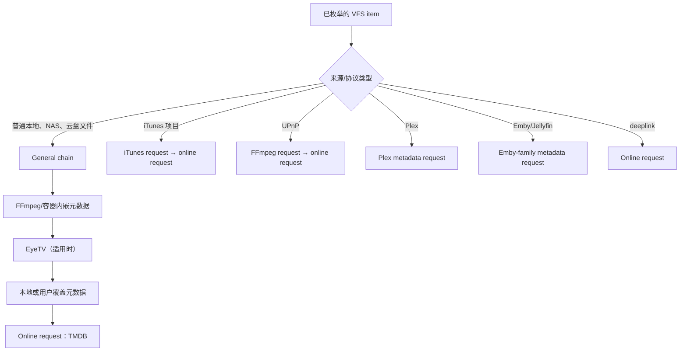

# Infuse iOS 8.5.1 解析、刮削与索引流程静态分析

版本：1.0<br>
日期：2026-08-14<br>
对象：用户提供的 `com.firecore.infuse_8.5.1_und3fined.ipa`<br>
对照：本机安装的 Infuse macOS 8.5.1（build 5726）

## 1. 结论

**iOS 版与 macOS 版的文件名解析、元数据请求链、TMDB 查询入口、文件索引合并及缺失元数据回收逻辑，属于同一套业务实现。**

这不是根据 UI 相似度得出的推测。两个包均为 8.5.1，`CFBundleVersion` 为 `8.5.5726`（内部 build 5726）；静态比对发现：

- 电影、剧集、标题清洗和父目录候选所用的类、正则及语义字符串相同；
- 关键方法调用的 Objective-C selector 数量、内容和先后顺序相同；
- 普通视频的元数据请求链构造顺序相同；
- TMDB 的主机、查询参数、详情扩展字段、限流与代理回退语义相同；
- `FileIndex` 临时快照差分 SQL 相同；
- 元数据两阶段删除逻辑相同，iOS 版同样使用 `-604800` 秒，即 7 天。

“相同”指核心业务规则和执行骨架相同，不表示两个 Mach-O 文件逐字节相同。文件访问权限、后台调度、UI、平台播放器和系统事件监听仍由 iOS/macOS 各自适配。

## 2. 样本与证据边界

| 项目 | 结果 |
|---|---|
| Bundle ID | `com.firecore.infuse` |
| 版本 | 8.5.1 |
| `CFBundleVersion` | `8.5.5726`（内部 build 5726） |
| 主程序架构 | ARM64 Mach-O |
| 最低系统 | iOS 18.0 |
| IPA SHA-256 | `964c1df87cc55b0c5c5b350c281ce6242a8c3ee3688a89c8f986ac4529f7eda1` |
| iOS 主程序 SHA-256 | `1ba8ad02d9a9252511e3c92f8e83e33cb357ea59914dfb30b909e32b89098bf2` |
| Mach-O `cryptid` | `0` |

`cryptid=0` 表示该主程序可直接做静态检查。本次没有执行解密、重新签名、注入或修改原 IPA，也没有提取或发布应用内的 API 凭据。

本报告基于字符串、Objective-C 元数据、SQL 和 ARM64 反汇编。没有在真实 iPhone 上注入运行时代码，也没有抓取某次实际扫描的网络流量，所以以下事项仍需动态验证：

- 某台设备在某个网络环境下最终选择直连 TMDB 还是 Infuse 代理；
- 远程配置、地区、账户状态或 A/B 配置是否改变部分优先级；
- 每个候选的完整评分权重；
- iOS 后台挂起后扫描任务的实际续跑时机。

## 3. 与 macOS 版的机械比对

以下比较不是只看方法名称，而是提取每个方法内的 Objective-C 消息调用序列，再比较数量与顺序：

| 关键方法 | 调用数量 | iOS 与 macOS |
|---|---:|---|
| `requestChainForItem:config:` | 12 | 完全一致 |
| `generalRequestChainForItem:config:` | 9 | 完全一致 |
| `onlineMetadataRequestForItem:config:` | 4 | 完全一致 |
| `FCMovieTitleParser parseFilenameOrMetadataForItem:` | 8 | 完全一致 |
| `FCMovieTitleParser parseTitle:` | 2 | 完全一致 |
| `FCSeriesTitleParser parseVariantsForItem:resultsHandler:` | 14 | 完全一致 |
| `FCMergedMetadataDAO clearObsoleteMetadata` | 21 | 完全一致 |

此外，以下语义块在两个主程序中逐项一致：

- 剧集编号正则和父目录解析规则；
- 显式 TMDB/IMDb ID、年份、分碟和 edition 规则；
- 分辨率、来源、编码、音频、HDR、3D、发布标签等标题噪声清理规则；
- TMDB 主机、代理、图片主机、搜索参数和详情扩展字段；
- `FileIndex` 临时表、集合差分、扫描成功合并和失败重试语义。

因此，可以对“解析、刮削和删除协调是否与 macOS 一样”给出高置信度的肯定答案。

## 4. 文件名解析流程

### 4.1 主要组件

静态符号和编译源路径显示，两端共同使用：

- `FCBaseTitleParser`
- `FCMovieTitleParser`
- `FCSeriesTitleParser`
- `FCTitleParserHelper`
- `ParsedTitleVariant`
- `ParsedEpisodeInfo`
- `TitleParsingRegExp`

`ParsedTitleVariant` 至少承载标题、季、集、TMDB ID、IMDb ID、是否剧集和命中的解析模式。解析器不是只产生一个字符串，而是可以生成多个候选变体。

### 4.2 实际解析步骤

1. 读取文件基本名，并在需要时加入父目录候选。
2. 先识别显式身份标签，例如 `{tmdb-...}`、`{imdb-...}`。
3. 检测剧集格式，例如 `S02E03`、`S2EP3`、`2x03`、`02-003` 及纯集数模式。
4. 对电影标题检测年份、分碟/分段和 edition 标签。
5. 清除明确的发布噪声，例如分辨率、WEB-DL/BluRay、x264/x265/HEVC、HDR、音频格式、remastered、proper、3D 和发布组等。
6. 通过 `sortedItemsForParsingByParentsFromItem:episodeInfo:` 把文件名候选与父目录候选排序，而不是只信文件名本身。
7. 保留多个 `ParsedTitleVariant`，交给后续在线匹配尝试。

这说明提高准确率的关键不只是“大正则”，而是三层组合：**结构标记优先、技术 token 清洗、父目录上下文补充**。

### 4.3 示例文件

对：

```text
Wednesday.S02E03.2022.2160p.NF.WEB-DL.DDP5.1.Atmos.H.265-ColorTV.mkv
```

两端共同的高优先级解析结果应是：

```json
{
  "kind": "tv",
  "title": "Wednesday",
  "season": 2,
  "episode": 3
}
```

这里的 `2022` 位于已经命中的 `S02E03` 后方。剧集正则会消费其余发布信息，因此仅凭这个候选，不能确认 iOS 版会把 `2022` 当作电视剧首播年份发送；若父目录是 `Wednesday (2022)`，则可再产生带年份的父目录候选。`2160p`、`NF`、`WEB-DL`、`DDP5.1`、`Atmos`、`H.265` 和 `ColorTV` 不进入剧名。

解析阶段不会凭空得到剧集 ID。它先得到 `Wednesday / S02E03`，随后通过显式 ID、服务器元数据或在线检索获得 TMDB series ID，再查询对应季和集。

## 5. 元数据请求链

请求链工厂会先按 VFS/来源类型分流。普通文件、iTunes、UPnP、媒体服务器和 deeplink 的链条不同。



对普通文件，反汇编确认数组按下面的顺序追加请求：

```text
ffmpegMetadataRequestForItem
eyeTVMetadataRequestForItem
overridingMetadataRequestForItem:config
onlineMetadataRequestForItem:config
```

这是“请求对象的构造顺序”。各字段最终由哪一来源覆盖，还会受 `VFSComplexMetadataRequest` 的缓存、合并和 `sourcePrioritiesWithSettings` 处理，不能简单理解成“最后一个请求覆盖所有字段”。

`onlineMetadataRequestForItem:config:` 对符合条件的普通视频创建 `tmdbRequestWithVideoItem:config:`。Plex、Emby/Jellyfin 项目则优先采用媒体服务器自己的 metadata request，不会无条件再用文件名走一遍普通 TMDB 链。

## 6. TMDB 查询逻辑

### 6.1 电影

没有精确 ID 时，搜索请求包含：

```text
GET /3/search/movie
query=<清洗后的标题>
language=<元数据语言>
primary_release_year=<可用时>
```

选择候选后再取详情，并可通过 `append_to_response` 合并请求：

```text
casts,releases,images,alternative_titles,translations
```

### 6.2 电视剧与单集

没有精确 series ID 时使用电视剧搜索；有年份候选时使用 `first_air_date_year`。命中 series 后，代码中可观察到以下阶段：

```text
fetchSeries(seriesId, metadataLanguage, thumbnailLanguage, regionCode)
fetchSeason(number, cachedSeries, seriesId)
fetchMetadata(seriesId, cachedSeries, cachedSeason)
```

电视剧详情的扩展信息包含：

```text
credits,content_ratings,external_ids,images,translations,alternative_titles
```

元数据语言与图片语言分开处理，并存在 alternate/fallback image language。series、season 和 episode 分别转换成内部实体并缓存，而不是把一整季压成单条记录。

### 6.3 认证、签名与主机路由

静态实现显示：

- 初始 API 主机是 `api.themoviedb.org`；
- URL 使用 HTTPS；
- v3 `api_key` 作为查询参数加入；
- 没看到在 `/3/search/movie` 等 TMDB 请求外再加一层自定义 HMAC、时间戳签名或请求体加密；
- 对 HTTP 429 有重试/限流处理；
- 代码中同时存在 `movie-api.infuse.im` 与 `movie-api-north-yc.infuse.im`；
- `proxiedFetch(path:query:method:)` 和 “TMDB may be blocked / switched to proxy” 日志表明，直连受阻或特定 HTTP/网络错误时可以切换 Infuse 代理；能看到对 403、451、502～504 等状态的判断；
- 图片初始主机是 `image.tmdb.org`，同时存在 Infuse 图片代理域名。

所以准确表述是：**默认路径从 TMDB 直连开始，但 Infuse 内置了自己的 API/图片代理作为回退；不能把它概括为永远直连，也不能概括为所有请求都先经过 Infuse。** 某次实际请求走哪条路线，需要在对应设备和网络上做运行时抓包确认。

## 7. 其他元数据与增强来源

iOS 与 macOS 两端都能看到以下相同组件：

| 来源 | 用途 | 是否核心标题匹配 |
|---|---|---:|
| FFmpeg/容器标签 | 时长、轨道、内嵌标题等本地信息 | 否，但进入合并链 |
| NFO / 本地覆盖 | 本地身份、标题、简介、图片或人工修改 | 可高优先级影响结果 |
| Plex | 使用 Plex 服务器的项目与元数据 | 是，针对 Plex 来源 |
| Emby/Jellyfin | 使用服务器项目与元数据 | 是，针对相应来源 |
| TMDB | 普通电影、电视剧和单集的主要在线刮削 | 是 |
| Metacritic | metascore/评分增强与缓存 | 否 |
| `api.theintrodb.org` | 在线片头片尾 marker | 否 |
| `IntroDbAppAPI` | 另一套 marker provider | 否 |
| OpenSubtitles | 字幕搜索和下载 | 否 |

两个包均包含 `EpisodeMarkers_IDBAPP`、`EpisodeMarkers_TIDBORG` 对应语义。两个主程序中都没有发现 `publicmetadb` 字符串或同名 provider；这只能说明 8.5.1 静态样本没有明显引用，不能排除服务器端把某个上游隐藏在统一接口后面。

## 8. 扫描、缺失检测与删除

iOS 版确认保留了与 macOS 相同的索引协调流程：

1. 为 VFS 来源或扫描覆盖范围建立临时 FileIndex 快照。
2. 把本轮实际枚举到的稳定 `ItemID` 写入临时表。
3. 只有 crawling 成功并进入 merge 阶段，才计算旧索引与当前快照的集合差。
4. 不在当前成功快照中的旧 `ItemID` 从主 FileIndex 移除。
5. 扫描失败、取消或来源不可达时走失败/重试路径，不应把不完整快照当成批量删除证据。

在线电影/剧集元数据不会与文件索引同步硬删。`FCMergedMetadataDAO` 在 iOS 版中也执行：

```text
now - 604800 秒
  → 对无启用文件且缓存过旧的元数据设置 MarkedForDeletion
  → 后续清理仍无关联时再删除
  → 文件或关联恢复时可以撤销 deletion mark
```

因此，iOS 版同样把“可播放文件消失”“继续观看显示”“可重建元数据回收”和“长期用户观看状态”分开处理。

## 9. 对跨平台开源实现的意义

本次比对反而支持三平台共用一套核心库，而不是为 iOS、Android、OHOS 分别写三套规则：

- 文件名 parser、候选生成、评分输入和 provider request plan 做成纯业务模块；
- iOS/OHOS/Android 只适配枚举、授权、网络、后台任务和 SQLite 驱动；
- 普通文件与 Plex/Emby/Jellyfin 必须是不同来源策略；
- provider 链要允许本地 metadata、用户 override、在线 metadata 合并，而不是单一 TMDB 响应覆盖一切；
- TMDB 主机路由应显式记录 `direct/proxy`、重试原因和状态码，方便定位地区网络问题；
- 文件缺失通过“成功扫描快照差分”判定，在线元数据另设延迟 GC，观看历史不随物理文件删除。

当前的 27 表 SQLite 方案与这些观察是一致的：`media_file`、`parse_result`、`file_binding`、`media_entity`、`external_id`、`localized_metadata`、`playback_state` 和 `playback_marker` 分层，正好能承载 Infuse 已表现出的职责分离，同时保持 clean-room 实现。

## 10. 最终判断

| 问题 | 判断 | 置信度 |
|---|---|---:|
| iOS 与 macOS 是否使用相同文件名解析规则 | 是 | 高 |
| `Wednesday.S02E03...` 是否都会识别为电视剧 S02E03 | 是 | 高 |
| 普通文件是否最终进入 TMDB 在线请求 | 符合条件时是 | 高 |
| Plex/Emby/Jellyfin 是否仍强制走普通 TMDB 链 | 否，走服务器专用分支 | 高 |
| TMDB 是否始终由 Infuse 服务器转发 | 否；默认直连，有代理回退 | 高 |
| 某台 iPhone 的某次请求一定走直连 | 静态分析无法保证 | 中/待抓包 |
| iOS 的索引差分和 7 天元数据回收是否与 macOS 相同 | 是 | 高 |
| iOS 与 macOS 的后台扫描时机是否完全相同 | 否，受平台调度约束 | 高 |
