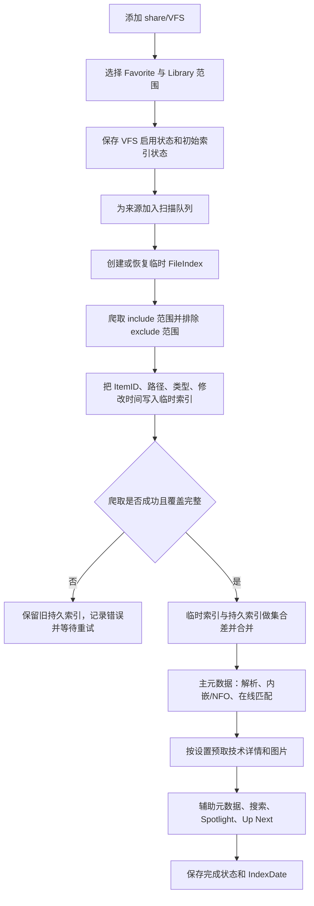
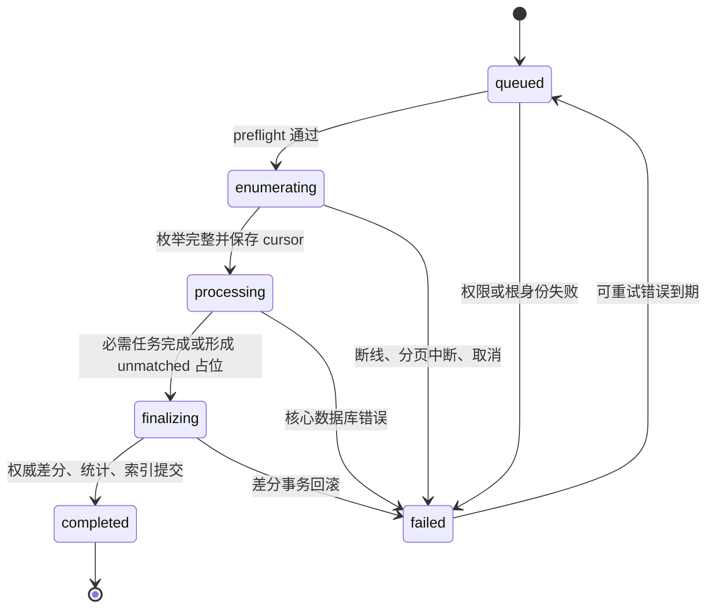

# Infuse 媒体库建立、扫描、重建与自有扫描器设计

版本：1.0  
日期：2026-08-14  
分析对象：Infuse iOS 8.5.1（build 5726）  
配套设计：[`cross_platform_media_library_design.md`](./cross_platform_media_library_design.md)

## 1. 结论先行

Infuse 的“媒体库”不是云端替设备维护的一张总表，也不是一次扫描后生成的单一海报列表。对普通本地、NAS 和云盘文件，它更接近以下五层结构：

1. 保存来源、Favorite 和是否纳入 Library 的配置；
2. 在设备本地维护可播放文件索引；
3. 把文件名、本地 NFO/内嵌信息和在线元数据合并为本地可查询的影视记录；
4. 在设备本地维护图片、搜索、Spotlight、技术参数等可重建缓存；
5. 把观看历史、进度、人工匹配、片单等用户数据与文件索引分开保存，并可选择通过 iCloud/Trakt/媒体服务器同步其中一部分。

静态分析显示，Infuse 8.5.1 的网络来源扫描由一个持久化状态机协调。一次来源任务至少拆成：

```text
目录/服务器爬取
  → 主元数据阶段
  → 缩略图/封面阶段
  → 辅助元数据阶段
  → 更新索引日期、统计和 Up Next
```

文件存在性不是靠文件哈希查询远端数据库判定。普通来源主要通过“本轮临时快照与旧 FileIndex 做集合差”发现新增、变化和删除；哈希最多适合作为本地移动/重复识别的补充。只有成功完成且覆盖范围明确的枚举结果，才适合成为删除依据。

重建也不是一个动作：

- “刷新媒体库”主要重新检查内容差异；
- “刷新元数据”会额外失效在线元数据与部分 HTTP/图片配置缓存；
- 单个项目“刷新/编辑元数据”只重做该项目的搜索、选择和绑定；
- “清除所有元数据”清的是缓存和派生状态，并重新排队获取，不应删除真实视频；
- 来源移除会清理该来源的文件索引存储，但不等于删除 NAS/云端文件；
- 缓存数据库损坏时可重建缓存并重扫，用户数据应使用独立恢复路径。

我们自己的方案继续使用既定的 **27 张核心表 + 3 张缓存表**，不增加第 28 张持久表。建议给现有表补少量调度字段，并用 `scan_run`、`media_file.last_seen_run_id` 和 `scan_queue` 实现可恢复、幂等、按范围协调删除的扫描器。

## 2. 证据范围与置信度

### 2.1 本次使用的证据

- Firecore 当前官方帮助文档；
- 用户提供的 Infuse iOS 8.5.1 IPA；
- Mach-O 中的 Objective-C 类、方法、Swift 类型名、SQL、日志字符串和 ARM64 调用关系；
- 前一份 27 表 SQLite 跨平台设计。

本次没有在 iPhone 中注入代码，也没有记录一次完整扫描的动态日志。因此本文把结论分为三档：

| 标记 | 含义 |
|---|---|
| 已证实 | 官方文档明确说明，或二进制中同时存在明确入口、状态存储和调用关系 |
| 高置信推断 | 多个静态证据相互吻合，但缺少一次运行时调用轨迹 |
| 待动态验证 | 只能确认能力存在，无法确认某台设备当次运行选择了哪条分支 |

### 2.2 不应过度解读的地方

- 二进制中的方法名证明代码能力存在，不自动证明每次扫描都会走该方法。
- `FCNetworkIndexer` 中某个超时路径出现 1 小时/24 小时间隔，不等于 Infuse 所有来源只有这两个扫描周期。
- 官方针对 Plex/Emby/Jellyfin 的说明写有前台每 15 分钟、Apple TV 后台每小时；普通文件来源的官方说明只说打开应用和空闲时周期扫描。
- Direct Mode、Library Mode、普通 SMB/云盘来源使用不同扫描器，不能把其中一条路径推广到全部来源。
- 本文描述的是行为和职责，不复制 Infuse 的私有实现代码。

## 3. Infuse 媒体库的职责分层

### 3.1 来源与纳入范围

官方说明中，用户先添加 share，再把至少一个文件夹设为 Favorite，并在设置中决定哪些 Favorite 纳入 Library。也就是说：

```text
连接凭据/协议
  → VFS 或 share
  → Favorite/文件夹范围
  → 是否参与 Library 索引
```

同一个 share 可以只有部分子目录进入 Library。二进制中与此对应的入口包括：

- `setIndexingForFavorite:enabled:`
- `enableIndexingForFavorite:`
- `disableIndexingForFavorite:isRemoving:`
- `updateSubtreeForFavorite:setEnabled:`
- `favoriteWillBeIndexedInParents:`
- `favoritesIndexCrawlerForVFS:including:excluding:`

这解释了为什么删除协调必须带“覆盖范围”，而不能只按来源做一次全局 `NOT IN`。

### 3.2 本地文件索引

Infuse 8.5.1 中可确认存在：

```sql
VFSIndex(
    Id,
    VFS_Key,
    IndexingState,
    IndexDate,
    Enabled
)
```

`FileIndex` 至少保存 `ItemID`、路径、VFS 外键、启用状态、文件类型、修改日期，以及元数据、缩略图、Spotlight、字幕等阶段状态。相关 DAO 支持：

- 为某个 VFS 建立临时索引存储；
- 从持久索引复制某个文件夹范围到临时存储；
- 批量写入临时或持久索引；
- 按 Favorite、父目录、媒体服务器 Library 等 include/exclude 范围合并；
- 删除旧集合中存在、当前成功快照中不存在的项目；
- 更新修改时间和阶段状态；
- 单独清空某个 VFS 或整个 FileIndex。

因此，Infuse 的海报墙不是每次启动都直接遍历文件夹并即时拼出来，而是主要查询本地物化索引和元数据缓存。

### 3.3 元数据与图片缓存

普通文件默认会匹配 TMDB，并把标题、简介、演员、海报、背景和外部数据库 ID 缓存在设备上。预缓存详情和预缓存图片可以分别关闭：

- 详情预缓存关闭时，时长、编码等深度信息可在浏览时按需获取；
- 图片预缓存关闭时，海报和背景可在浏览时按需下载；
- 云服务因为 API 请求限制，详情预缓存默认关闭。

所以“文件已经进入媒体库”与“技术探测完成”“原图已经下载”是三个不同状态。

### 3.4 用户状态和同步

Firecore 的 iCloud 文档列出的同步内容包括：share、Favorite、主页布局、人工元数据匹配、文件级播放设置、字幕、片单、合集，以及 Pro 用户的 Up Next、观看历史、进度和评分。

它没有把每台设备的完整 FileIndex、每个扫描任务和全部图片缓存描述为同步对象。这与静态实现中“本地 VFS/FileIndex + 可同步用户记录”的分层一致。

## 4. Infuse 首次建库流程

### 4.1 普通文件来源

首次建库可整理为下面的流程：



其中“先临时、后合并”很关键。Infuse 不是边枚举边立即删除旧行；否则 SMB 断线、云盘分页失败或应用被系统挂起时，会把未遍历到的后半个媒体库误删。

### 4.2 队列骨架

`FCMIndexer enqueueVFS:withState:` 的 Objective-C 调用顺序明确包含：

1. `addIndexCrawlerForVFS:`
2. `addMetadataFetcherForVFS:primary:`，主阶段
3. `addThumbnailsFetcherForVFS:`
4. `addMetadataFetcherForVFS:primary:`，辅助阶段

这是任务加入内部优先队列的顺序。实际并发与个别来源的特殊调度仍由优先级、协议类型和设置决定。

完成回调也分开存在：

- `filesFetcherDidFinish:`
- `primaryMetadataFetcherDidFinish:`
- `thumbnailsFetcherDidFinish:`
- `secondaryMetadataFetcherDidFinish:`
- `finishIndexingForVFS:`

`finishIndexingForVFS:` 最后更新 VFS 状态和索引日期；若扫描期间收到“缓存已清理”事件，还会把该 VFS 再次入队，避免以已经失效的缓存状态错误结束。

### 4.3 文件夹浏览不是完整媒体库扫描

`FCFolderIndexer` 有自己的一套阶段：crawler、metadata fetcher、thumbnail fetcher，并支持 `onlyFetchContent`。`IVCIndexingAdaptor` 可以在本地和远程文件夹之间切换。

因此用户打开一个文件夹时触发的内容加载，可能只为当前 UI 范围取目录内容或元数据，并不等于对整个 Library 做完整权威扫描。我们的实现也必须区分：

- 浏览刷新：低延迟、局部、不能协调全库删除；
- Library 扫描：有明确覆盖范围，可以在成功提交后协调缺失项。

## 5. Infuse 如何发现新增、变化、移动和删除

### 5.1 新增

当前快照中有、持久 FileIndex 中没有的稳定 `ItemID` 会作为新项目写入。后续元数据状态为“待获取”的项目进入 parser/metadata/thumbnail 流程。

### 5.2 内容或属性变化

二进制中能看到对 `ModificationDate`、Flags、Label 和相关状态的差异更新。修改时间变化后，可以重置元数据、缩略图、Spotlight 或字幕阶段中的相应部分，而不需要把整库所有记录删除再建。

### 5.3 移动与改名

`FCMIndexDAO` 存在 `moveDataFromItem:toItem:`，说明索引层具备把旧项目数据转移到新项目身份的能力。但静态分析不能证明每种协议都提供足够稳定的 ID，也不能证明所有改名都能保留同一记录。

合理理解是：

1. 协议若提供稳定对象 ID，优先按 ID 识别移动；
2. 稳定 ID 不可用时，可能退化为“旧路径删除 + 新路径新增”；
3. 没有发现 Infuse 把文件哈希上传到外部影视数据库并据此识别影片的主流程。

### 5.4 删除

高置信度的普通来源删除路径是：

```text
本轮成功枚举到的 ItemID 写入临时表
  → 旧 FileIndex 中属于本轮覆盖范围的 ItemID
  → EXCEPT 当前临时表 ItemID
  → 从持久 FileIndex 移除这些旧项目
```

静态 SQL 中存在全 VFS、Favorite include/exclude、父目录以及 Emby Library 等不同范围的删除语句。失败或取消时不应合并不完整快照。

此外还存在 `FCFindMissingItemsOperation`，它能：

- 对普通项目按父目录重新取列表；
- 处理 bookmark 项目；
- 处理 Plex 剧集；
- 区分 removed 与 invalid 项目。

这说明 Infuse 除全量快照差分外，还有面向小集合的定点可用性复核。仅凭静态代码无法确定它在所有 UI 场景中的调用时机。

### 5.5 文件索引删除不等于元数据立即物理删除

`FCMergedMetadataDAO` 的清理逻辑显示：

1. 元数据记录若没有启用的 FileIndex 引用，并且缓存日期早于当前时间 7 天，会被标为 `MarkedForDeletion`；
2. 后续清理仍确认没有文件关联时才真正删除；
3. 文件关联恢复时可以撤销删除标记。

因此 Infuse 至少把以下动作分开处理：

- 文件已不可播放；
- 海报墙是否继续显示；
- 元数据缓存何时回收；
- 观看历史和进度是否保留。

## 6. Infuse 扫描由什么触发

### 6.1 触发矩阵

| 触发 | 已观察到的行为 | 是否可作为删除依据 | 证据级别 |
|---|---|---:|---|
| 首次添加并启用来源 | 创建/加载 VFS 状态，加入爬取和元数据队列 | 完整成功后可以 | 已证实 |
| Favorite 被纳入 Library | 启用对应 subtree，按 include/exclude 范围重排队 | 只对成功覆盖的 Favorite 范围可以 | 已证实 |
| Favorite 从 Library 移除 | 禁用 subtree；必要时清理该 VFS/范围索引 | 属于配置移除，不应删除真实文件 | 已证实 |
| 应用打开 | 官方说明 Auto Scan 开启时会扫描；初始化器会恢复/重置需处理的 VFS 状态 | 取决于实际爬取是否完整 | 已证实 |
| 从后台回前台 | iOS 8.5.1 在离开前台超过 60 秒后，会筛选 VFS 并以 `autoTriggered=1` 重置索引状态 | 取决于随后扫描结果 | 静态证实 |
| 应用前台空闲 | 普通来源官方只写“周期”；媒体服务器官方写每 15 分钟 | 取决于随后扫描结果 | 官方证实，具体来源周期不同 |
| Apple TV 后台刷新 | 媒体服务器官方说明约每小时，且需开启 Background App Refresh | 取决于任务是否完成 | 官方证实，仅 tvOS 场景 |
| 用户“刷新媒体库/Scan for Changes” | 设置 user-initiated 标记、重置崩溃计数、以非自动方式重排来源并恢复后台服务 | 完整成功后可以 | 已证实 |
| 用户“刷新元数据” | 在普通刷新基础上清 URL 缓存、图片基址缓存并重置在线元数据状态 | 主要更新元数据，不应据此删除文件 | 已证实 |
| 单个项目“刷新/编辑元数据” | 搜索候选、应用电影/剧集新 ID、清项目派生数据、更新合集并标记相关项目待刷新 | 否 | 已证实 |
| share/VFS 新增 | 加入 VFS 列表、保存状态并自动重排队 | 完整成功后可以 | 已证实 |
| share/VFS 编辑 | 根据负责范围、Library 开关和旧状态决定重新入队或调整 enabled subtree | 只对新确认范围可以 | 已证实 |
| share/VFS 移除 | 停止队列、清状态、清崩溃信息、清该 VFS 的 FileIndex/临时 store | 这是来源移除，不是远端文件删除 | 已证实 |
| 网络连接错误 | 停止当前 fetcher，标记 Favorite 失败并记录错误 | 否 | 已证实 |
| reachability 变化 | 索引状态管理器和后台服务管理器暂停、恢复或重新评估任务 | 单独不能 | 已证实其参与调度，具体分支待动态验证 |
| 存储设备状态变化 | 检查受影响 VFS 的 enabled/state，并重置相关来源 | 随后的完整扫描才可以 | 已证实 |
| 本地目录 watcher | 当前 Files 界面根目录空闲时启动 `indexingAdaptor` 局部刷新 | 局部浏览刷新不能协调全库删除 | 已证实 |
| 设置变化 | 调整 VFS enabled 或重置相应阶段 | 视设置类型而定 | 已证实 |
| 扫描中缓存被清理 | 设置 `cacheWasCleared`；当前 VFS 完成时再次入队 | 否 | 已证实 |
| 缓存损坏或被系统清理 | UI 提示恢复/重扫；数据库层具备 recreate 能力 | 重建时必须重新取得权威枚举 | 已证实存在恢复入口 |

### 6.2 60 秒、15 分钟、1 小时为何同时出现

这些时间属于不同路径：

- 60 秒：iOS 8.5.1 的 `appWillEnterForeground:` 中直接比较的阈值；超过后触发自动重排队。
- 15 分钟：Firecore 对 Plex/Emby/Jellyfin 前台运行时扫描新内容的官方说明。
- 1 小时：同一官方文档描述的 Apple TV 后台刷新近似周期；二进制 `reindexIntervalForVFS:state:` 的一个超时检查路径也出现 3600 秒。
- 24 小时：上述二进制超时路径对一个数值状态返回 86400 秒；状态枚举名已被裁剪，不能把它命名为某种具体错误。

结论是：我们的产品不要复制一个神秘的全局定时器，而应按来源能力、应用状态、失败类型和用户设置明确调度。

## 7. Infuse 的中断、重试与恢复

### 7.1 持久化状态

Infuse 使用 `VFSIndex.IndexingState` 和 `IndexDate` 保存来源级状态。另有 `FCShareIndexingState`，支持安全编码并保存：

- 当前爬取 stack；
- subtree 状态；
- items identifier；
- 已开始处理的内容和深度；
- 未合并状态重置。

字符串 `libraryIndexingHasUnfinishedJob`、`ShareIndexing.plist` 和 `ShareIndexingCrashes.plist` 进一步说明，未完成工作与崩溃计数不是只存在内存里。

### 7.2 失败处理

fetcher 失败时，`FCMIndexer` 会：

- 把错误写入来源状态；
- 保存最后错误；
- 从当前队列移除该 VFS；
- 启动下一个任务；
- 在适用时通过 `scheduleReindexingOfVFS:` 再排队。

`checkReindexingTimeouts` 会遍历 VFS，比较最后索引日期与来源/状态对应间隔，清理旧状态后以 `autoTriggered=1` 重排队。

### 7.3 防崩溃循环

手动扫描会调用 `resetCrashesInfo`。二进制中还存在按 VFS 清理崩溃信息和 `shouldProcessItem` 一类计数逻辑。合理目标是避免单个损坏文件令整个来源每次启动都崩溃或无限重试。

我们的实现应把“跳过本次有问题的项目”和“整次枚举没有权威性”分开：

- 单文件解析/探测失败：扫描仍可完成，该文件标错并可重试；
- 根目录不可达、分页中断、凭据失效：整次枚举无权协调缺失项。

## 8. 不同来源不是同一种扫描

### 8.1 普通本地、NAS、云盘文件

```text
列目录
  → 文件名/目录名解析
  → NFO、内嵌 metadata、附近图片
  → 必要时向 TMDB 匹配
  → 本地物化媒体实体和图片引用
```

来源的 Auto Scan、预缓存详情、预缓存图片、Smart Folder 等选项会改变成本和完成条件。

### 8.2 Plex、Emby、Jellyfin Library Mode

官方明确说明，这些来源显示媒体服务器提供的元数据，而不是把每个服务器项目再用文件名交给 TMDB 匹配。Library Mode 会把服务器信息和图片预缓存在设备上，以支持统一 Library 和更强的离线浏览。

二进制分别存在：

- Plex 全量与 incremental indexing context；
- Emby/Jellyfin full sync、quick sync、checkpoint 和 removed item；
- Library/section/playlist 的 include/exclude 合并；
- 服务器专用 metadata request。

InfuseSync 插件会记录 Emby/Jellyfin 的媒体变化，以减少 Library Mode 的同步时间。

### 8.3 Direct Mode

Direct Mode 不要求预缓存或全量扫描服务器 Library，内容和元数据按需获取。因此 Direct Mode 更像远程浏览数据源，不应硬套本地 `media_file` 全量镜像流程。

我们的产品可以把 Direct Mode 实体短期缓存到缓存库，但不应让它们参与“本地权威快照未见即 missing”的协调。

## 9. Infuse 的几种“重建”含义

| 用户动作或故障 | Infuse 可观察行为 | 应保留 | 可失效/重建 |
|---|---|---|---|
| 刷新媒体库 | 重新排队检查文件/服务器变化 | 人工匹配、观看状态、片单、可复用元数据 | 文件存在性、变化状态、派生索引 |
| 刷新元数据 | 清部分网络与图片配置缓存，重置在线元数据状态，再扫描 | 文件身份、观看状态、片单 | 在线标题、简介、人物、类型、图片选择等 |
| 单项目刷新 | 清该项目派生数据，搜索或选择新 asset/ID，更新关联项目 | 其他项目和全库扫描状态 | 该电影或剧集的匹配与派生信息 |
| 使用本地元数据 | 文件夹范围改走内嵌/NFO；官方提示会删除该范围现有在线元数据和图片 | 文件与观看状态 | 该范围在线 metadata/artwork |
| 清除所有元数据 | 批量清缓存、索引日期和多个派生状态，重排扫描 | 官方语义是保留真实媒体；未观察到删除实际文件入口 | 下载元数据、图片、选择缓存、阶段状态 |
| 删除/取消来源 | 停队列并清该 VFS 的文件索引和临时 store | 真实远端文件；同步用户数据应单独处理 | 来源本地索引和派生数据 |
| 缓存损坏/被系统清理 | recreate/恢复缓存并重新扫描 | 能从 iCloud/媒体服务器恢复的用户状态 | 本地 FileIndex、metadata/artwork cache |

### 9.1 重建边界

不能把“清除元数据”“重建媒体索引”“清空全部用户数据”做成同一个按钮。至少应分别提供：

1. 扫描变化；
2. 刷新选中项目元数据；
3. 刷新全部元数据；
4. 重建派生索引；
5. 从应用移除来源；
6. 清空整个应用数据。

每个按钮都要明确是否影响观看历史、人工匹配、片单、下载字幕、真实文件和云端同步 tombstone。

### 9.2 iOS 8.5.1 中三个入口的实际差别

普通手动扫描和全局元数据刷新最终都进入 `startUserInitiatedIndexingWithMode:`，但 mode 不同：

```text
普通刷新
  → userInitiatedIndexing = true
  → resetCrashesInfo
  → resetIndexingStateWithAutoTriggered(false)
  → resumeServicesIfNeeded

元数据刷新（mode = 1）
  → 先清 NSURLCache
  → 清 TMDB 图片 base URL 缓存
  → resetIndexWithOnlineMetadata
  → 再执行普通刷新步骤
```

“清除所有元数据”更重。`FCClearAllMetadataOperation main` 的调用关系显示它会在数据库事务中清多组缓存/DAO，随后：

```text
clearUserInitiatedIndexingFlag
resetIndexingStateWithAutoTriggered(false)
resetCrashesInfo
遍历 managed VFS 清 IndexDate
清人工 reload choice/元数据相关缓存
清图片 base URL 和 NSURLCache
更新索引统计
```

这三条路径都没有出现删除真实媒体文件的调用。单项目刷新则通过 `clearItemDataForReload:`、设置新 `MetaID`、更新 collection、`markForUpdateItems:` 来限制影响范围。

## 10. 我们自己的扫描器：总体设计

### 10.1 核心原则

1. **枚举与刮削解耦。** 存储来源可达时即使 TMDB 不可达，也能安全确认文件存在性。
2. **Watcher 只是提示。** 真正的数据库差异必须经过来源 adapter 验证。
3. **覆盖不完整就不协调删除。** 根目录不可达、分页失败、权限失效和取消均令 `reconcile_missing=0`。
4. **任务幂等。** 同一文件、同一输入 revision、同一阶段重复执行只得到同一结果。
5. **用户数据与可重建数据隔离。** 观看历史、片单、人工匹配、同步 outbox 不参加自动 GC。
6. **一来源最多一个活跃 scan_run。** 新触发与当前任务合并或升级，不制造扫描风暴。
7. **按范围提交。** 子目录增量扫描只能协调该子目录，不能影响同来源其他目录。
8. **先保证海报墙可用，再补重资源。** parser 和基本 materialize 优先，probe 和原图按策略延后。

### 10.2 27 表职责映射

| 扫描职责 | 使用的表 | 说明 |
|---|---|---|
| 来源和策略 | `library_source` | 协议、根、权限引用、能力、Auto/手动/计划策略 |
| 一次任务与权威范围 | `scan_run` | mode、trigger、coverage、cursor、完成状态和计数 |
| 文件快照 | `media_file` | 稳定键、路径、etag/mtime/hash、last seen、可用性 |
| 分阶段任务 | `scan_queue` | parse/probe/local metadata/match/materialize/artwork/search |
| 文件名结果 | `parse_result` | movie/episode、标题、年、季集、ID hint 和 parser version |
| 本地附属文件 | `sidecar` | NFO、图片、字幕、章节等 |
| 技术参数 | `technical_summary`、`media_stream` | 容器、时长、轨道、HDR、音频等 |
| 影视实体 | `media_entity` | movie/series/season/episode 层级 |
| 文件与影视绑定 | `file_binding` | 自动/手工匹配、置信度、锁定 |
| 在线身份与显示数据 | `external_id`、`localized_metadata`、`genre*`、`person`、`credit`、`artwork` | provider 结果物化层 |
| 海报墙搜索 | `search_document` | 可重建的聚合搜索文档 |
| 用户状态 | `playback_*`、`media_collection`、`collection_item` | 不随扫描结果自动删除 |
| 跨设备写入 | `change_log`、`sync_cursor` | 用户数据同步与 tombstone |

## 11. 在不增加表的前提下补强字段

现有 27 表已经能实现基本扫描。为支持触发合并、租约恢复和精确重建，建议升级到 schema v2 时增加下列字段。

### 11.1 `library_source`

```sql
ALTER TABLE library_source ADD COLUMN last_successful_scan_at_ms INTEGER;
ALTER TABLE library_source ADD COLUMN next_scan_at_ms INTEGER;
ALTER TABLE library_source ADD COLUMN offline_since_ms INTEGER;
ALTER TABLE library_source ADD COLUMN last_error_code TEXT;
ALTER TABLE library_source ADD COLUMN scan_options_json TEXT;
```

现有 v1 的 `kind` CHECK 尚未覆盖通用云盘。升级 v2 时应通过“建新表 → 复制 → 外键校验 → 换表”的正式迁移，把 `cloud` 加入来源类型；具体厂商写入 `capabilities_json.provider`，避免每接一个云盘就改一次表。Direct/Library Mode 写入 `scan_options_json.connection_mode`，仍不增加新表。

`scan_options_json` 保存非敏感策略，例如：

```json
{
  "auto_scan": true,
  "precache_details": false,
  "precache_artwork": true,
  "metadata_mode": "online",
  "prefer_local_artwork": false,
  "ignore_nomedia": false,
  "missing_grace_days": 7
}
```

### 11.2 `scan_run`

```sql
ALTER TABLE scan_run ADD COLUMN trigger TEXT;
ALTER TABLE scan_run ADD COLUMN requested_at_ms INTEGER;
ALTER TABLE scan_run ADD COLUMN priority INTEGER NOT NULL DEFAULT 0;
ALTER TABLE scan_run ADD COLUMN request_key TEXT;
ALTER TABLE scan_run ADD COLUMN parent_run_id INTEGER REFERENCES scan_run(id) ON DELETE SET NULL;
ALTER TABLE scan_run ADD COLUMN heartbeat_at_ms INTEGER;
ALTER TABLE scan_run ADD COLUMN checkpoint_json TEXT;
ALTER TABLE scan_run ADD COLUMN policy_snapshot_json TEXT;
ALTER TABLE scan_run ADD COLUMN enumeration_committed_at_ms INTEGER;
```

推荐 `trigger` 值：

```text
source_added
favorite_enabled
app_launch
foreground
periodic
background_scheduler
watcher_hint
manual_scan
manual_metadata_refresh
settings_changed
storage_changed
reachability_retry
provider_delta
app_upgrade
cache_recovery
```

同一来源只允许一个活跃 run：

```sql
CREATE UNIQUE INDEX uq_scan_run_one_active_source
ON scan_run(source_id)
WHERE state IN ('queued', 'enumerating', 'processing', 'finalizing');
```

### 11.3 `media_file`

```sql
ALTER TABLE media_file ADD COLUMN observed_revision INTEGER NOT NULL DEFAULT 0;
ALTER TABLE media_file ADD COLUMN last_verified_at_ms INTEGER;
ALTER TABLE media_file ADD COLUMN path_compare_key TEXT;
```

- `observed_revision`：路径、size、mtime、etag 或内容身份变化时加一；
- `last_verified_at_ms`：最近一次权威确认存在的时间；
- `path_compare_key`：按来源大小写与 Unicode 规则生成，只用于比较，不替代显示路径。

### 11.4 `scan_queue`

建议增加：

```sql
ALTER TABLE scan_queue ADD COLUMN required INTEGER NOT NULL DEFAULT 1;
ALTER TABLE scan_queue ADD COLUMN input_revision INTEGER NOT NULL DEFAULT 0;
ALTER TABLE scan_queue ADD COLUMN entity_id INTEGER REFERENCES media_entity(id) ON DELETE SET NULL;
```

如果要支持“已经没有文件、但因观看历史而保留的实体”做元数据刷新，可在一次正式迁移中把 `media_file_id` 改为可空，并加入“文件或实体至少有一个”的 CHECK。由于 SQLite 无法直接修改原列约束，这一步需要建新表、复制、校验、换表，不能只靠 `ALTER COLUMN`。

`input_revision` 防止旧任务覆盖新文件：worker 完成前再次读取 `media_file.observed_revision`，不一致时丢弃结果并重新入队。

## 12. 自有触发调度器

### 12.1 触发合并规则

扫描请求按 `(source_id, normalized_scope)` 合并：

```text
repair > full > incremental
manual > foreground > periodic > watcher_hint
父目录范围覆盖子目录范围
```

当来源已有活跃 run：

- 新 watcher 事件落在当前 coverage 内：只把路径加入 `checkpoint_json.pending_hints`；
- 新范围不在 coverage 内：合并为后续 run；
- 用户发起 full scan：当前 run 可安全取消则升级，否则创建高优先级后继 run；
- 元数据刷新：不打断权威目录枚举，只追加 repair 工作。
- 后台 enrichment/repair 正占用来源时，手动扫描可抢占它；先把 repair 设为 `cancelled` 并保存未完成任务，再创建权威扫描，稍后重新生成 repair 后继任务。

### 12.2 推荐时间策略

不要硬编码 Infuse 的时间。推荐默认值：

| 场景 | 我们的默认策略 |
|---|---|
| 应用冷启动 | 对 `auto_scan=1` 且超过最小间隔的来源做增量检查 |
| 回前台 | 离开超过 60 秒时消费 watcher/delta；超过 15 分钟才轮询无 delta 能力的远程来源 |
| 前台空闲 | 15 分钟检查 due source，只运行轻量增量，不反复 full scan |
| iOS 后台 | 由系统给出的短窗口执行 checkpoint 可恢复的批次，不承诺准点 |
| Android 后台 | WorkManager 唯一任务，按网络/充电约束执行 |
| OHOS 后台 | 使用目标设备允许的后台任务能力，逐批 checkpoint；前台恢复 |
| 手动刷新 | 立即、最高优先级，仍遵守删除安全条件 |
| 失败重试 | 指数退避加抖动；认证错误等待用户修复，不自动猛刷 |
| 安全全量校验 | 即使有 watcher/delta，本地每 7 天、远程每 7～30 天做一次可配置 full scan |

### 12.3 Watcher 规则

```text
第一条事件到达
  → 2 秒 debounce
  → 合并同目录/父子目录事件
  → 最多等待 10 秒形成批次
  → 创建 scoped incremental run
```

Watcher overflow、事件丢失、根目录替换或来源重新挂载时直接升级为 full scan。Watcher 永远不能直接执行 `DELETE FROM media_file`。

## 13. 自有扫描状态机



### 13.1 阶段 A：preflight

1. 解析来源权限句柄；
2. 验证凭据和根目录可达；
3. 读取根的稳定身份或安全哨兵；
4. 固化本次 `coverage_json` 和 `policy_snapshot_json`；
5. 创建 `scan_run(state='queued', reconcile_missing=0)`；
6. 获取来源级枚举锁。

根目录突然返回空列表不能立即视为“全库删除”。如果旧库项目数很大而新枚举为 0，应额外复核根身份、权限和错误码。

`coverage_json` 至少应能表达：

```json
{
  "authority": "recursive_snapshot",
  "roots": ["/Movies"],
  "include": ["/Movies/**"],
  "exclude": ["/Movies/Incoming/**"],
  "root_fingerprint": "provider-specific-stable-root-id",
  "case_sensitive": false,
  "unicode_normalization": "NFC",
  "delta_deletions_complete": false
}
```

范围比较必须按路径段进行；字符串 `/Movies/A` 不能误覆盖 `/Movies/AB`。

### 13.2 阶段 B：枚举

对每个条目生成：

```text
stable_key
parent_stable_key
normalized relative_path
path_compare_key
kind
size
mtime
etag/version-id
```

每 200～1000 项短事务 UPSERT：

- 找到同一 `(source_id, stable_key)`：更新路径和属性；
- 文件重新出现：恢复 `availability='present'`，清 missing 计数；
- 每个实际看到的项目都更新 `last_seen_run_id`，即使内容未变；
- 只有输入变化或处理版本过期时才创建下游任务；
- 保存分页 cursor、目录 stack 和计数到 `checkpoint_json`。

### 13.3 阶段 C：变化分类

| 变化 | 需要重做的阶段 |
|---|---|
| 新文件 | parse、local metadata；按设置 probe、match、materialize、artwork、search |
| 仅路径/文件名变化 | parse、local metadata、match、materialize、search；内容稳定时可复用 probe |
| size/mtime/etag 变化 | parse、local metadata、probe；必要时 rematch/materialize/artwork/search |
| parser version 升级 | parse → match → materialize → search |
| probe version 升级 | probe；若时长/分辨率参与版本分组，再 materialize |
| metadata locale 变化 | match/details → materialize → artwork → search，不必重新列目录 |
| artwork locale 或缓存清理 | artwork only |
| 搜索算法升级 | search_index only |
| 人工锁定绑定 | 禁止自动 match 覆盖；仍允许 probe、artwork 和未锁字段刷新 |

### 13.4 阶段 D：任务 DAG

```text
parse ───────────────┐
local_metadata ──────┼→ match → materialize → search_index
probe ───────────────┘              └────────→ artwork
```

具体规则：

- `local_metadata` 可用明确 TMDB/IMDb ID 时，`match` 直接验证 ID，不做模糊搜索；
- 在线 provider 不可达时，为新文件物化 `unmatched` 占位，使文件仍可浏览；
- `probe` 和 `artwork` 是否为 required 取决于来源预缓存策略；
- required 任务终态为 done 或“可显示的明确失败”后，扫描可以 finalizing；
- 非 required 的图片/深度探测不阻止权威扫描提交；finalizing 时把仍未完成的任务移到一个 `mode='repair'`、`reconcile_missing=0` 的后继 run；
- 每个阶段写入必须比较 `input_revision`。

### 13.5 阶段 E：权威提交与 missing 协调

只有同时满足以下条件，才把 `reconcile_missing` 设为 1：

1. 根和全部分页访问成功；
2. 没有 watcher overflow 未处理；
3. 扫描未取消；
4. coverage 能精确表达本次 include/exclude 范围；
5. 来源身份与 preflight 一致；
6. 对 server delta，provider 明确保证 cursor 连续且删除事件完整。

在 finalizing 的一个短事务中：

```text
确认 scan_run 仍是当前来源的有效 run
  → 设置 cursor_out、enumeration_committed_at_ms、reconcile_missing=1
  → 仅在 coverage 范围内查找 last_seen_run_id != 当前 run 的旧文件
  → present 改为 missing，增加 missing_scan_count
  → 恢复本轮看到的文件
  → 更新 last_successful_scan_at_ms
  → scan_run = completed
  → 如有未完成的 optional 任务，创建 reconcile_missing=0 的 repair 后继 run 并迁移任务
```

事务内先把当前 run 设为 `completed`，再插入后继 `queued` run，因此“同一来源最多一个活跃 run”的唯一索引不会冲突。若 finalizing 事务失败，全部回滚，旧库继续可用。

为了避免把复杂路径范围直接拼入 SQL，可在 finalizing 的同一连接创建 `TEMP reconcile_candidate(id INTEGER PRIMARY KEY)`：先由范围比较器把有资格协调的旧 `media_file.id` 分批写入临时表，再通过 `UPDATE ... WHERE id IN (SELECT id FROM reconcile_candidate)` 标为 missing。该表只活在当前连接，不是第 28 张持久表；事务回滚或连接关闭后自动消失。

### 13.6 为什么允许图片任务稍后完成

`completed` 在这里表示“该 run 的文件存在性和基础媒体库物化已经安全提交”。未完成的原图或深度探测属于后继 repair run；否则一个图片 CDN 超时会阻止文件删除协调数天。

UI 应分别显示：

- 扫描文件；
- 匹配元数据；
- 获取详情；
- 获取封面；
- 后台补全失败项目。

## 14. 来源 adapter 设计

| 来源 | 稳定键优先级 | 增量能力 | 权威删除条件 |
|---|---|---|---|
| iOS 本地/Picker | 平台资源 ID/bookmark 范围 + file resource ID；退化为规范路径 | watcher hint + scoped enumeration | security scope 有效且完整枚举成功 |
| Android MediaStore | volume + media `_ID`/generation | generation、ContentObserver | 查询成功且 generation 连续 |
| Android SAF | document ID；退化为 tree URI + 相对路径 | provider 能力不一，通常需轮询 | 全部 children/page 成功 |
| OHOS Picker/本地 | 平台 URI/文件 ID；退化为规范路径 | watcher/系统能力适配 | 权限有效且完整枚举成功 |
| SMB/NFS/WebDAV/FTP | server file ID/inode（若稳定）→ etag+路径 → 规范路径 | 通常轮询；WebDAV 可用 etag | 根身份正确、全部目录成功 |
| 云盘 | provider file ID | changes/delta cursor | cursor 连续并含删除；否则 full scan |
| Plex Library Mode | server ratingKey/metadata ID | server 增量 API | section/playlist scope 完整 |
| Emby/Jellyfin Library Mode | server ItemId | quick sync/plugin cursor | checkpoint 连续；否则 full sync |
| Direct Mode | server item ID，仅短期缓存 | 按需读取 | 不参与本地镜像 missing 协调 |

`.nomedia`、用户排除目录和 local-metadata 目录在 adapter/过滤阶段处理，但必须写入 coverage policy，保证后续差分知道哪些路径是“明确排除”，哪些只是“本轮没访问到”。

## 15. 删除与回收策略

### 15.1 自动扫描发现缺失

```text
第一次权威未见
  → media_file.availability = missing
  → 从普通可播放查询隐藏或标不可用
  → 保留 file_binding、media_entity、playback_state、collection_item

宽限期内重新出现
  → stable_key 或受控移动匹配
  → 恢复 present，清 missing 计数

多次权威未见且超过宽限
  → 确认没有未上传同步事件
  → 硬删 media_file 及文件拥有的派生行
  → 影视实体另走独立 GC
```

建议默认：本地来源至少 24 小时且两次成功扫描；远程来源 7 天；不稳定云盘可配置 30 天。

### 15.2 移动识别

只在同一来源和有限时间窗内按下列顺序匹配：

1. 平台/服务器稳定 ID；
2. provider version ID 或可靠 etag；
3. size + mtime + quick hash；
4. full hash，仅在本地、用户允许且冲突仍无法消除时。

远程来源默认不为移动识别下载大文件做 full hash。匹配唯一时更新原 `media_file.relative_path`；不唯一时保守地保留“旧 missing + 新文件”，等待人工或后续证据。

### 15.3 来源离线

- 设置 `library_source.offline_since_ms` 和 `last_error_code`；
- 现有 `media_file` 改为或查询时视为 `offline`；
- 不增加 `missing_scan_count`；
- 不清 `file_binding`；
- 不运行实体 GC；
- 恢复网络后优先增量，根身份变化时 full scan。

### 15.4 实体 GC

`media_entity` 只有在没有任何 present/offline/missing 宽限中的文件绑定，并且没有观看状态、人工片单、人工 marker、锁定匹配或未上传 change_log 时，才有资格回收。

这与 Infuse 的“文件索引先移除、元数据延迟 7 天清理”的思路一致，但我们的保护条件更显式。

## 16. 我们自己的重建方案

### 16.1 扫描变化

```text
scan_run.mode = incremental
trigger = manual_scan / watcher_hint / foreground
```

不清 metadata cache，不解除人工绑定。只处理新增、变化、移动和缺失。

### 16.2 刷新元数据

```text
scan_run.mode = repair
trigger = manual_metadata_refresh
coverage_json.job_kind = metadata_refresh
```

处理范围内：

- 保留 `media_file`、技术参数、观看状态和片单；
- 保留 `file_binding.locked=1` 的身份；
- 未锁定项目重新 match；
- 有可靠 external ID 的项目直接重新取详情；
- 替换 provider 生成的 localized metadata、genre、credit、artwork；
- 不覆盖 `locked_fields_json`；
- 重建 search document。

### 16.3 重建派生索引

适用于 parser/probe/search 算法升级：

- 通过 `parser_version`、`probe_version` 定点找过期记录；
- 不需要重新枚举来源时，`coverage_json.job_kind='derived_rebuild'` 且 `reconcile_missing=0`；
- 按版本分批排 `scan_queue`；
- Search/Spotlight 可整表重建，但不改变 entity/file UID。

### 16.4 完整重建文件索引

不要先清空现有媒体库再扫描。推荐“代际重建”：

1. 创建 full `scan_run`，旧记录继续服务 UI；
2. 按 stable key UPSERT，尽量保留 `media_file.uid`；
3. 复用 `external_id` 对应的 `media_entity.uid`；
4. required 阶段完成后原子提交 missing 差分；
5. 宽限期后回收旧文件派生数据；
6. 全程不删用户表。

### 16.5 缓存库重建

`metadata_cache.sqlite` 的 `provider_response_cache`、`match_candidate_cache`、`artwork_cache_file` 可直接删除或清空后重建，但：

- 核心库已经物化的标题和 external ID 不应随之消失；
- `artwork.local_relative_path` 需先置空或校验引用；
- 正在下载的任务要取消或让 revision 失效；
- 当前 scan 完成时若发现 cache generation 变化，应追加 artwork/metadata repair。

### 16.6 核心数据库损坏

```text
PRAGMA quick_check
  → 失败则停止所有 writer
  → 复制损坏 DB 供诊断
  → 尝试导出可验证的用户域记录
  → 新建 schema
  → 恢复 playback/collection/manual binding/change_log
  → 对所有来源 full scan
  → external ID/UID 重新关联用户状态
```

如果核心 DB 已无法读取，应优先从同步或备份恢复用户域，不能假装一次文件扫描能重建观看历史和人工片单。

### 16.7 清空全部应用数据

这是唯一允许删除核心库用户域的操作，必须二次确认并明确列出：

- 观看历史和进度；
- 人工匹配；
- 片单/合集；
- 未同步 change_log；
- 来源凭据引用；
- 元数据和图片缓存。

真实媒体文件仍默认不删除。

## 17. Worker、并发与事务

### 17.1 并发上限

- 一个来源最多一个 enumerator；
- SQLite 采用单 writer 协调器，多 reader；
- parser 可小规模 CPU 并发；
- probe 限制为 1～2 个，移动设备低电量时暂停；
- provider 按主机设置 QPS 和 429 退避；
- artwork 下载独立低优先级并发池；
- 用户正在浏览/播放的项目可临时提高优先级。

### 17.2 任务租约

worker 领取任务时在短事务中：

1. 选择 `queued/retry` 且到期的最高优先级任务；
2. 更新为 `running`、`attempts+1`、设置 `lease_until_ms`；
3. 提交后执行外部 I/O；
4. 写回前比较 lease、run state 和 `input_revision`；
5. 应用启动时把过期 `running` 恢复为 `retry`。

不得在下载 TMDB 或探测远程视频的整个过程中持有 SQLite 写事务。

### 17.3 错误分类

| 错误 | 处理 |
|---|---|
| 网络超时、429、5xx | 指数退避重试 |
| 认证失效、权限撤销 | 来源进入 needs-attention，等待用户 |
| 单文件损坏 | 文件任务 failed，扫描可继续 |
| 根目录不可达/分页断裂 | scan_run failed，reconcile_missing=0 |
| provider 无候选 | 物化 unmatched，不无限重试 |
| DB constraint/integrity 错误 | 停 writer，进入 repair，不继续差分 |
| watcher overflow | 升级 full scan |
| revision 已变化 | 丢弃旧结果，按新 revision 重排 |

## 18. 海报墙生成与一致性

普通媒体墙查询不应该直接 join 所有 provider 缓存，而应只读物化核心表：

```text
media_entity
  ← file_binding ← media_file(availability = present)
  ← localized_metadata
  ← artwork(selected = 1)
  ← playback_state
```

一个电影有 1080p 和 4K 两个文件时，两条 `media_file` 绑定同一 `media_entity`，海报墙只显示一个实体。删除其中一个版本只减少一个绑定，不删除电影。

新文件的渐进显示：

1. parser 完成：用清洗后的标题和占位图显示；
2. match/materialize 完成：替换为正式标题、年份和简介；
3. artwork 完成：无闪烁替换为缓存海报；
4. probe 完成：补充 4K/HDR/音轨徽标。

这样不会因为等待原图或远程 probe 而让新文件长时间“凭空消失”。

## 19. UI 与产品语义

建议设置页提供：

| 操作 | 用户文案重点 |
|---|---|
| 扫描变化 | 检查新增、修改和删除，不重做所有元数据 |
| 刷新元数据 | 重新从本地/NFO/服务器/TMDB 获取详情，保留观看历史和片单 |
| 重建搜索与封面缓存 | 解决显示问题，不扫描真实文件删除 |
| 完整重扫来源 | 重新核对全部路径，可能耗时，不删除真实文件 |
| 从应用移除来源 | 删除本机索引和授权，远端文件不受影响 |
| 清空全部应用数据 | 会删除观看历史、人工匹配和片单；真实视频默认不删除 |

扫描状态不要只显示一个无限转圈。至少显示来源、当前阶段、已发现/已处理/失败数，以及“等待网络”“权限失效”“后台暂停”等可行动状态。

## 20. 验收测试矩阵

### 20.1 建库与幂等

- 同一来源连续 full scan 两次，不增加重复文件或实体；
- 两个不同来源的同一 TMDB 电影绑定同一实体但保留两个版本；
- 新文件在图片未下载时也可见；
- Direct Mode 不把全服务器复制进本地 FileIndex。

### 20.2 触发合并

- 1000 个 watcher 事件合并成有限 scoped run；
- 前台、周期和 watcher 同时触发时，一来源仍只有一个活跃 run；
- 手动 full scan 能升级后续计划而不并发踩库；
- 应用重启后从 checkpoint/lease 恢复。

### 20.3 删除安全

- SMB 断线返回空目录不会产生 missing；
- 云盘第二页失败不会提交第一页形成的不完整差分；
- 子目录扫描不影响兄弟目录；
- 来源根被替换时触发安全复核；
- missing 文件恢复后沿用原观看状态；
- 文件物理删除不会级联删除实体观看历史；
- 来源移除绝不调用真实文件删除 API。

### 20.4 变化和移动

- 同 stable ID 改名只更新路径；
- 同路径替换为不同内容会增加 revision 并使旧任务失效；
- quick hash 冲突时不自动合并；
- 多版本电影删除一个版本，海报仍存在。

### 20.5 重建

- metadata refresh 不重新枚举文件也不修改 missing 计数；
- artwork cache 清理只重排 artwork；
- parser 升级只处理旧 parser version；
- 全索引重建保留 playback、collection、manual binding 和 change_log；
- DB corruption 恢复后 external ID 能重新挂回用户状态；
- 清空全部应用数据必须经过确认且生成可审计结果。

### 20.6 并发与恢复

- worker 写回旧 revision 被拒绝；
- lease 过期任务可重领且不会重复物化；
- finalizing 中断后事务全回滚；
- provider 429 不阻止文件存在性扫描完成；
- 单坏文件不会令整个来源进入无限崩溃循环。

## 21. 实施顺序

### 第一阶段：安全文件索引

1. `library_source`、`scan_run`、`media_file`、`scan_queue`；
2. 本地/SMB 一个 adapter；
3. full + scoped incremental；
4. last-seen 差分、missing 宽限、来源离线保护；
5. 扫描触发合并和崩溃恢复。

### 第二阶段：可用海报墙

1. parser、sidecar、TMDB match；
2. entity/binding/external ID；
3. localized metadata、artwork、search；
4. 渐进显示和人工匹配锁定。

### 第三阶段：重资源与服务器来源

1. probe/stream；
2. artwork 原图与缓存 GC；
3. Plex/Emby/Jellyfin Library Mode；
4. delta/quick sync 与安全 full fallback；
5. Direct Mode 按需缓存。

### 第四阶段：完整恢复体系

1. metadata/derived/full rebuild；
2. user domain 导出恢复；
3. 数据库 integrity repair；
4. 三平台后台调度和可观察性。

## 22. Infuse 8.5.1 静态证据索引

| 组件 | 关键方法/证据 | 支持的结论 |
|---|---|---|
| `FCMIndexer` | enqueue、reset、schedule、files/primary/secondary/thumb finish、failure、cache cleared | 扫描是分阶段可恢复队列 |
| `FCNetworkIndexer` | app background/foreground、connection/storage/VFS/favorite/reachability、manual mode | 触发来源和前后台策略 |
| `FCFolderIndexer` | setupStages、crawler、metadata、thumbnails、onlyFetchContent | 浏览局部刷新与全库扫描不同 |
| `IVCIndexingAdaptor` | local/remote、load content、reindex local filesystems | UI 文件浏览有独立适配层 |
| `FCMIndexDAO` | temp store、copy、merge、include/exclude、EXCEPT、clear VFS | 快照差分与按范围提交 |
| `FCMVFSIndexDAO` / `FCVFSIndexState` | saved state、enabled、IndexDate | 来源状态持久化 |
| `FCShareIndexingState` | secure coding、stack、subtree states、reset non-merged | 中断恢复与树爬取 checkpoint |
| `FCFindMissingItemsOperation` | regular/bookmark/Plex missing checks | 除全量差分外还有定点复核 |
| `FCClearAllMetadataOperation` | clear caches、reset state/crash info/index dates、requeue | 清元数据是派生状态重建 |
| `FCMetadataReloader` / `FCReloadApplyingService` | search、clear item、apply movie/series、update collections | 单项目刷新和人工改匹配 |
| `FCMergedMetadataDAO` | `DateCached`、`MarkedForDeletion`、604800 秒 | 元数据延迟两阶段回收 |
| Swift 类型 | DirectoryWatcher、TreeCrawlingService、MetaDiff、Emby Full/Quick Sync | 本地事件、树爬取、增量元数据和服务器增量能力 |

## 23. 仍需动态验证的问题

若后续要把“高置信推断”提升为运行时事实，建议在自有设备和自有账号上只做观察性验证：

1. 普通 SMB、云盘、Plex Library、Emby Library 和 Direct Mode 各抓一次完整扫描日志；
2. 分别制造新增、改名、移动、删除、临时断线和分页失败；
3. 记录每个来源实际周期、并发和退避；
4. 验证前台 60 秒重排队是否对所有 Auto Scan 来源生效；
5. 验证 1 小时/24 小时超时分支对应的具体状态名；
6. 验证“清除所有元数据”前后观看历史、人工匹配、片单和 FileIndex 的实际变化；
7. 验证本地 watcher 在 Files UI 不可见时是否仍触发全局 Library 扫描。

这些验证不影响本文为自有实现给出的安全原则：任何不完整或非权威事件都不能直接成为自动删除依据。

## 24. 官方参考资料

- [Firecore：Library Scanning & Indexing](https://support.firecore.com/hc/en-us/articles/27862264977047-Library-Scanning-Indexing)
- [Firecore：Setting Up Your Library](https://support.firecore.com/hc/en-us/articles/115000074814-Setting-Up-Your-Library)
- [Firecore：Streaming from Plex, Emby, and Jellyfin](https://support.firecore.com/hc/en-us/articles/360006462093-Streaming-from-Plex-Emby-and-Jellyfin)
- [Firecore：InfuseSync for Emby and Jellyfin](https://support.firecore.com/hc/en-us/articles/23885208585367-InfuseSync-for-Emby-and-Jellyfin)
- [Firecore：Excluding Files and Folders](https://support.firecore.com/hc/en-us/articles/4405044108183-Excluding-Files-and-Folders)
- [Firecore：Using Embedded Metadata](https://support.firecore.com/hc/en-us/articles/4405036751767-Using-Embedded-Metadata)
- [Firecore：iCloud Sync](https://support.firecore.com/hc/en-us/articles/115000070773-iCloud-Sync)
