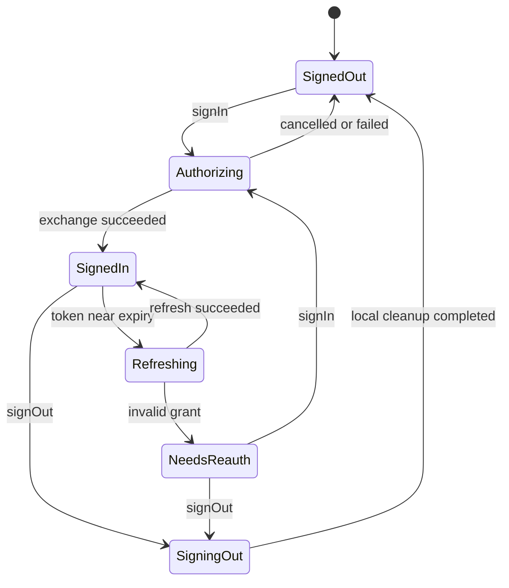

# OAuth 与会话规范

## 目标

为恒星播放器提供授权码模式加 PKCE 的 OAuth 登录、令牌刷新、多账号切换、登出和会话恢复。客户端应用只接触会话状态，不直接持久化令牌。

## 状态机

统一状态值为 `signed_out`、`authorizing`、`signed_in`、`refreshing`、`needs_reauth`、`signing_out`。状态变化 MUST 通过可观察事件流发布。

## 公开模型

`UserSession`：

| 字段 | 类型 | 说明 |
| --- | --- | --- |
| `account_uid` | string | 本地稳定账号标识，不使用邮箱作主键 |
| `subject` | string | OAuth `sub` |
| `issuer` | string | 规范化 issuer URL |
| `display_name` | string? | 展示名 |
| `avatar_url` | string? | 头像地址 |
| `scopes` | string[] | 实际获得的 scope |
| `access_expires_at_ms` | int64 | 访问令牌过期时间 |
| `profile_revision` | string? | 用户资料修订版本 |
| `schema_version` | int | 当前为 1 |

此模型不得包含 access token、refresh token、授权码、PKCE verifier 或客户端私密信息。

## 必须支持的操作

- `restoreSession()`：从安全存储恢复最近账号，必要时刷新令牌。
- `signIn(request)`：启动系统授权页，校验回调的 `state`、issuer 与 redirect URI。
- `getAccessToken(minValidityMs)`：返回至少仍有效指定时长的令牌；刷新必须 single-flight。
- `listAccounts()` 与 `switchAccount(accountUid)`：切换后发布账号作用域变化事件。
- `refreshProfile()`：更新非敏感用户资料。
- `signOut(accountUid, revokeRemote)`：先让该账号停止新任务，再清理本地令牌；远端撤销失败不能阻止本地登出。

## 令牌与 PKCE

- MUST 使用授权码模式、PKCE `S256` 和每次随机生成的 `state`。
- access token 与 refresh token MUST 写入平台安全存储，不得进入 SQLite、日志、崩溃报告或普通偏好设置。
- 令牌刷新提前量 SHOULD 为 60–300 秒，并考虑设备时钟偏差。
- 同一账号同时发生的刷新请求 MUST 合并成一次网络请求，等待者共享结果。
- `invalid_grant` 或 refresh token 被撤销后转为 `needs_reauth`，不得无限重试。
- 多账号安全存储键 MUST 包含 issuer、client ID 与 account UID，避免环境和账号串用。

## 平台适配

| 平台 | 授权入口 | 安全存储 | 建议并发模型 |
| --- | --- | --- | --- |
| Swift | `ASWebAuthenticationSession` | Keychain | `async/await` + actor |
| Android | Custom Tabs / AppAuth | Android Keystore 加密后的存储 | Kotlin coroutines + `Flow` |
| OpenHarmony | 系统浏览器或授权 UI 扩展 | HUKS 支持的加密存储 | Promise/TaskPool + 可观察状态 |

平台代码不得把 WebView cookie 当作唯一登录状态；回调处理需防止重复消费。

## 事件

- `session_state_changed`
- `active_account_changed`
- `profile_changed`
- `reauthentication_required`
- `signed_out`

事件必须包含 `account_uid`（若已知）、发生时间和追踪 ID，但不得包含令牌。

## 验收条件

- 应用重启后能恢复有效会话或明确进入 `needs_reauth`。
- 20 个并发取令牌请求最多触发一次刷新。
- 用户取消授权不污染之前的有效账号。
- 登出后该账号的新扫描和同步任务无法取得令牌。
- 三端对相同错误响应产生相同的错误类别与状态转换。

