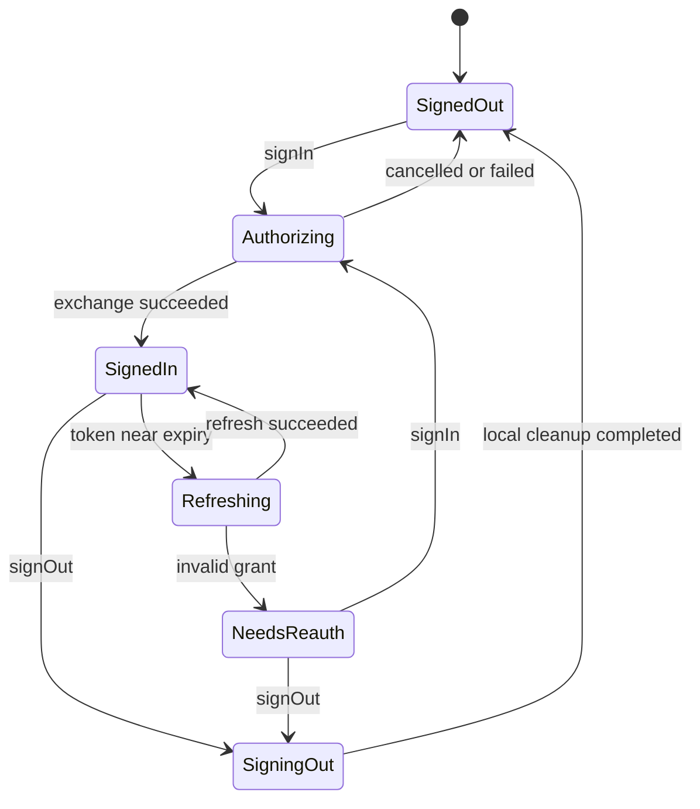

# OAuth 与会话规范

## 目标

为恒星播放器提供授权码模式加 PKCE 的 OAuth 登录、令牌刷新、多账号切换、登出和会话恢复。客户端应用只接触会话状态，不直接持久化令牌。

## 状态机

统一状态值为 `signed_out`、`authorizing`、`signed_in`、`refreshing`、`needs_reauth`、`signing_out`。状态变化 MUST 通过可观察事件流发布。

## 公开模型

`UserSession`：

| 字段 | 类型 | 说明 |
| --- | --- | --- |
| `account_uid` | string | 本地稳定账号标识，不使用邮箱作主键 |
| `subject` | string | OAuth `sub` |
| `issuer` | string | 规范化 issuer URL |
| `display_name` | string? | 展示名 |
| `avatar_url` | string? | 头像地址 |
| `scopes` | string[] | 实际获得的 scope |
| `access_expires_at_ms` | int64 | 访问令牌过期时间 |
| `profile_revision` | string? | 用户资料修订版本 |
| `schema_version` | int | 当前为 1 |

此模型不得包含 access token、refresh token、授权码、PKCE verifier 或客户端私密信息。

## 必须支持的操作

- `restoreSession()`：从安全存储恢复最近账号，必要时刷新令牌。
- `signIn(request)`：启动系统授权页，校验回调的 `state`、issuer 与 redirect URI。
- `getAccessToken(minValidityMs)`：返回至少仍有效指定时长的令牌；刷新必须 single-flight。
- `listAccounts()` 与 `switchAccount(accountUid)`：切换后发布账号作用域变化事件。
- `refreshProfile()`：更新非敏感用户资料。
- `signOut(accountUid, revokeRemote)`：先让该账号停止新任务，再清理本地令牌；远端撤销失败不能阻止本地登出。

## 令牌与 PKCE

- MUST 使用授权码模式、PKCE `S256` 和每次随机生成的 `state`。
- access token MUST 只位于进程内存或平台安全存储；refresh token MUST 写入平台安全存储。两者都不得进入 SQLite、日志、崩溃报告或普通偏好设置。
- Keychain 默认 MUST 使用无需每次读取时验证用户在场的设备绑定策略；不得默认要求 Face ID、Touch ID 或设备密码。生物识别只能作为用户显式开启的高安全模式，并必须明确说明它会阻止锁屏后台刷新。
- Apple 默认 Keychain 路径 MUST 完全非交互：不得创建或写入 `kSecAttrAccessControl`，不得使用 `.userPresence`、`.biometryAny`、`.biometryCurrentSet`、`.devicePasscode` 或 `.applicationPassword`，不得调用 `LAContext.evaluatePolicy` / `evaluateAccessControl`。因此 SDK 不要求 `NSFaceIDUsageDescription`，也不得把 LocalAuthentication 权限或生物识别注册状态作为登录前提。
- Apple 每次 `SecItemAdd`、`SecItemCopyMatching`、`SecItemUpdate` 和 `SecItemDelete` MUST 设置 `kSecUseDataProtectionKeychain=true`，尤其禁止 macOS 回退到 legacy file-based Keychain。Stellar token MUST 设置 `kSecAttrSynchronizable=false`；需要锁屏后台刷新时使用 `kSecAttrAccessibleAfterFirstUnlockThisDeviceOnly`，否则使用 `kSecAttrAccessibleWhenUnlockedThisDeviceOnly`。
- Apple 默认不指定 `kSecAttrAccessGroup`，使用应用自身的默认私有组；SDK 不要求 Keychain Sharing、App Groups 或其他额外 capability/entitlement。只有宿主明确需要多个同开发者 target 共享会话时，才允许由宿主在构建时配置共享 access group，这仍不得产生运行时权限请求。
- Apple 读取、更新和删除查询 MUST 传入 `interactionNotAllowed=true` 的 `LAContext`（旧系统等价行为可使用非交互 Security API 选项）。如果旧记录、系统状态或错误配置要求交互，操作必须以 `errSecInteractionNotAllowed`/稳定存储错误失败，绝不显示认证 UI。旧版受 user-presence 保护的 token 不做交互迁移；将其视为不可用，完成普通 OAuth 后写入新的非交互版本化 item。
- access token SHOULD 优先只保存在内存并按需刷新；需要恢复短期会话时可以与 refresh token 一同进入上述平台安全存储。refresh token 必须持久化，除非产品明确选择每次启动重新登录。
- 令牌刷新提前量 SHOULD 为 60–300 秒，并考虑设备时钟偏差。
- 同一账号同时发生的刷新请求 MUST 合并成一次网络请求，等待者共享结果。
- `invalid_grant` 或 refresh token 被撤销后转为 `needs_reauth`，不得无限重试。
- 多账号安全存储键 MUST 包含 issuer、client ID 与 account UID，避免环境和账号串用。

## 平台适配

| Apple 平台 | 授权入口 | 安全存储 | 建议并发模型 |
| --- | --- | --- | --- |
| iOS/iPadOS | `ASWebAuthenticationSession` | Data Protection Keychain | `async/await` + actor |
| macOS | `ASWebAuthenticationSession` 或注入的 loopback presenter | Data Protection Keychain | `async/await` + actor |
| tvOS | 宿主提供的受支持授权 presenter | Data Protection Keychain | `async/await` + actor |

各 Apple 平台可以利用系统磁盘加密、应用沙箱和设备解锁状态，但不得因此把 Stellar OAuth token 跨设备复制。

平台代码不得把 WebView cookie 当作唯一登录状态；回调处理需防止重复消费。

## 当前 StellarPlayer Gateway Profile

开发环境以 Gateway 发布的 RFC 8414 Metadata 为唯一在线能力声明，并由 [`gateway-oauth-v1.json`](../fixtures/auth/gateway-oauth-v1.json) 固定当前客户端合同：

| 项目 | 当前值 |
| --- | --- |
| Issuer | `https://dev-gateway.2dland.cn/` |
| Authorization Endpoint | `https://dev-gateway.2dland.cn/oauth/authorize` |
| Token Endpoint | `https://dev-gateway.2dland.cn/oauth/token` |
| Revocation Endpoint | `https://dev-gateway.2dland.cn/oauth/revoke` |
| 用户资料 | `GET https://dev-user-stellarplayer.2dland.cn/api/v1/me` |
| Desktop Client | `stellarplayer-desktop`，Public Client，无 secret |
| Desktop Redirect | `http://127.0.0.1:{dynamic_port}/oauth/callback` |
| iOS Demo Client | `stellarplayer-ios-demo`，Public Client，无 secret |
| iOS Demo Redirect | `https://dev-auth-stellarplayer.2dland.cn/oauth/callback` |
| 首个 Scope | `profile.read` |

Gateway 当前不是 OpenID Connect Provider，不返回 ID Token。客户端不得自行解析 Access Token 建立本地账号资料；必须使用 Bearer Access Token 调用 `/api/v1/me`，并以返回的 `subject_id` 作为 `subject` 与首版 `account_uid`。Token Request 不发送 OAuth 2.0 遗留的 `redirect_uri`，也不得发送 `client_secret`。Refresh Token 每次成功刷新都会轮换；并发刷新必须在客户端合并，否则服务端会把旧 Token 的第二次使用视为重放并撤销整个 Grant。

`ASWebAuthenticationSession` 原生支持 private-use scheme 与 HTTPS callback，不支持 Gateway desktop Client 的动态 HTTP loopback。Swift 核心因此把浏览器展示建模为可注入 presenter：iOS Demo 使用已注册的 claimed HTTPS callback 和 `ASWebAuthenticationSession` presenter；desktop loopback 则使用只监听 `127.0.0.1`、校验精确 Host/Path/state 且只消费一次回调的 presenter。2026-08-18 已使用已签名的 `examples/swift/StellarOAuthDemo` 在真机验收前者，覆盖登录、Keychain 恢复、资料/令牌刷新、账户切换和注销，且未触发生物识别、设备密码或运行时权限弹框。任何其他客户端仍必须使用 Gateway 精确注册的 Client ID 和回调 URI，不得放宽服务端 redirect 规则。

## 事件

- `session_state_changed`
- `active_account_changed`
- `profile_changed`
- `reauthentication_required`
- `signed_out`

事件必须包含 `account_uid`（若已知）、发生时间和追踪 ID，但不得包含令牌。

## 验收条件

- 应用重启后能恢复有效会话或明确进入 `needs_reauth`。
- 首次安装、首次保存、冷启动恢复、前台刷新、后台刷新、登出和遗留受保护 item 场景均不出现 Face ID、Touch ID、设备密码或 Keychain 访问确认框，也不触发运行时权限申请；需要交互的遗留 item 失败关闭并进入普通重新登录。
- 20 个并发取令牌请求最多触发一次刷新。
- 用户取消授权不污染之前的有效账号。
- 登出后该账号的新扫描和同步任务无法取得令牌。
- iOS/iPadOS、macOS 与 tvOS 对相同错误响应产生相同的错误类别与状态转换。
