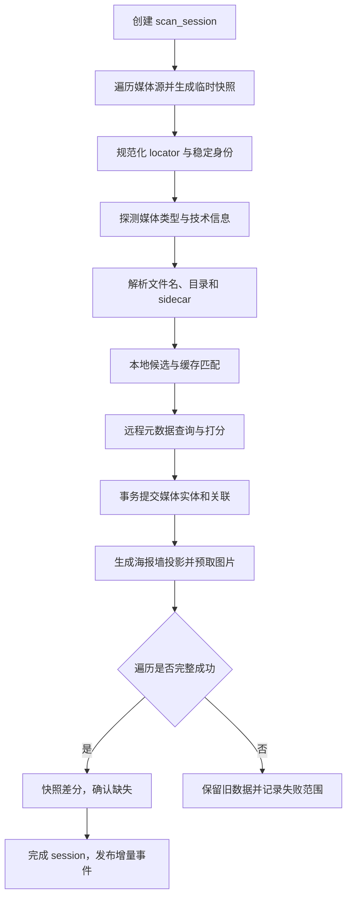

# 扫描、解析与海报墙规范

## 目标与边界

媒体库模块把各类媒体源转换为稳定、可查询、可恢复的本地索引。它负责发现文件、解析文件名、匹配元数据、组织影片/剧集/季/单集和管理图片缓存；不负责删除用户的远程文件。

## 扫描模式

| 模式 | 用途 | 是否允许判定缺失 |
| --- | --- | --- |
| `full` | 首次建库、根目录或过滤规则改变、用户手动重建 | 成功完成全部目录后允许 |
| `incremental` | 计划任务、回到前台、服务端变更通知 | 只对明确覆盖的目录或变更集允许 |
| `repair` | 重试解析、补元数据、补图、纠正低置信度匹配 | 不允许 |
| `availability_check` | 快速确认媒体源或若干文件是否可访问 | 不允许删除，只更新可用性 |

## 触发来源

- 媒体源新增、启用或配置发生结构性变化。
- 用户手动刷新或重建。
- 应用启动/回到前台后的过期检查。
- 定时调度、网络恢复、充电或进入非受限网络。
- 连接器提供的变更游标、推送或目录监控事件。
- 播放时发现文件不存在，触发单项确认与父目录复查。
- 元数据策略或语言变化，触发 `repair` 而非文件系统重扫。

## 核心流程

详细的阶段、恢复点和数据库映射见[扫描重建调研与自有设计](../../docs/research/infuse/infuse_library_scan_rebuild_and_our_scanner_design.md)。

## 文件身份与变更判断

身份优先级：连接器稳定对象 ID；规范化后的 `source_uid + relative_path`；文件系统 inode/resource ID；最后才是派生指纹。文件大小、修改时间、etag 和可选的轻量内容指纹用于判断内容是否变化，不作为跨库元数据搜索主路径。

只有在连接器明确支持并且隐私策略允许时才计算全量或部分哈希。哈希默认仅本地用于去重/变更判断，不上传第三方元数据服务。

## 文件名解析与匹配

解析器按以下顺序收集证据：

1. 用户手动匹配和同目录 sidecar（NFO、JSON）优先。
2. 文件名中的剧集标记，如 `S02E03`、`2x03`、日期型集号。
3. 年份、季目录、标题目录和连续剧集范围。
4. 移除分辨率、来源、编解码、音轨、发布组等噪声标签。
5. 保留原始字符串、规范标题和每条解析证据，产出电影或剧集候选及置信度。

元数据匹配必须分候选生成、候选打分、决策三步；查询成功但低于阈值的项目进入待人工匹配，不得用搜索第一条强行绑定。用户确认后的绑定设置 `manual_lock`，自动修复不得覆盖。

Infuse 行为与参考脚本的已知边界见[匹配器一致性审计](../../docs/research/infuse/infuse_tmdb_matcher_parity_audit.md)。

## 缺失与删除安全规则

- 扫描前把目标范围写入临时快照或本次发现表；遍历完整成功后才与正式库存量做差分。
- 超时、权限错误、认证失败、分页中断、离线、用户取消或目录仅部分完成时，MUST NOT 把未发现项判定为已删除。
- 首次缺失先标记 `missing_since_ms` 和不可播放；可配置宽限期或第二次成功扫描后再清理派生记录。
- 删除媒体源配置只清理本地索引、关系和缓存，不触碰远端实体。
- 播放历史、收藏、用户匹配和观看进度应按逻辑媒体 ID 保留，使文件重新出现后可恢复。
- 图片、字幕缓存和孤立元数据由垃圾回收任务处理，不在扫描事务内做大规模删除。

## 海报墙查询

SDK v1 输出数据模型和分页查询，不内置三端 UI 组件。公开查询至少支持：

- 继续观看、最近添加、最近播放、电影、剧集、类型、收藏和自定义媒体库。
- `sort`：标题、添加时间、发行日期、最近播放、评分、随机种子。
- `filter`：媒体类型、来源、可用性、类型、年份、观看状态、家长分级。
- 游标分页、稳定排序和指定 `library_revision` 的一致性快照。
- 详情查询返回逻辑媒体、可播放文件、季/集结构、图片候选、字幕/音轨摘要和用户状态。

`PosterWallItem` 至少包含 `media_uid`、类型、标题、副标题、年份、主海报、背景图、观看进度、未看集数、来源可用性和元数据修订号。

## 图片管理

- 数据库保存图片提供方、远程路径、宽高、语言、类型、投票和本地缓存状态。
- 图片 URL 由提供方配置和路径组合生成，MUST 不永久持久化带时效签名的下载 URL。
- 原图仅在明确请求下载/导出时获取；海报墙按屏幕像素尺寸选择接近的可用规格。
- 缓存键必须包含提供方、图片路径、目标尺寸和变换版本。
- LRU 清理只删除可再生成缓存；用户导入图片和手工设置必须受保护。

## 事件与一致性

扫描写入后台事务，提交后发布：`scan_started`、`scan_progress`、`library_delta`、`scan_completed`、`scan_failed`、`match_required`。海报墙消费 `library_delta` 并按变更 UID 更新，不轮询整库。

## 验收条件

- 中断全量扫描不会让已有海报墙大面积消失。
- 相同文件重复扫描不产生重复实体或重复用户状态。
- 电影与剧集文件可被稳定区分；低置信度结果可人工修正并锁定。
- 文件换路径后，在稳定 ID 或足够可靠指纹存在时能继承观看状态。
- 删除远端文件后，经完整成功扫描会从可播放列表移除，但用户状态仍可恢复。

