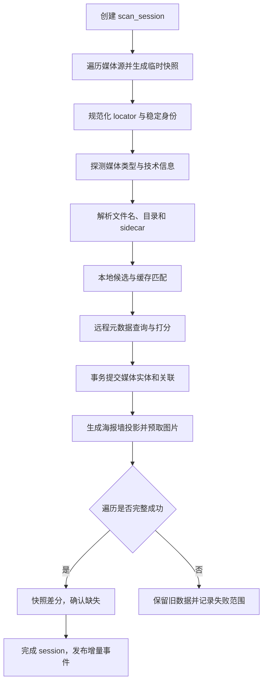

# 扫描、解析与海报墙规范

## 目标与边界

媒体库模块把各类媒体源转换为稳定、可查询、可恢复的本地索引。它负责发现文件、解析文件名、匹配元数据、组织影片/剧集/季/单集和管理图片缓存；不负责删除用户的远程文件。

## 扫描模式

| 模式 | 用途 | 是否允许判定缺失 |
| --- | --- | --- |
| `full` | 首次建库、根目录或过滤规则改变、用户手动重建 | 成功完成全部目录后允许 |
| `incremental` | 计划任务、回到前台、服务端变更通知 | 只对明确覆盖的目录或变更集允许 |
| `repair` | 重试解析、补元数据、补图、纠正低置信度匹配 | 不允许 |
| `availability_check` | 快速确认媒体源或若干文件是否可访问 | 不允许删除，只更新可用性 |

## 触发来源

- 媒体源新增、启用或配置发生结构性变化。
- 用户手动刷新或重建。
- 应用启动/回到前台后的过期检查。
- 定时调度、网络恢复、充电或进入非受限网络。
- 连接器提供的变更游标、推送或目录监控事件。
- 播放时发现文件不存在，触发单项确认与父目录复查。
- 元数据策略或语言变化，触发 `repair` 而非文件系统重扫。

## 核心流程

详细的阶段、恢复点和数据库映射见[扫描重建调研与自有设计](../../docs/research/infuse/infuse_library_scan_rebuild_and_our_scanner_design.md)。

## 文件身份与变更判断

身份优先级：连接器稳定对象 ID；规范化后的 `source_uid + relative_path`；文件系统 inode/resource ID；最后才是派生指纹。文件大小、修改时间、etag 和可选的轻量内容指纹用于判断内容是否变化，不作为跨库元数据搜索主路径。

只有在连接器明确支持并且隐私策略允许时才计算全量或部分哈希。哈希默认仅本地用于去重/变更判断，不上传第三方元数据服务。

## 来源枚举合同 v1

所有文件型来源 MUST 映射为同一组来源无关值，连接器私有的 URL、文件句柄和协议对象不得进入 scanner 或 wire fixture：

- `RemoteLocator` 由非空 `source_uid` 和根目录相对的 `relative_path` 组成；根路径编码为空字符串，分隔符固定为 `/`。
- `relative_path` MUST 移除重复分隔符与 `.` 段，MUST 拒绝 NUL 和 `..` 段。显示路径保留连接器返回的大小写和 Unicode 拼写，不用 compare key 替换。
- `RemoteEntry` 至少携带 locator、kind、可选稳定 ID、size、`modified_at_ms` 和 etag。未知 kind 必须安全降级为 `unknown`。
- 稳定 ID 能力分为 `none`、`scan` 和 `persistent`。只有 `persistent` 可跨扫描识别改名或移动；`scan` 只用于单次枚举去重和循环检测。
- 目录枚举统一返回游标页。即使底层来源不分页，也必须返回一个 `next_cursor: null` 的终页；空游标、重复游标或中途失败都令本次 coverage 不完整。
- 连接器 MUST 声明路径大小写为 `sensitive`、`insensitive` 或 `unknown`，Unicode 规则为 `preserve`、`nfc` 或 `nfd`。`unknown`/`preserve` 采用精确比较，不能擅自合并可能不同的远端对象。

`path_compare_key` MUST 逐路径段生成：先按声明执行 NFC/NFD，再在大小写不敏感来源上执行 Unicode default case folding，最后用 `/` 连接。它只用于同一来源内的比较；不同 `source_uid` 的相同路径始终是不同对象。范围判断也必须按路径段执行，`Movies/A` 不得覆盖 `Movies/AB`。

连接器能力 fixture 使用以下稳定字段：

| 字段 | 语义 |
| --- | --- |
| `stable_id_scope` | `none`、`scan` 或 `persistent` |
| `case_sensitivity` | `sensitive`、`insensitive` 或 `unknown` |
| `unicode_normalization` | `preserve`、`nfc` 或 `nfd` |
| `supports_range_reads` | 是否支持按 byte range 读取 |
| `supports_change_cursor` | 是否支持来源变化游标 |
| `delta_deletions_complete` | delta 是否保证包含范围内全部删除；只有为真时 delta 才能协调 missing |

[`remote-enumeration-v1.json`](../fixtures/media-library/remote-enumeration-v1.json) 固定首组跨语言 locator、entry、路径比较和分页样本。

## Scanner 状态机合同 v1

`full`、scoped `incremental` 与 `repair` 共用 `MediaScanRequest`、`MediaScanCheckpoint` 和最终 `MediaScanCompletion`：

- `full` MUST 只覆盖连接器配置根；`incremental` MUST 携带一个或多个互不重叠的递归目录范围；`repair` 不重新枚举来源且永远没有 missing 协调资格。
- 枚举前 MUST 对每个根执行 `stat`，确认它仍是目录并保存根稳定 ID。恢复使用 persistent stable ID 的 checkpoint 时，根身份变化 MUST 令续扫失败。
- 每个成功验证的目录页 MUST 把该页 entries 与更新后的 pending page queue、已完成 cursor、去重身份和计数作为同一原子批次提交。恢复允许重放尚未确认的页，因此持久层 MUST 按稳定 ID 或 path compare key 幂等 UPSERT。
- 目录请求并发度 MUST 有显式上限。持久层批次提交完成前不得无限继续领取结果，以形成背压；取消必须传播到所有 in-flight 请求。
- 连接器返回不同来源、非直接子项、空/重复 cursor 或目录循环/异常路径时，当前 coverage MUST 失败关闭。精确重复条目不增加发现计数；`scan`/`persistent` stable ID 用于单次扫描去重，只有 `persistent` 可用于跨扫描移动识别。
- 只有最终原子批次中的 `completion.reconcile_missing_eligible=true` 才授权持久层在 `covered_roots` 内协调 missing。连接、鉴权、根预检、分页、持久化、取消或超时失败只保存可恢复 checkpoint，不产生 completion。

checkpoint 的 pending queue 也包含当前 in-flight 请求。这样任一并发页提交后，其他尚未提交的请求仍会留在 durable checkpoint；崩溃恢复最多重复读取和幂等 UPSERT，不会跳过目录。进度事件只能携带 run、phase、计数和错误分类，不得携带路径或稳定 ID。

[`scanner-state-v1.json`](../fixtures/media-library/scanner-state-v1.json) 固定 full、scoped incremental、repair、分页重复条目、中断 checkpoint 和 missing 资格样本。各语言实现 MUST 规范化顺序后比较结果，不得把连接器到达顺序写进合同。

## 文件名解析与匹配

文件名 fixture v1 的规范结果除 `kind`、`title`、`year`、`season` 和 `episode` 外，还可携带：

- `episode_end`：`S01E01E02` 一类连续多集文件的末集；
- `edition`：`Director's Cut`、`Final Cut`、`Extended`、`IMAX`、`Theatrical` 或 `Criterion` 等版本标签；
- `is_sample`：样片标记；样片的 `kind` 为 `extra`，不得自动物化为正片；
- `series` 与 `season` kind：仅在输入以目录分隔符结尾、明确表示目录时产生，避免把普通无扩展名文件误判为目录实体。

解码旧 fixture 时缺失的 `is_sample` 等价于 `false`。未知 kind 继续安全降级为 `unknown`。

解析器按以下顺序收集证据：

1. 用户手动匹配和同目录 sidecar（NFO、JSON）优先。
2. 文件名中的剧集标记，如 `S02E03`、`2x03`、日期型集号。
3. 年份、季目录、标题目录和连续剧集范围。
4. 移除分辨率、来源、编解码、音轨、发布组等噪声标签。
5. 保留原始字符串、规范标题和每条解析证据，产出电影或剧集候选及置信度。

元数据匹配必须分候选生成、候选打分、决策三步；查询成功但低于阈值的项目进入待人工匹配，不得用搜索第一条强行绑定。用户确认后的绑定设置 `manual_lock`，自动修复不得覆盖。

Infuse 行为与参考脚本的已知边界见[匹配器一致性审计](../../docs/research/infuse/infuse_tmdb_matcher_parity_audit.md)。

## 缺失与删除安全规则

- 扫描前把目标范围写入临时快照或本次发现表；遍历完整成功后才与正式库存量做差分。
- 超时、权限错误、认证失败、分页中断、离线、用户取消或目录仅部分完成时，MUST NOT 把未发现项判定为已删除。
- 首次缺失先标记 `missing_since_ms` 和不可播放；可配置宽限期或第二次成功扫描后再清理派生记录。
- 删除媒体源配置只清理本地索引、关系和缓存，不触碰远端实体。
- 播放历史、收藏、用户匹配和观看进度应按逻辑媒体 ID 保留，使文件重新出现后可恢复。
- 图片、字幕缓存和孤立元数据由垃圾回收任务处理，不在扫描事务内做大规模删除。

## 海报墙查询

SDK v1 输出数据模型和分页查询，不内置三端 UI 组件。公开查询至少支持：

- 继续观看、最近添加、最近播放、电影、剧集、类型、收藏和自定义媒体库。
- `sort`：标题、添加时间、发行日期、最近播放、评分、随机种子。
- `filter`：媒体类型、来源、可用性、类型、年份、观看状态、家长分级。
- 游标分页、稳定排序和指定 `library_revision` 的一致性快照。
- 详情查询返回逻辑媒体、可播放文件、季/集结构、图片候选、字幕/音轨摘要和用户状态。

`PosterWallItem` 至少包含 `media_uid`、类型、标题、副标题、年份、主海报、背景图、观看进度、未看集数、来源可用性和元数据修订号。

### PosterWall 合同 v1

列表只返回顶层 `movie` 与 `series`，season、episode、extra 和同实体的多个文件版本不得重复生成海报墙条目。series 的来源、可用性、最近播放和继续观看状态从其 episode 聚合；movie 从直接绑定的 primary/version 文件聚合。

v1 固定以下 section：

| section | 选择与默认顺序 |
| --- | --- |
| `all` | 全部顶层实体，使用请求 sort |
| `movies` / `series` | 对应实体类型，使用请求 sort |
| `recently_added` | `created_at_ms` 降序 |
| `continue_watching` | 指定 profile 下存在未完成且进度大于零的状态，最近播放降序 |
| `recently_played` | 指定 profile 下有播放时间的实体，最近播放降序 |
| `collection` | 指定 `collection_uid` 的未删除片单成员，使用请求 sort |

过滤支持 media kind、一个或多个 source UID、类型名、年份范围、聚合可用性和 profile 观看状态。多个 media kind 或 source 采用“任一命中”，多个类型名采用“全部命中”。搜索对标题、alias、人物、类型和 romanized 投影执行 Unicode 宽度/变音符号/大小写折叠，再以规范化子串匹配；不得依赖 SQLite 平台私有 tokenizer。

`title` 排序使用同一 Unicode 规范化文本并以 `media_uid` 收尾；`added_at`、`release_date`、`recently_played` 均为降序并以 `media_uid` 收尾；`random` 使用请求 `random_seed` 与 `media_uid` 计算跨平台稳定的 FNV-1a 64-bit 顺序。实现不得使用进程随机化 hash。

响应携带不透明 `library_revision`。cursor MUST 绑定规范化查询身份、library revision 和上一页最后一个 `media_uid`；查询参数不一致、revision 改变、anchor 消失或 cursor 无法解码时失败关闭，映射为 `conflict` 或 `invalid_configuration`，不得静默跳页或重复页。一次数据库 read transaction 内构造的 page/detail 使用同一 snapshot。

可用性聚合优先级为 `present` → `offline` → `missing` → `unavailable`。存在任一可播放版本时实体为 `present`；一个版本 missing 不得隐藏仍可播放的其他版本。详情返回顶层实体、provider external IDs、全部 artwork 候选、电影 playable versions 或 series→season→episode 层级，以及每个文件的技术摘要和轨道列表。

[`poster-wall-v1.json`](../fixtures/media-library/poster-wall-v1.json) 固定 title pagination、最近添加、继续观看、搜索、类型、片单、选图、剧集层级和轨道投影样本。各语言实现比较规范化 UID/字段输出；cursor 本身是不透明实现值，不比较编码文本，但必须重放并验证 revision 失效行为。

## 图片管理

- 数据库保存图片提供方、远程路径、宽高、语言、类型、投票和本地缓存状态。
- 图片 URL 由提供方配置和路径组合生成，MUST 不永久持久化带时效签名的下载 URL。
- 原图仅在明确请求下载/导出时获取；海报墙按屏幕像素尺寸选择接近的可用规格。
- 缓存键必须包含提供方、图片路径、目标尺寸和变换版本。
- LRU 清理只删除可再生成缓存；用户导入图片和手工设置必须受保护。

列表选图按 `is_selected`、请求 locale、`und` fallback、provider score、像素面积、`artwork_uid` 的顺序确定。人工 selected 图必须胜过 provider 分数更高的未选图；详情仍返回全部候选。带 query、签名或短期 token 的下载 URL 不得作为稳定 `remote_reference` 写入核心库。

每个缓存 variant identity MUST 包含 artwork UID、provider、稳定 remote reference、目标像素宽高和 transform version。缓存索引与 prefetch 是可替换异步接口；平台实现负责网络、电量、磁盘预算和 LRU，SDK 的内存实现只用于测试或短生命周期宿主。缓存相对路径拒绝绝对路径、空段、`.`、`..` 与 NUL。

## 事件与一致性

扫描写入后台事务，提交后发布：`scan_started`、`scan_progress`、`library_delta`、`scan_completed`、`scan_failed`、`match_required`。海报墙消费 `library_delta` 并按变更 UID 更新，不轮询整库。

## 验收条件

- 中断全量扫描不会让已有海报墙大面积消失。
- 相同文件重复扫描不产生重复实体或重复用户状态。
- 电影与剧集文件可被稳定区分；低置信度结果可人工修正并锁定。
- 文件换路径后，在稳定 ID 或足够可靠指纹存在时能继承观看状态。
- 删除远端文件后，经完整成功扫描会从可播放列表移除，但用户状态仍可恢复。
