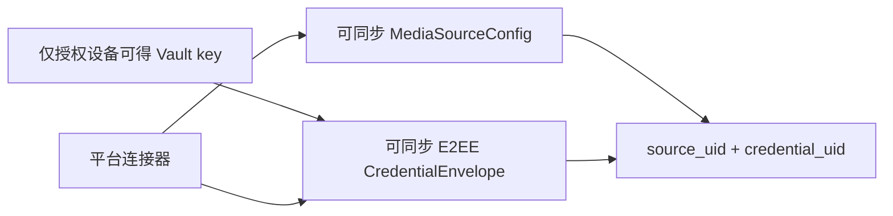

# 远程媒体配置同步规范

## 范围

本模块同步“如何连接和扫描媒体源”的配置，包括 NAS、网盘、媒体服务器和本地目录。用户名、密码、Cookie、第三方 refresh token、私钥等通过独立的 Credential Vault 记录端到端加密并同步，规则见 [`../security/credential-vault.md`](../security/credential-vault.md)。

## 配置模型

`MediaSourceConfig`：

| 字段 | 类型 | 说明 |
| --- | --- | --- |
| `source_uid` | string | 全局稳定配置 ID |
| `account_uid` | string | 所属恒星账号 |
| `kind` | enum | `local_folder`、`device_media`、`smb`、`nfs`、`webdav`、`ftp`、`cloud_drive`、`plex`、`emby`、`jellyfin` |
| `display_name` | string | 用户可见名称 |
| `endpoint` | object | 主机、端口和 TLS 等非敏感连接信息 |
| `root_path` | string | 扫描根目录或服务端库 ID |
| `included_paths` | string[] | 允许扫描的相对路径 |
| `excluded_paths` | string[] | 排除路径或模式 |
| `scan_policy` | object | 自动扫描、间隔、网络与电量限制 |
| `metadata_policy` | object | 语言、地区、首选元数据源、文件名优先级 |
| `connection_mode` | enum | `direct`、`relay`、`automatic` |
| `credential_mode` | enum | `e2ee_synced`、`device_local`、`server_managed`、`none` |
| `credential_uid` | string? | 可同步的稳定凭据引用；不是秘密，不得用作授权依据 |
| `capabilities` | string[] | 读取、列目录、变更游标、服务端搜索等能力 |
| `revision` | int64 | 单调递增逻辑修订号 |
| `updated_at_ms` | int64 | 最近修改时间 |
| `deleted_at_ms` | int64? | 删除墓碑时间 |
| `schema_version` | int | 当前为 1 |

`endpoint` MUST 进行协议级规范化，但不得把用户名或密码嵌入 URL。`root_path` 的大小写和 Unicode 规范化策略由连接器声明，不能全局假定大小写不敏感。

## 配置与凭据分离



- `credential_uid` 可随配置上传，用于关联独立同步的加密 envelope；它不是 bearer secret。
- `e2ee_synced` 是需要跨平台复用连接凭据时的默认模式。新设备取得配置和密文后，在 Vault 获得授权前保持 `credential_required`。
- `device_local` 仅用于用户明确选择不上传某项凭据的来源；每台设备分别输入。
- `server_managed` 表示恒星服务端持有上游授权，客户端只获取短期、最小权限的连接凭证。
- `none` 只用于无需认证的来源。
- MediaSourceConfig 和 CredentialEnvelope 使用独立 revision/outbox；任一到达顺序都必须安全。缺少配置、密文或 Vault 授权时不得尝试连接。

## 同步协议

拉取请求包含 `account_uid`、设备 ID、客户端 schema 版本和上次游标。响应为：

```json
{
  "items": [],
  "next_cursor": "opaque-cursor",
  "server_time_ms": 0,
  "has_more": false
}
```

上传采用幂等操作：`operation_uid`、`source_uid`、`base_revision`、完整的新配置或删除墓碑。服务端接受后返回新 `revision` 和同步游标。

合并规则：

1. 不同 `source_uid` 独立合并。
2. 本地 `base_revision` 等于服务端 revision 时直接应用。
3. 冲突时，删除与安全相关字段优先，普通配置字段可以按 `updated_at_ms` 合并；CredentialEnvelope 不允许字段级合并。
4. 同时修改无法无损合并的连接端点或根路径时，保留两份冲突记录并请求用户选择。
5. 删除使用墓碑，服务端确认所有活跃设备越过该游标后才可压缩。

## 连接器接口

每个媒体源连接器 MUST 提供：

- `validate(config, credential)`：验证结构和最小连接能力。
- `list(path, pageToken)`：稳定分页列目录，输出连接器原始 ID、路径、类型、大小、修改时间和可用的 etag。
- `stat(locator)`：按需查询单项状态。
- `open(locator, range)`：为播放器返回可取消的流，支持时声明字节范围。
- `changes(cursor)`：可选的增量变更游标。
- `capabilities()`：声明大小写、符号链接、稳定 ID、服务端哈希、变更订阅等能力。

连接器不得直接写媒体库表；扫描协调器负责事务和生命周期。

## 配置变更触发

| 变更 | 默认动作 |
| --- | --- |
| 新增媒体源 | 完整扫描 |
| 凭据同步、恢复或更新但配置未变 | Vault 解锁和连通性检查后增量扫描 |
| 根路径、包含或排除规则变化 | 完整扫描并重新计算可见范围 |
| 元数据语言变化 | 元数据修复任务，不重复遍历文件系统 |
| 元数据源优先级变化 | 仅重试未锁定和低置信度项目 |
| 删除媒体源 | 停止任务，标记源不可见；按保留策略异步清理本地派生数据 |

## 验收条件

- 同一配置重复上传不会生成重复媒体源。
- 未授权新设备拉取后只能获得加密 envelope；授权完成后可以使用同步的第三方凭据而无需重新输入。
- 云端和本地 SQLite 中均不存在第三方密码或 Token 明文。
- 离线编辑可入队，联网后按 revision 合并。
- 同步冲突不会静默覆盖根路径或认证方式。
- 配置删除不会调用 NAS 或网盘的物理删除 API。
