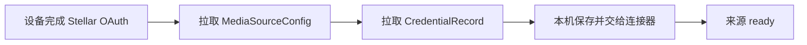

# 第三方凭据存储与同步规范

## 1. 范围与当前决策

本规范覆盖 NAS、SMB、WebDAV、网盘及媒体服务器的用户名、密码、Cookie、API Token、第三方 OAuth refresh token 和私钥。

v1 以“用户在新设备登录后无需批准旧设备、输入恢复口令或解锁独立 Vault”为产品优先级。第三方凭据因此作为可同步的 `CredentialRecord` 保存；当前唯一可创建的保护模式是 `plaintext`。客户端、同步服务和服务端数据库都可以读取 payload 明文，不得把 Base64、数据库磁盘加密或 TLS 描述为端到端加密。

本决策不降低以下边界：

- 账户和同步 API MUST 使用 HTTPS；
- 服务端 MUST 按账户鉴权并拒绝跨账户读写；
- 凭据不得进入 URL、命令行参数、日志、崩溃报告、分析事件或普通错误文本；
- 本地文件继续依赖应用沙箱和平台 data-protection，服务端继续依赖最小数据库权限、备份访问控制和基础设施加密；
- 诊断导出、数据库备份和服务端快照均按凭据材料处理；
- Stellar 账户自身的 OAuth access/refresh token 不进入 `CredentialRecord`、不跨设备复制，每台设备仍保存在平台安全存储中。

## 2. 用户体验

同步凭据不要求：

- 已有设备批准；
- Vault key 或设备 key wrapping；
- 恢复码、恢复口令或独立的凭据解锁步骤；
- Face ID、Touch ID、Android 生物识别或 OHOS 生物识别提示。

如果账户策略、服务端权限或来源本身拒绝访问，客户端仍必须显示错误；“无额外操作”不允许绕过 Stellar OAuth 或来源认证。

## 3. CredentialPayload

`CredentialPayload` 是带 `schema_version` 的受限 JSON 对象，不接受任意类型反序列化。首版认证类型包括：

| `auth_type` | 允许字段 |
| --- | --- |
| `username_password` | `username`、`password`、可选 `domain` |
| `oauth_token` | `refresh_token`、可选短期 `access_token`、`expires_at_ms`、`scope` |
| `api_token` | `token`、可选 `username` |
| `cookie` | 受限 cookie 集合及作用域 |
| `key_pair` | 私钥、公钥和可选口令 |

用户名也位于 payload。端点、端口和根路径位于 `MediaSourceConfig`；不得把用户名、密码或 token 嵌入 endpoint URL。

实现 MUST 对 payload 设置类型与大小上限，并在交给连接器前重新校验。公开模型的 `description`、调试输出和错误不得包含 payload。

## 4. CredentialRecord v1

`CredentialRecord` 的 wire format 为：

| 字段 | 类型 | 说明 |
| --- | --- | --- |
| `credential_uid` | string | 全局稳定凭据 ID |
| `account_uid` | string | 账户隔离边界 |
| `source_uid` | string | 所属媒体源 |
| `kind` | enum | `password`、`oauth_token`、`api_token`、`cookie`、`key_pair` 或可保留的未知值 |
| `protection_mode` | enum | v1 只能创建 `plaintext`；预留 `server_encrypted`、`end_to_end_encrypted` |
| `payload_json` | string? | `plaintext` 时必填的规范 JSON 字符串 |
| `algorithm` | string? | 未来受保护记录使用；`plaintext` 时必须为空 |
| `key_version` | int? | 未来密钥版本；`plaintext` 时必须为空 |
| `nonce_b64` | string? | 未来加密 nonce；`plaintext` 时必须为空 |
| `protected_payload_b64` | string? | 未来密文与认证 tag；`plaintext` 时必须为空 |
| `aad_version` | int? | 未来认证附加数据版本；`plaintext` 时必须为空 |
| `revision` | int64 | 服务端单调递增版本 |
| `updated_at_ms` | int64 | 客户端更新时间 |
| `deleted_at_ms` | int64? | 删除墓碑时间 |
| `schema_version` | int | record schema，首版为 1 |

当前客户端 MUST 只创建和使用 `protection_mode=plaintext`。收到其他模式时必须保留可同步元数据但返回稳定的 `credential_protection_unsupported`，不得把密文当明文、静默降级或要求用户重新输入后覆盖远端记录。

## 5. 本地与服务端存储

- `account.sqlite` 使用 `credential_record` 表保存完整记录。`plaintext` 的 `payload_json` 是应用层明文。
- 同步服务和服务端数据库保存同一记录；服务端可以读取 payload，并负责账户归属、revision、大小和 schema 校验。
- 本地连接器只能通过最小权限凭据接口按 `credential_uid` 取得 payload，不能自行扫描凭据表。
- 删除来源默认同时产生凭据 tombstone；共享同一 `credential_uid` 时必须先确认没有其他活跃引用。
- 受托管语言无法保证字符串或 JSON 缓冲立即清零，文档和威胁模型必须如实记录。

## 6. 同步、冲突与删除

- 上传携带 `operation_uid`、`credential_uid`、`base_revision` 和完整记录，重复操作必须幂等。
- 凭据记录不做字段级自动合并。并发更新保留冲突候选或按明确的完整记录获胜规则处理，不得拼接两个 payload。
- 删除使用 tombstone；所有活跃设备越过删除游标后才可压缩。
- 新设备完成 Stellar OAuth 后即可拉取并使用 `plaintext` 记录，不存在独立 Vault 授权状态。

## 7. 未来加密升级缝隙

未来引入服务端托管加密或 E2EE 时 MUST 新增版本化 ADR，并复用稳定的 `credential_uid`、revision、tombstone 和 outbox：

1. 通过能力协商和最低客户端版本阻止旧客户端覆盖新保护模式；
2. 在单条记录的原子事务中把 `payload_json` 转换为受保护 payload，再清空明文字段；
3. 升级前先处理数据库备份、WAL、同步队列和冲突副本中的历史明文；
4. 任何迁移失败保留原记录且不得产生半明文半密文状态；
5. 不允许从 `server_encrypted` 或 `end_to_end_encrypted` 静默降级到 `plaintext`。

预留字段只是迁移接口，不代表 v1 已实现或承诺任何加密能力。

## 8. 验收条件

- 新设备完成 Stellar OAuth 后无需额外批准或恢复步骤即可使用已同步凭据；
- Swift、Kotlin、ArkTS 和 Windows 客户端对同一 `CredentialRecord` 产生相同 wire 数据与错误分类；
- 本地 SQLite、同步请求和受限服务端测试存储可以读取测试 payload，证明实现没有虚假声称 E2EE；
- 日志、崩溃报告、分析事件、CLI 参数和诊断导出找不到测试用户名、密码或 token；
- 跨账户读取、写入和冲突注入被拒绝；
- 未支持的保护模式失败关闭且不会被旧客户端覆盖；
- SQLite/WAL/备份和服务端快照的明文风险进入发布检查与数据删除流程。
