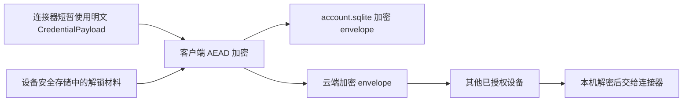

# Credential Vault 与凭据同步规范

## 1. 范围与硬性边界

用户需要在 Swift、Android 和 OpenHarmony 设备之间同步 NAS、WebDAV、网盘及媒体服务器的连接信息和凭据。本规范覆盖第三方媒体源的用户名、密码、Cookie、API Token、OAuth refresh token 和私钥。

这些凭据 MUST 在客户端加密后才可写入本地 SQLite 或上传云端。Stellar 服务端 MUST 无法解密。日志、崩溃报告、分析事件、命令行参数和配置 URL MUST 不包含明文凭据。

Stellar 账户自身的 OAuth access/refresh token 不进入本 Vault、不跨设备复制；每台设备仍通过平台安全存储维护自己的 Stellar 会话。

## 2. 数据分层

- `CredentialPayload`：只在需要新增、更新或使用凭据时短暂存在内存中。
- `EncryptedCredentialEnvelope`：可写入 `account.sqlite`、备份并上传云端的密文记录。
- Vault key：随机生成、按账户隔离且带版本；不得写入 SQLite、普通文件、日志或服务端可直接解密的字段。
- 设备解锁材料：存入 Keychain、Keystore 或 HUKS 等平台安全存储。

## 3. 明文 payload

明文 payload 使用带 `schema_version` 的受限 JSON 对象，不接受任意类型反序列化。首版认证类型包括：

| `auth_type` | 允许字段 |
| --- | --- |
| `username_password` | `username`、`password`、可选 `domain` |
| `oauth_token` | `refresh_token`、可选短期 `access_token`、`expires_at_ms`、`scope` |
| `api_token` | `token`、可选 `username` |
| `cookie` | 受限 cookie 集合及作用域 |
| `key_pair` | 私钥、公钥和可选口令 |

用户名默认也进入加密 payload。端点、端口和根路径位于 `MediaSourceConfig`；不得把用户名、密码或 token 嵌入端点 URL。

## 4. 加密 envelope

`EncryptedCredentialEnvelope` 的 wire format 为：

| 字段 | 类型 | 说明 |
| --- | --- | --- |
| `credential_uid` | string | 全局稳定凭据 ID |
| `account_uid` | string | 账户隔离边界 |
| `source_uid` | string | 所属媒体源 |
| `kind` | enum | `password`、`oauth_token`、`api_token`、`cookie`、`key_pair` 或可保留的未知值 |
| `algorithm` | string | 首版为 `aes_256_gcm` |
| `key_version` | int | Vault key 版本 |
| `nonce_b64` | string | 96-bit 随机 nonce 的 Base64；同一 key 下 MUST 唯一 |
| `ciphertext_b64` | string | 密文与认证 tag 的 Base64 |
| `aad_version` | int | 认证附加数据编码版本，首版为 1 |
| `revision` | int64 | 服务端单调递增版本 |
| `updated_at_ms` | int64 | 客户端更新时间 |
| `deleted_at_ms` | int64? | 删除墓碑时间 |
| `schema_version` | int | envelope schema，首版为 1 |

AAD v1 MUST 以规范化编码绑定 `account_uid`、`credential_uid`、`source_uid`、`kind`、`algorithm`、`key_version`、`aad_version` 和 `schema_version`，防止密文被替换到其他账户、来源或认证类型。不得自行实现密码算法；三端使用经过审计的平台实现或成熟密码库，并共享已知答案测试向量。

## 5. 跨设备密钥授权

- 每个账户生成随机 Vault key；服务端不得获得可直接解密该 key 的材料。
- 每台设备生成自己的设备密钥并在平台安全存储中保护私钥。
- 新设备登录 Stellar 账户后，还必须由一个已授权设备批准，或使用用户持有的恢复材料，才能取得为该设备包装的 Vault key。
- 服务端只保存设备公钥、包装后的 Vault key、key 版本和授权/撤销元数据。
- 撤销设备后，服务端停止向它提供后续 envelope；高风险场景 MUST 支持轮换 Vault key 并重新加密仍有效的凭据。
- 设备包装算法、恢复流程和密码学测试向量必须在 Credential Vault 投产前通过单独版本化 ADR 固化；在此之前不得发布声称支持安全跨设备解密的实现。

## 6. 本地存储

`account.sqlite` 增加版本化的 `credential_envelope` 表，只保存第 4 节字段及同步元数据。数据库还应使用平台 data-protection；但数据库文件保护不能替代字段级 AEAD。

连接器通过最小权限的 `CredentialVault` 接口按 `credential_uid` 临时取得解密结果。公开模型不得提供默认会打印秘密的 `description`；完成请求后尽快释放明文缓冲。受托管语言无法保证内存立即清零时，文档必须如实说明该限制。

## 7. 同步、冲突与删除

- 上传携带 `operation_uid`、`credential_uid`、`base_revision` 和完整 envelope，重复操作必须幂等。
- 服务端可以校验字段、大小、账户归属和 revision，但不得要求或记录明文 payload。
- 客户端 MUST 在解密前验证 AEAD tag、AAD、账户、来源和 schema。
- 密文不可做字段级合并。并发更新必须保留冲突候选并请求用户选择，或按协议明确选择一个完整版本；不得拼接两个 payload。
- 删除凭据使用同步 tombstone。所有活跃设备越过删除游标后才可压缩；本地明文缓存立即失效。
- 来源删除默认同时产生凭据 tombstone；若凭据被多个来源引用，必须在事务中确认引用后再删除。

## 8. 验收条件

- 检查本地数据库、云端请求和服务端存储均找不到测试用户名、密码或 token 明文。
- Swift、Kotlin 和 ArkTS 能使用同一组已知答案向量互相加解密。
- 修改 envelope 的账户、来源、类型、nonce、密文或 AAD 任一部分都会解密失败。
- 未授权新设备只能取得配置和密文，不能使用媒体源凭据。
- 已授权新设备能在不重新输入第三方密码的情况下连接媒体源。
- 设备撤销、密码修改、并发修改、凭据删除和 key 轮换均有端到端测试。
